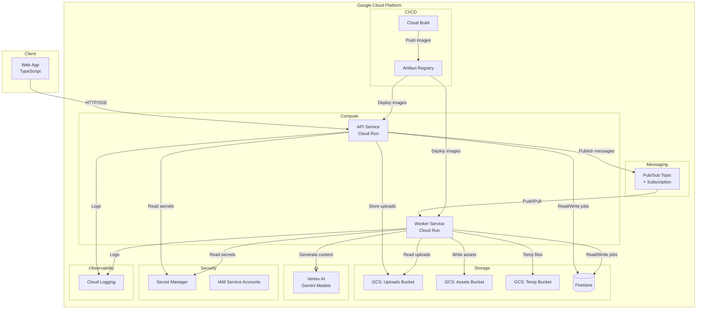

# Design Document: Content Storyteller GCP Foundation

## Overview

Content Storyteller is a multimodal AI product that transforms rough inputs (text, images, screenshots, voice notes) into polished marketing assets: copy, generated visuals, storyboards, voiceover scripts, and short promo videos. This design document covers the GCP foundation layer — the monorepo structure, Terraform-managed infrastructure, IAM configuration, async pipeline architecture, deployment tooling, observability, and shared type contracts.

The system runs entirely on Google Cloud with Vertex AI (Gemini models) for AI generation. The architecture follows a three-tier pattern: a TypeScript web frontend, a TypeScript API backend on Cloud Run, and a TypeScript async worker on Cloud Run. State is managed in Firestore, media in Cloud Storage, and async dispatch via Pub/Sub.

This is a hackathon project. The design is production-shaped but pragmatic — favoring speed of delivery, reproducibility, and clear documentation over enterprise-grade complexity.

## Architecture

### High-Level Architecture Diagram



### Request Flow

1. User uploads media via Web App → API Service
2. API Service stores media in uploads bucket, creates Job in Firestore (`queued`), publishes message to Pub/Sub
3. Worker Service receives message, updates Job to `processing_input`
4. Worker progresses through pipeline stages: `processing_input` → `generating_copy` → `generating_images` → `generating_video` → `composing_package` → `completed`
5. At each stage, Worker persists assets to GCS assets bucket and updates Job document
6. Web App polls or streams (SSE) Job status via API Service
7. On completion, Web App retrieves asset bundle via API Service

### Key Architecture Decisions

| Decision | Choice | Rationale |
|---|---|---|
| Async dispatch | Pub/Sub | More flexible than Cloud Tasks; supports fan-out, filtering, dead-letter topics |
| Worker deployment | Cloud Run service (not job) | Supports push subscriptions, always-on for low latency, simpler for hackathon |
| Language | TypeScript everywhere | Code sharing via `packages/shared`, single toolchain, fastest path to MVP |
| State store | Firestore Native mode | Serverless, real-time listeners for SSE, no schema management |
| Monorepo tool | npm/pnpm workspaces | Zero additional tooling, native to Node.js ecosystem |
| IaC | Terraform | Declarative, reproducible, well-supported GCP provider |


## Components and Interfaces

### 1. Monorepo Structure

```
content-storyteller/
├── apps/
│   ├── web/                    # TypeScript frontend (Vite + React or similar)
│   │   ├── src/
│   │   ├── Dockerfile
│   │   ├── package.json
│   │   └── .env.example
│   ├── api/                    # TypeScript API service (Express/Fastify)
│   │   ├── src/
│   │   │   ├── routes/         # HTTP route handlers
│   │   │   ├── services/       # Business logic (upload, job, streaming)
│   │   │   ├── middleware/     # Correlation ID, error handling, upload limits
│   │   │   └── index.ts        # Entry point
│   │   ├── Dockerfile
│   │   ├── package.json
│   │   └── .env.example
│   └── worker/                 # TypeScript async worker service
│       ├── src/
│       │   ├── pipeline/       # Pipeline stage implementations
│       │   ├── services/       # AI generation, storage, Firestore clients
│       │   ├── capabilities/   # Capability detection and fallback logic
│       │   └── index.ts        # Entry point (Pub/Sub message handler)
│       ├── Dockerfile
│       ├── package.json
│       └── .env.example
├── packages/
│   └── shared/                 # Shared TypeScript types, schemas, enums
│       ├── src/
│       │   ├── types/          # API request/response types, Asset, Job
│       │   ├── schemas/        # Structured output schemas (Creative Brief, etc.)
│       │   └── index.ts        # Barrel export
│       └── package.json
├── infra/
│   └── terraform/
│       ├── main.tf             # Provider config, API enablement
│       ├── variables.tf        # Input variables (project_id, region)
│       ├── outputs.tf          # All resource identifiers
│       ├── storage.tf          # GCS buckets
│       ├── firestore.tf        # Firestore database
│       ├── pubsub.tf           # Pub/Sub topic + subscription
│       ├── registry.tf         # Artifact Registry
│       ├── secrets.tf          # Secret Manager placeholders
│       ├── cloudrun.tf         # Cloud Run services
│       ├── iam.tf              # Service accounts and role bindings
│       └── terraform.tfvars.example
├── scripts/
│   ├── bootstrap.sh            # Project init, auth, terraform apply
│   ├── build.sh                # Docker build + push to AR
│   ├── deploy.sh               # Cloud Run deploy
│   └── dev.sh                  # Local dev server startup
├── docs/
│   ├── architecture.md         # Mermaid diagrams, service descriptions
│   ├── deployment-proof.md     # Live deployment evidence
│   ├── iam.md                  # Service accounts and role justifications
│   ├── env.md                  # Environment variable reference
│   ├── demo-flow.md            # End-to-end demo scenario
│   ├── submission-checklist.md # Hackathon criteria checkboxes
│   └── kiro-build-handoff.md   # Structured handoff for Kiro
├── cloudbuild.yaml             # CI/CD pipeline definition
├── Makefile                    # Task runner targets
├── .env.example                # Root env template
├── package.json                # Workspace root config
└── README.md                   # Project overview, quickstart, architecture
```

### 2. Terraform Infrastructure Components

#### 2.1 API Enablement (`main.tf`)

Enables all required GCP APIs using `google_project_service` resources:
- `aiplatform.googleapis.com` (Vertex AI)
- `run.googleapis.com` (Cloud Run)
- `artifactregistry.googleapis.com`
- `secretmanager.googleapis.com`
- `cloudbuild.googleapis.com`
- `storage.googleapis.com`
- `firestore.googleapis.com`
- `cloudtasks.googleapis.com`
- `pubsub.googleapis.com`
- `iam.googleapis.com`
- `logging.googleapis.com`

Uses `disable_on_destroy = false` to prevent accidental API disablement.

#### 2.2 Storage (`storage.tf`)

Three buckets with naming convention `${var.project_id}-{purpose}`:
- `${var.project_id}-uploads` — raw user uploads
- `${var.project_id}-assets` — generated output assets
- `${var.project_id}-temp` — temporary processing files (7-day lifecycle delete rule)

All buckets use `uniform_bucket_level_access = true` and are created in `var.region`.

#### 2.3 Firestore (`firestore.tf`)

Single Firestore database in Native mode. Uses `google_firestore_database` resource with `type = "FIRESTORE_NATIVE"` and `location_id = var.region`.

#### 2.4 Pub/Sub (`pubsub.tf`)

- Topic: `content-generation-jobs`
- Subscription: `content-generation-jobs-sub` with:
  - `ack_deadline_seconds = 600` (10 min, matching worker timeout)
  - Retry policy: `minimum_backoff = "10s"`, `maximum_backoff = "600s"`
  - Dead-letter topic for messages that fail after max retries

#### 2.5 Artifact Registry (`registry.tf`)

Docker-format repository: `content-storyteller` in `var.region`.

#### 2.6 Secret Manager (`secrets.tf`)

Placeholder secrets created as `google_secret_manager_secret` resources (no versions with actual values). Secrets are populated manually or via CI/CD.

#### 2.7 Cloud Run (`cloudrun.tf`)

Two services:
- **api-service**: HTTP-serving, concurrency 80, 1 CPU / 512Mi memory, uses `api-sa` service account
- **worker-service**: Pub/Sub push endpoint or pull-based, concurrency 1 (one job at a time), 2 CPU / 1Gi memory, timeout 600s, uses `worker-sa` service account

Both services receive environment variables from Terraform outputs: bucket names, Firestore DB, Pub/Sub topic, region, project ID.

#### 2.8 IAM (`iam.tf`)

Three service accounts with least-privilege bindings:

| Service Account | Roles |
|---|---|
| `api-sa` | `roles/storage.objectAdmin` (uploads + assets buckets), `roles/datastore.user`, `roles/pubsub.publisher`, `roles/secretmanager.secretAccessor`, `roles/logging.logWriter`, `roles/aiplatform.user` |
| `worker-sa` | `roles/storage.objectAdmin` (all 3 buckets), `roles/datastore.user`, `roles/secretmanager.secretAccessor`, `roles/logging.logWriter`, `roles/aiplatform.user`, `roles/pubsub.subscriber` |
| `cicd-sa` | `roles/artifactregistry.writer`, `roles/run.admin`, `roles/cloudbuild.builds.editor`, `roles/iam.serviceAccountUser` |

No `roles/owner` or `roles/editor` assigned to any service account.

### 3. API Service Interfaces

#### 3.1 HTTP Endpoints

| Method | Path | Description |
|---|---|---|
| `POST` | `/api/v1/upload` | Upload media files (multipart/form-data, max 50MB) |
| `POST` | `/api/v1/jobs` | Create a generation job from uploaded media |
| `GET` | `/api/v1/jobs/:jobId` | Poll job status and partial results |
| `GET` | `/api/v1/jobs/:jobId/stream` | SSE stream of job state changes and partial results |
| `GET` | `/api/v1/jobs/:jobId/assets` | Retrieve completed asset bundle |
| `GET` | `/api/v1/health` | Health check endpoint |

#### 3.2 Middleware Stack

- **Correlation ID middleware**: Generates or propagates `X-Correlation-ID` header, attaches to request context
- **Upload size limiter**: Rejects requests exceeding 50MB
- **Structured logger**: JSON logs with correlation ID, timestamp, severity
- **Error handler**: Catches unhandled errors, returns structured error responses

### 4. Worker Service Interfaces

#### 4.1 Message Handler

Receives Pub/Sub messages containing `{ jobId: string, idempotencyKey: string }`. On receipt:
1. Check idempotency (skip if already processed)
2. Load Job from Firestore
3. Execute pipeline stages sequentially
4. Acknowledge message on completion or permanent failure

#### 4.2 Pipeline Stages

Each stage is an independent module implementing a common interface:

```typescript
interface PipelineStage {
  name: string;
  jobState: JobState;
  execute(context: PipelineContext): Promise<StageResult>;
}
```

Stages:
1. **ProcessInput** — Analyze uploaded media via Vertex AI multimodal understanding, produce Creative Brief
2. **GenerateCopy** — Generate marketing copy package from Creative Brief
3. **GenerateImages** — Generate images from prompts (with capability check + fallback)
4. **GenerateVideo** — Generate video brief/assets (with capability check + fallback)
5. **ComposePackage** — Assemble final Asset Bundle, update Job to `completed`

#### 4.3 Capability Detection

Before calling image or video generation APIs, the worker checks availability:

```typescript
interface GenerationCapability {
  name: string;
  isAvailable(): Promise<boolean>;
  generate(input: GenerationInput): Promise<GenerationOutput>;
}
```

If unavailable or access-denied, the stage records a fallback notice in the Job document and continues. No mock data is produced — the Job document clearly indicates "capability unavailable".

### 5. Shared Package (`packages/shared`)

Exports all types, schemas, and enums consumed by 2+ services:
- API request/response types
- Job state enum and Job document type
- Asset metadata type
- Structured output schemas (Creative Brief, Copy Package, Image Prompt Set, Storyboard, Video Brief, Asset Bundle)
- Generation capability interfaces (real + stub substitution)
- Common constants (bucket name env vars, Pub/Sub topic names)

### 6. Deployment Scripts

#### `scripts/bootstrap.sh`
1. Check for `gcloud`, `terraform`, `docker` CLI tools
2. Authenticate with `gcloud auth login` and `gcloud auth application-default login`
3. Set project via `gcloud config set project $PROJECT_ID`
4. `cd infra/terraform && terraform init && terraform apply`

#### `scripts/build.sh`
1. Read Artifact Registry path from Terraform output
2. `docker build` API and Worker images
3. `docker push` to Artifact Registry

#### `scripts/deploy.sh`
1. Read Cloud Run service names and AR image paths from Terraform output
2. `gcloud run deploy` API and Worker services with latest images

#### `scripts/dev.sh`
1. Load `.env` files for each service
2. Start Web App dev server, API Service, and Worker Service concurrently (using `concurrently` or similar)

#### `Makefile` targets
- `make bootstrap` — runs `scripts/bootstrap.sh`
- `make build` — runs `scripts/build.sh`
- `make deploy` — runs `scripts/deploy.sh`
- `make dev` — runs `scripts/dev.sh`
- `make tf-plan` — `cd infra/terraform && terraform plan`
- `make tf-apply` — `cd infra/terraform && terraform apply`
- `make tf-destroy` — `cd infra/terraform && terraform destroy`

### 7. Observability

- **Structured JSON logging**: Both API and Worker emit logs as `{ severity, message, correlationId, jobId?, timestamp, ...context }`
- **Correlation ID propagation**: API generates ID on request entry, passes to Worker via Pub/Sub message attributes
- **Cloud Logging integration**: Logs are automatically ingested by Cloud Logging from Cloud Run stdout/stderr
- **Cost-conscious defaults**: Cloud Run concurrency limits, GCS lifecycle rules on temp bucket, Pub/Sub dead-letter for poison messages


## Data Models

### Job Document (Firestore)

Collection: `jobs`

```typescript
interface Job {
  id: string;                    // Auto-generated document ID
  correlationId: string;         // Propagated from API request
  idempotencyKey: string;        // Client-provided dedup key
  state: JobState;               // Current pipeline state
  uploadedMediaPaths: string[];  // GCS paths to uploaded files
  creativeBrief?: CreativeBrief; // Generated after processing_input stage
  assets: AssetReference[];      // References to generated assets
  fallbackNotices: FallbackNotice[]; // Capabilities that were unavailable
  errorMessage?: string;         // Set when state is 'failed'
  createdAt: Timestamp;
  updatedAt: Timestamp;
}

type JobState =
  | 'queued'
  | 'processing_input'
  | 'generating_copy'
  | 'generating_images'
  | 'generating_video'
  | 'composing_package'
  | 'completed'
  | 'failed';
```

### Asset Reference

```typescript
interface AssetReference {
  assetId: string;
  jobId: string;
  assetType: AssetType;
  storagePath: string;           // GCS path in assets bucket
  generationTimestamp: Timestamp;
  status: 'pending' | 'completed' | 'skipped';
}

type AssetType =
  | 'copy'
  | 'image'
  | 'video'
  | 'storyboard'
  | 'voiceover_script';
```

### Fallback Notice

```typescript
interface FallbackNotice {
  capability: string;            // e.g., 'image_generation', 'video_generation'
  reason: string;                // e.g., 'API unavailable', 'access denied'
  timestamp: Timestamp;
  stage: JobState;               // Which pipeline stage triggered the fallback
}
```

### Creative Brief (Structured Output)

```typescript
interface CreativeBrief {
  targetAudience: string;
  tone: string;
  keyMessages: string[];
  visualDirection: string;
  brandGuidelines?: string;
  inputSummary: string;          // AI-generated summary of uploaded media
}
```

### Asset Bundle

```typescript
interface AssetBundle {
  jobId: string;
  completedAt: Timestamp;
  assets: AssetReference[];
  creativeBrief: CreativeBrief;
  fallbackNotices: FallbackNotice[];
}
```

### Pub/Sub Message Schema

```typescript
interface GenerationTaskMessage {
  jobId: string;
  idempotencyKey: string;
}

// Message attributes (metadata):
// - correlationId: string
// - publishedAt: ISO 8601 timestamp
```

### Terraform Variables

```hcl
variable "project_id" {
  description = "GCP project ID"
  type        = string
  # No default — must be provided
}

variable "region" {
  description = "GCP region for all resources"
  type        = string
  default     = "us-central1"
}
```

### Environment Variables (Cloud Run)

| Variable | Source | Services |
|---|---|---|
| `GCP_PROJECT_ID` | Terraform var | API, Worker |
| `GCP_REGION` | Terraform var | API, Worker |
| `UPLOADS_BUCKET` | Terraform output | API, Worker |
| `ASSETS_BUCKET` | Terraform output | API, Worker |
| `TEMP_BUCKET` | Terraform output | Worker |
| `FIRESTORE_DATABASE` | Terraform output | API, Worker |
| `PUBSUB_TOPIC` | Terraform output | API |
| `PUBSUB_SUBSCRIPTION` | Terraform output | Worker |
| `PORT` | Static (8080) | API, Worker |


## Correctness Properties

*A property is a characteristic or behavior that should hold true across all valid executions of a system — essentially, a formal statement about what the system should do. Properties serve as the bridge between human-readable specifications and machine-verifiable correctness guarantees.*

### Property 1: No hardcoded sensitive values in Terraform

*For any* `.tf` file in the `infra/terraform` directory, the file content shall not contain hardcoded project IDs, region strings (other than in variable defaults), bucket name literals, or secret values. All such values must be referenced via `var.*` or `local.*` expressions.

**Validates: Requirements 2.4, 7.2**

### Property 2: Bucket names use project ID prefix

*For any* `google_storage_bucket` resource in the Terraform config, the bucket name shall include `var.project_id` as a prefix component, ensuring global uniqueness.

**Validates: Requirements 4.2**

### Property 3: Uniform bucket-level access on all buckets

*For any* `google_storage_bucket` resource in the Terraform config, `uniform_bucket_level_access` shall be set to `true`.

**Validates: Requirements 4.5**

### Property 4: Cloud Run services use respective service accounts

*For any* `google_cloud_run_v2_service` resource in the Terraform config, the `service_account` field shall reference the service account designated for that specific service (api-sa for API, worker-sa for Worker).

**Validates: Requirements 8.3**

### Property 5: Required environment variables passed to Cloud Run services

*For any* Cloud Run service resource in the Terraform config, the environment variables block shall include all required variables: `GCP_PROJECT_ID`, `GCP_REGION`, `UPLOADS_BUCKET`, `ASSETS_BUCKET`, `FIRESTORE_DATABASE`, and the service-specific variables (`PUBSUB_TOPIC` for API, `PUBSUB_SUBSCRIPTION` and `TEMP_BUCKET` for Worker).

**Validates: Requirements 8.4**

### Property 6: No owner or editor roles on service accounts

*For any* IAM role binding in the Terraform config that references a service account created by this configuration, the role shall not be `roles/owner` or `roles/editor`.

**Validates: Requirements 9.5**

### Property 7: All Terraform outputs have descriptions

*For any* `output` block in the Terraform config, the block shall include a non-empty `description` attribute.

**Validates: Requirements 10.2**

### Property 8: Upload creates storage object and Job document

*For any* valid media upload request (file ≤ 50MB, valid content type), the API Service shall store the file in the uploads bucket and create a corresponding Job document in Firestore with state `queued`, such that the Job's `uploadedMediaPaths` contains the GCS path of the stored file.

**Validates: Requirements 14.1**

### Property 9: Job creation publishes Pub/Sub message

*For any* Job document created with state `queued`, the API Service shall publish a message to the Pub/Sub topic containing the `jobId` and `idempotencyKey`, with the `correlationId` in message attributes.

**Validates: Requirements 14.2**

### Property 10: Task message receipt transitions Job to processing_input

*For any* valid Pub/Sub message received by the Worker Service containing a `jobId` referencing a Job in `queued` state, the Worker shall update the Job state to `processing_input` before beginning pipeline execution.

**Validates: Requirements 14.3**

### Property 11: Job state transitions follow sequential order

*For any* Job that reaches `completed` state, the sequence of state transitions recorded shall be a subsequence of: `queued` → `processing_input` → `generating_copy` → `generating_images` → `generating_video` → `composing_package` → `completed`. Stages may be skipped (due to capability fallback) but never reordered.

**Validates: Requirements 14.4**

### Property 12: Unrecoverable error transitions Job to failed

*For any* pipeline stage execution that throws an unrecoverable error, the Worker Service shall update the Job state to `failed` with a non-empty `errorMessage` and shall not execute any subsequent pipeline stages.

**Validates: Requirements 14.5**

### Property 13: Completed stages persist assets and update Job

*For any* pipeline stage that completes successfully and produces output assets, those assets shall exist in the GCS assets bucket, and the Job document's `assets` array shall contain `AssetReference` entries with matching `storagePath` values and `status: 'completed'`.

**Validates: Requirements 14.6**

### Property 14: Correlation ID propagated to Worker via Pub/Sub

*For any* API request that creates a Job and publishes a Pub/Sub message, the message attributes shall contain a `correlationId` field matching the correlation ID from the originating API request.

**Validates: Requirements 15.1**

### Property 15: Structured JSON logs with required fields

*For any* log entry emitted by the API Service or Worker Service, the entry shall be valid JSON containing at minimum: `severity`, `message`, and `timestamp` fields. Worker log entries during pipeline processing shall additionally contain `correlationId` and `jobId` fields.

**Validates: Requirements 15.2, 15.3, 15.4**

### Property 16: Upload size limit enforced

*For any* upload request where the file size exceeds 50MB, the API Service shall reject the request with an appropriate error response and shall not store the file or create a Job document.

**Validates: Requirements 15.5**

### Property 17: Worker processing timeout enforced

*For any* Job being processed by the Worker Service, if the total processing time exceeds 10 minutes, the Worker shall terminate processing and update the Job state to `failed` with a timeout error message.

**Validates: Requirements 15.6**

### Property 18: Idempotent message processing

*For any* Pub/Sub message processed by the Worker Service, if a second message arrives with the same `idempotencyKey`, the Worker shall skip processing and the Job document shall remain unchanged from its state after the first processing.

**Validates: Requirements 15.7**

### Property 19: Capability check before AI API calls

*For any* pipeline stage that invokes an external AI generation API (image generation, video generation), the Worker Service shall call the capability's `isAvailable()` check before attempting the generation call.

**Validates: Requirements 18.1**

### Property 20: Unavailable capabilities produce fallback notices without mock data

*For any* generation capability that is unavailable or returns access-denied, the Worker Service shall skip that stage, record a `FallbackNotice` in the Job document with the capability name and reason, and continue to the next stage. The Job shall not contain any generated assets for the skipped capability, and no mock/fake data shall be substituted.

**Validates: Requirements 18.2, 18.3, 18.5**

### Property 21: Naming conventions enforced

*For any* source file in the monorepo, the file name shall use kebab-case. *For any* TypeScript type or interface declaration, the name shall use PascalCase. *For any* function or variable declaration, the name shall use camelCase.

**Validates: Requirements 19.4**

### Property 22: Shared package exports consumed by multiple services

*For any* export from `packages/shared`, that export shall be imported by at least two of the three services (Web App, API Service, Worker Service).

**Validates: Requirements 19.5**


## Error Handling

### API Service Error Handling

| Error Scenario | HTTP Status | Behavior |
|---|---|---|
| Upload exceeds 50MB | 413 Payload Too Large | Reject immediately, log warning with correlation ID |
| Invalid file type | 400 Bad Request | Reject with descriptive error message |
| Job not found | 404 Not Found | Return structured error response |
| Firestore write failure | 500 Internal Server Error | Retry once, then return error; log with correlation ID |
| Pub/Sub publish failure | 500 Internal Server Error | Retry with exponential backoff (max 3 attempts); if all fail, mark Job as `failed` in Firestore |
| Malformed request body | 400 Bad Request | Return validation error details |
| SSE connection dropped | N/A | Client reconnects; API resumes from current Job state |

All error responses follow a consistent structure:
```typescript
interface ErrorResponse {
  error: {
    code: string;        // Machine-readable error code
    message: string;     // Human-readable description
    correlationId: string;
  };
}
```

### Worker Service Error Handling

| Error Scenario | Behavior |
|---|---|
| Pub/Sub message missing jobId | Acknowledge message (prevent redelivery), log error |
| Job not found in Firestore | Acknowledge message, log error with correlation ID |
| Duplicate idempotency key | Acknowledge message, skip processing (no-op) |
| Vertex AI API error (transient) | Retry with exponential backoff (max 3 attempts per stage) |
| Vertex AI API error (permanent, e.g., 403) | Record fallback notice, skip stage, continue pipeline |
| GCS write failure | Retry once; if persistent, mark Job as `failed` |
| Processing timeout (10 min) | Terminate pipeline, mark Job as `failed` with timeout message |
| Unhandled exception in pipeline stage | Catch at pipeline runner level, mark Job as `failed`, acknowledge message |

### Retry Strategy

- **Pub/Sub subscription**: Exponential backoff from 10s to 600s, configured in Terraform
- **Dead-letter topic**: Messages that fail after max delivery attempts are routed to a dead-letter topic for manual inspection
- **Application-level retries**: Transient API errors (5xx, network timeouts) retried up to 3 times with exponential backoff before marking as permanent failure
- **Idempotency**: All message processing is idempotent via `idempotencyKey` — safe to retry without side effects

### Fallback Behavior

The capability detection system handles graceful degradation:

1. Before each AI generation stage, call `isAvailable()` on the capability
2. If unavailable: skip stage, add `FallbackNotice` to Job, continue
3. If API call fails with access-denied (403): treat as unavailable, same fallback path
4. If API call fails with transient error: retry up to 3 times, then treat as permanent failure
5. Final Asset Bundle includes `fallbackNotices` array so the client can display which capabilities were unavailable

No mock data is ever produced. The system clearly communicates what was generated and what was skipped.

## Testing Strategy

### Dual Testing Approach

This project uses both unit tests and property-based tests for comprehensive coverage:

- **Unit tests**: Verify specific examples, edge cases, integration points, and error conditions
- **Property-based tests**: Verify universal properties across randomly generated inputs

### Property-Based Testing

**Library**: [fast-check](https://github.com/dubzzz/fast-check) (TypeScript)

**Configuration**:
- Minimum 100 iterations per property test (`numRuns: 100`)
- Each property test references its design document property via comment tag
- Tag format: `Feature: content-storyteller-gcp-foundation, Property {number}: {property_text}`

**Each correctness property from the design document maps to a single property-based test.**

### Test Categories

#### Infrastructure Tests (Terraform)

Unit tests that parse and validate Terraform configuration files:
- Verify all required API services are enabled (Req 2.1)
- Verify bucket configuration (lifecycle rules, uniform access) (Req 4.3, 4.5)
- Verify IAM role assignments match requirements (Req 9.2, 9.3, 9.4)
- Verify all required outputs exist (Req 10.1)

Property-based tests:
- **Property 1**: No hardcoded sensitive values across all .tf files
- **Property 2**: Bucket names use project_id prefix
- **Property 3**: Uniform bucket-level access on all buckets
- **Property 6**: No owner/editor roles on service accounts
- **Property 7**: All outputs have descriptions

#### API Service Tests

Unit tests:
- Upload endpoint accepts valid files and rejects invalid ones
- Job creation returns correct response shape
- Polling endpoint returns current state
- SSE endpoint emits events
- Health check returns 200

Property-based tests:
- **Property 8**: Upload creates storage object and Job document
- **Property 9**: Job creation publishes Pub/Sub message
- **Property 14**: Correlation ID propagated via Pub/Sub
- **Property 15**: Structured JSON logs with required fields
- **Property 16**: Upload size limit enforced

#### Worker Service Tests

Unit tests:
- Pipeline stage execution order
- Individual stage output validation
- Error handling for each failure mode
- Dead-letter message handling

Property-based tests:
- **Property 10**: Task message transitions Job to processing_input
- **Property 11**: State transitions follow sequential order
- **Property 12**: Unrecoverable error transitions to failed
- **Property 13**: Completed stages persist assets and update Job
- **Property 17**: Processing timeout enforced
- **Property 18**: Idempotent message processing
- **Property 19**: Capability check before AI API calls
- **Property 20**: Unavailable capabilities produce fallback notices

#### Shared Package Tests

Unit tests:
- Type exports are importable
- JobState enum contains all required values
- Asset metadata schema has all required fields

Property-based tests:
- **Property 21**: Naming conventions enforced
- **Property 22**: Shared package exports consumed by 2+ services

### Test Execution

Tests run via npm scripts in each package:
```bash
# Run all tests
npm test

# Run property tests only
npm run test:properties

# Run with coverage
npm run test:coverage
```

Test runner: **Vitest** (fast, TypeScript-native, compatible with fast-check)

### Integration Testing

For the hackathon scope, integration tests are manual but documented:
- `docs/demo-flow.md` describes the end-to-end test scenario
- `docs/deployment-proof.md` captures evidence of live deployment
- Bootstrap script validates infrastructure provisioning end-to-end

