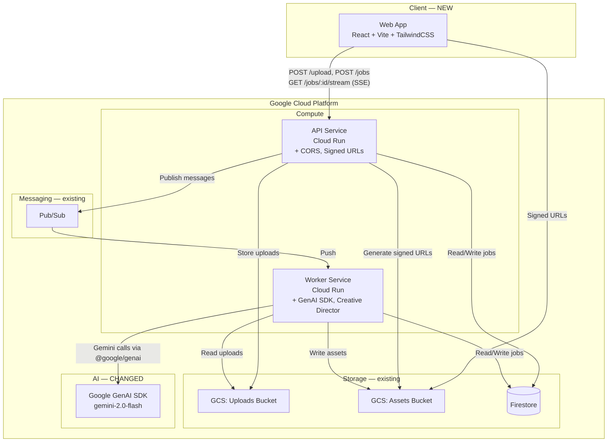
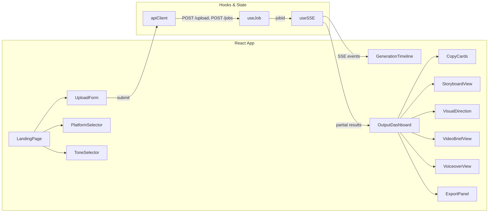

# Design Document: Content Storyteller MVP

## Overview

This design covers the product experience layer built on top of the existing GCP foundation. The foundation already provides: monorepo structure, Terraform infrastructure (Cloud Run, GCS, Firestore, Pub/Sub, IAM), Express API with routes, async Worker with pipeline stages, shared TypeScript types, deployment scripts, and CI/CD.

The MVP adds three major capabilities:

1. **Enhanced shared types** — Platform/Tone enums, CopyPackage, Storyboard, VideoBrief, ImageConcept schemas, extended CreateJobRequest/CreativeBrief/Job/StreamEventShape interfaces
2. **Enriched worker pipeline** — GenAI SDK migration (`@google/genai` replacing `@google-cloud/vertexai`), Creative Director Agent logic in ProcessInput, platform-aware and tone-aware Gemini prompts, structured output schemas for all generation stages
3. **React frontend** — Vite + TailwindCSS app with upload form, platform/tone selectors, SSE-driven generation timeline, output dashboard (copy cards, storyboard, visual direction, video brief, voiceover, on-screen text), export/download via signed URLs

The design focuses on what changes and what's new — not re-documenting existing architecture.

## Architecture

### Changes to Existing Architecture



### Key Changes from Foundation

| Area | Foundation | MVP |
|---|---|---|
| Frontend | Placeholder `index.ts` | Full React + Vite + TailwindCSS SPA |
| AI SDK | `@google-cloud/vertexai` | `@google/genai` (hackathon requirement) |
| Job creation | `uploadedMediaPaths` + `idempotencyKey` | + `promptText`, `platform`, `tone` |
| Creative Brief | Basic fields | + `platform`, `tone`, `campaignAngle`, `pacing`, `visualStyle` |
| Copy output | Unstructured JSON blob | Structured `CopyPackage` (hook, caption, CTA, hashtags, threadCopy, voiceoverScript, onScreenText) |
| Image output | Raw image prompts | Structured `ImageConcept` (conceptName, visualDirection, generationPrompt, style) |
| Video output | Basic storyboard JSON | Structured `Storyboard` + `VideoBrief` with scene pacing, motion, camera direction |
| SSE events | `state_change` only | + `partial_result` with typed partial content |
| Asset download | Direct GCS read via API | Signed URLs for direct browser download |
| CORS | None | Configurable `CORS_ORIGIN` |

### Frontend Architecture



State management uses React hooks (`useState`, `useReducer`) — no external state library needed for this scope. The `useSSE` hook manages the EventSource connection lifecycle and dispatches events to update the dashboard progressively.

## Components and Interfaces

### 1. Shared Package Changes (`packages/shared`)

#### New Enums

```typescript
// packages/shared/src/types/enums.ts
export enum Platform {
  InstagramReel = 'instagram_reel',
  LinkedInLaunchPost = 'linkedin_launch_post',
  XTwitterThread = 'x_twitter_thread',
  GeneralPromoPackage = 'general_promo_package',
}

export enum Tone {
  Cinematic = 'cinematic',
  Punchy = 'punchy',
  Sleek = 'sleek',
  Professional = 'professional',
}
```

#### New Schema Interfaces

```typescript
// packages/shared/src/schemas/copy-package.ts
export interface CopyPackage {
  hook: string;
  caption: string;
  cta: string;
  hashtags: string[];
  threadCopy: string[];
  voiceoverScript: string;
  onScreenText: string[];
}

// packages/shared/src/schemas/storyboard.ts
export interface StoryboardScene {
  sceneNumber: number;
  description: string;
  duration: string;
  motionStyle: string;
  textOverlay: string;
  cameraDirection: string;
}

export interface Storyboard {
  scenes: StoryboardScene[];
  totalDuration: string;
  pacing: string;
}

// packages/shared/src/schemas/video-brief.ts
export interface VideoBrief {
  scenes: StoryboardScene[];
  totalDuration: string;
  motionStyle: string;
  textOverlayStyle: string;
  cameraDirection: string;
  energyDirection: string;
}

// packages/shared/src/schemas/image-concept.ts
export interface ImageConcept {
  conceptName: string;
  visualDirection: string;
  generationPrompt: string;
  style: string;
}
```

#### Extended Existing Interfaces

Changes to existing interfaces (backward-compatible — all new fields are optional or have defaults):

```typescript
// Extend CreateJobRequest (packages/shared/src/types/api.ts)
export interface CreateJobRequest {
  uploadedMediaPaths: string[];
  idempotencyKey: string;
  promptText: string;           // NEW — required
  platform: Platform;           // NEW — required
  tone: Tone;                   // NEW — required
}

// Extend Job (packages/shared/src/types/job.ts)
export interface Job {
  // ... existing fields ...
  promptText?: string;          // NEW — optional for backward compat
  platform?: Platform;          // NEW — optional for backward compat
  tone?: Tone;                  // NEW — optional for backward compat
}

// Extend CreativeBrief (packages/shared/src/schemas/creative-brief.ts)
export interface CreativeBrief {
  // ... existing fields ...
  platform?: Platform;          // NEW
  tone?: Tone;                  // NEW
  campaignAngle?: string;       // NEW
  pacing?: string;              // NEW
  visualStyle?: string;         // NEW
}

// Extend StreamEventShape (packages/shared/src/types/api.ts)
export interface StreamEventShape {
  event: string;
  data: {
    jobId: string;
    state: JobState;
    assets?: AssetReference[];
    errorMessage?: string;
    timestamp: string;
    creativeBrief?: CreativeBrief;           // NEW
    partialCopy?: Partial<CopyPackage>;      // NEW
    partialStoryboard?: Partial<Storyboard>; // NEW
    partialVideoBrief?: Partial<VideoBrief>; // NEW
    partialImageConcepts?: ImageConcept[];   // NEW
  };
}

// Extend PollJobStatusResponse (packages/shared/src/types/api.ts)
export interface PollJobStatusResponse {
  // ... existing fields ...
  creativeBrief?: CreativeBrief;  // NEW
  platform?: Platform;            // NEW
  tone?: Tone;                    // NEW
}

// Extend RetrieveAssetsResponse asset references with signedUrl
// Each AssetReference in the response will include:
export interface AssetReferenceWithUrl extends AssetReference {
  signedUrl: string;              // NEW — 60-minute validity
}
```

### 2. API Service Changes

#### CORS Middleware (NEW)

```typescript
// apps/api/src/middleware/cors.ts
import cors from 'cors';
const CORS_ORIGIN = process.env.CORS_ORIGIN || '*';
export const corsMiddleware = cors({ origin: CORS_ORIGIN, credentials: true });
```

Added to the Express middleware stack in `apps/api/src/index.ts` before route handlers.

#### Enhanced Job Creation (`POST /api/v1/jobs`)

Changes to `apps/api/src/routes/jobs.ts`:
- Validate `promptText` is present and non-empty (400 if missing)
- Validate `platform` is a valid Platform enum value (400 if invalid)
- Validate `tone` is a valid Tone enum value (400 if invalid)
- Store `promptText`, `platform`, `tone` on the Job document
- Include these fields in the Pub/Sub message payload (via Job document — worker reads from Firestore)

#### Signed URL Generation (`GET /api/v1/jobs/:jobId/assets`)

Changes to `apps/api/src/routes/jobs.ts`:
- After retrieving assets, generate a signed URL for each `AssetReference.storagePath`
- Use `@google-cloud/storage` `getSignedUrl()` with `action: 'read'`, `expires: Date.now() + 60 * 60 * 1000` (60 minutes)
- Return `AssetReferenceWithUrl[]` instead of `AssetReference[]`

```typescript
// apps/api/src/services/storage.ts — new function
export async function generateSignedUrl(storagePath: string): Promise<string> {
  const bucket = storage.bucket(ASSETS_BUCKET);
  const file = bucket.file(storagePath);
  const [url] = await file.getSignedUrl({
    action: 'read',
    expires: Date.now() + 60 * 60 * 1000,
  });
  return url;
}
```

#### Enhanced SSE Streaming (`GET /api/v1/jobs/:jobId/stream`)

Changes to `apps/api/src/routes/stream.ts`:
- On `state_change` to `generating_copy` → `generating_images` transition, read the copy asset from the Job and emit `partial_result` with `partialCopy`
- On `state_change` to `generating_images` → `generating_video` transition, emit `partial_result` with `partialImageConcepts`
- On `state_change` to `generating_video` → `composing_package` transition, emit `partial_result` with `partialStoryboard` and `partialVideoBrief`
- On `state_change` to `processing_input` → `generating_copy` transition, emit `partial_result` with `creativeBrief`
- The SSE poll loop reads the Job document and checks for new assets since last poll to determine which partial results to emit

#### Enhanced Poll Endpoint (`GET /api/v1/jobs/:jobId`)

Changes to `apps/api/src/routes/jobs.ts`:
- Include `creativeBrief`, `platform`, `tone` in the `PollJobStatusResponse`

### 3. Worker Pipeline Changes

#### GenAI SDK Migration

All pipeline stages migrate from `@google-cloud/vertexai` to `@google/genai`:

```typescript
// Before (foundation):
import { VertexAI } from '@google-cloud/vertexai';
const vertexAI = new VertexAI({ project: PROJECT_ID, location: REGION });
const model = vertexAI.getGenerativeModel({ model: 'gemini-2.0-flash' });
const result = await model.generateContent({ contents: [{ role: 'user', parts }] });
const text = result.response?.candidates?.[0]?.content?.parts?.[0]?.text;

// After (MVP):
import { GoogleGenAI } from '@google/genai';
const genai = new GoogleGenAI({ apiKey: process.env.GEMINI_API_KEY });
const result = await genai.models.generateContent({
  model: 'gemini-2.0-flash',
  contents: [{ role: 'user', parts }],
});
const text = result.text;
```

The `GEMINI_API_KEY` environment variable is added to the Worker Cloud Run service. Falls back to Application Default Credentials if not set.

#### Creative Director Agent — ProcessInput Enhancement

The `ProcessInput` stage is enhanced to act as a Creative Director:

1. Read `promptText`, `platform`, `tone` from the Job document
2. Build a platform-aware prompt with structure guidance:
   - `InstagramReel` → 15-second vertical reel format, hook-first pacing
   - `LinkedInLaunchPost` → Professional long-form, thought-leadership angle
   - `XTwitterThread` → Thread format with numbered posts, punchy hooks
   - `GeneralPromoPackage` → Versatile multi-format package
3. Include tone direction in the prompt (cinematic language, punchy short-form, sleek minimal, formal professional)
4. Generate a Creative Brief with the new fields: `platform`, `tone`, `campaignAngle`, `pacing`, `visualStyle`

#### Enhanced GenerateCopy Stage

Generates a structured `CopyPackage` instead of an unstructured JSON blob:
- Prompt includes platform-specific instructions (thread copy for X/Twitter, reel captions for Instagram, etc.)
- Prompt includes tone-specific language direction
- Output is validated against the `CopyPackage` schema
- Persisted as `{jobId}/copy/{assetId}.json` in assets bucket

#### Enhanced GenerateImages Stage

Generates structured `ImageConcept[]` alongside actual image generation attempts:
- Always produces `ImageConcept` objects (creative direction) regardless of image generation capability
- If image generation is available, uses the `generationPrompt` from each concept
- Persists concepts as `{jobId}/image-concepts/{assetId}.json`
- Persists generated images as `{jobId}/images/{assetId}.png`

#### Enhanced GenerateVideo Stage

Generates structured `Storyboard` and `VideoBrief`:
- Platform-aware scene pacing (15s for Instagram, 30s for LinkedIn, etc.)
- Includes motionStyle, textOverlay, cameraDirection per scene
- VideoBrief includes energyDirection and textOverlayStyle
- Persists as `{jobId}/storyboard/{assetId}.json` and `{jobId}/video-brief/{assetId}.json`

### 4. Frontend Components (`apps/web`)

#### Project Setup

Replace the placeholder `apps/web/src/index.ts` with a full Vite + React + TailwindCSS application:

```
apps/web/
├── index.html
├── vite.config.ts
├── tailwind.config.js
├── postcss.config.js
├── src/
│   ├── main.tsx                 # React root render
│   ├── App.tsx                  # Router / main layout
│   ├── api/
│   │   └── client.ts            # API client (fetch wrapper)
│   ├── hooks/
│   │   ├── useJob.ts            # Job creation + polling
│   │   └── useSSE.ts            # SSE connection management
│   ├── components/
│   │   ├── LandingPage.tsx      # Hero + form
│   │   ├── UploadForm.tsx       # Drag-and-drop file upload
│   │   ├── PlatformSelector.tsx # Platform enum selector
│   │   ├── ToneSelector.tsx     # Tone enum selector
│   │   ├── GenerationTimeline.tsx # Pipeline stage progress
│   │   ├── OutputDashboard.tsx  # Container for all output sections
│   │   ├── CopyCards.tsx        # Hook, caption, CTA, hashtags display
│   │   ├── StoryboardView.tsx   # Scene cards
│   │   ├── VisualDirection.tsx  # ImageConcept cards
│   │   ├── VideoBriefView.tsx   # Video brief details
│   │   ├── VoiceoverView.tsx    # Voiceover script display
│   │   └── ExportPanel.tsx      # Download + copy-to-clipboard
│   └── index.css                # TailwindCSS imports
├── package.json
├── tsconfig.json
└── Dockerfile
```

#### API Client

```typescript
// apps/web/src/api/client.ts
const API_URL = import.meta.env.VITE_API_URL || '';

export async function uploadFiles(files: File[]): Promise<UploadMediaResponse[]> { ... }
export async function createJob(req: CreateJobRequest): Promise<CreateJobResponse> { ... }
export async function pollJob(jobId: string): Promise<PollJobStatusResponse> { ... }
export async function getAssets(jobId: string): Promise<RetrieveAssetsResponse> { ... }
export function createSSEConnection(jobId: string): EventSource { ... }
```

#### useSSE Hook

Manages the EventSource lifecycle:
- Opens connection to `/api/v1/jobs/:jobId/stream`
- Listens for `state_change`, `partial_result`, `complete`, `failed` events
- Dispatches parsed event data to a reducer that updates the dashboard state
- Cleans up on unmount or terminal state

#### Component Behavior

- **LandingPage**: Hero section + form. On "Generate" click: upload files → create job → navigate to generation view
- **GenerationTimeline**: Vertical timeline with 5 stages. Each stage shows pending/active/completed icon. Active stage has a pulse animation
- **OutputDashboard**: Renders sections progressively as `partial_result` events arrive. Uses skeleton loaders before data
- **CopyCards**: Card grid showing hook, caption, CTA, hashtags. Each card has a copy-to-clipboard button
- **ExportPanel**: "Download All" button fetches the asset bundle and triggers downloads via signed URLs

#### Dockerfile

Multi-stage build:
1. Stage 1: `node:18-alpine` — install deps, run `vite build`
2. Stage 2: `nginx:alpine` — copy `dist/` to nginx html dir, serve on port 8080

## Data Models

### New Types Summary

| Type | File | Purpose |
|---|---|---|
| `Platform` | `types/enums.ts` | Target platform enum (4 values) |
| `Tone` | `types/enums.ts` | Creative tone enum (4 values) |
| `CopyPackage` | `schemas/copy-package.ts` | Structured marketing copy output |
| `StoryboardScene` | `schemas/storyboard.ts` | Single scene in a storyboard |
| `Storyboard` | `schemas/storyboard.ts` | Complete storyboard with scenes |
| `VideoBrief` | `schemas/video-brief.ts` | Video production brief |
| `ImageConcept` | `schemas/image-concept.ts` | Image generation direction |
| `AssetReferenceWithUrl` | `types/api.ts` | Asset reference + signed URL |

### Extended Types Summary

| Type | New Fields | Backward Compatible |
|---|---|---|
| `CreateJobRequest` | `promptText`, `platform`, `tone` | Yes — new fields added |
| `Job` | `promptText?`, `platform?`, `tone?` | Yes — all optional |
| `CreativeBrief` | `platform?`, `tone?`, `campaignAngle?`, `pacing?`, `visualStyle?` | Yes — all optional |
| `StreamEventShape.data` | `creativeBrief?`, `partialCopy?`, `partialStoryboard?`, `partialVideoBrief?`, `partialImageConcepts?` | Yes — all optional |
| `PollJobStatusResponse` | `creativeBrief?`, `platform?`, `tone?` | Yes — all optional |

### Environment Variable Additions

| Variable | Service | Purpose |
|---|---|---|
| `GEMINI_API_KEY` | Worker | Google GenAI SDK API key |
| `CORS_ORIGIN` | API | Allowed CORS origin for frontend |
| `VITE_API_URL` | Web (build-time) | API base URL for frontend |


## Correctness Properties

*A property is a characteristic or behavior that should hold true across all valid executions of a system — essentially, a formal statement about what the system should do. Properties serve as the bridge between human-readable specifications and machine-verifiable correctness guarantees.*

### Property 1: Platform and Tone enum completeness

*For any* expected platform value in `['instagram_reel', 'linkedin_launch_post', 'x_twitter_thread', 'general_promo_package']` and any expected tone value in `['cinematic', 'punchy', 'sleek', 'professional']`, the `Platform` and `Tone` enums shall contain that value, and conversely, every value in the enum shall be one of the expected values.

**Validates: Requirements 1.1, 1.2**

### Property 2: New schema interfaces have all required fields

*For any* randomly generated instance of `CopyPackage`, `StoryboardScene`, `Storyboard`, `VideoBrief`, or `ImageConcept`, the object shall contain all fields specified in the interface definition with the correct types (strings, string arrays, numbers as appropriate).

**Validates: Requirements 3.1, 4.1, 4.2, 4.3, 5.1**

### Property 3: Extended interfaces maintain backward compatibility

*For any* valid `Job`, `CreativeBrief`, `CreateJobRequest`, `StreamEventShape`, or `PollJobStatusResponse` object created with only the foundation-era fields (no new MVP fields), the object shall still satisfy the interface type — all new fields are optional and do not break existing consumers.

**Validates: Requirements 2.4**

### Property 4: Job creation stores all creative direction fields

*For any* valid `promptText` (non-empty string), valid `Platform` enum value, valid `Tone` enum value, and non-empty `uploadedMediaPaths` array, creating a job via `POST /api/v1/jobs` shall produce a Job document in Firestore containing all four fields with state `queued`.

**Validates: Requirements 7.1, 7.4**

### Property 5: Invalid enum values rejected on job creation

*For any* string that is not a valid `Platform` enum value or not a valid `Tone` enum value, a `POST /api/v1/jobs` request containing that invalid value shall be rejected with HTTP 400 status.

**Validates: Requirements 7.3**

### Property 6: Signed URLs present on all asset references

*For any* completed job with one or more assets, a `GET /api/v1/jobs/:jobId/assets` response shall include a non-empty `signedUrl` field on every asset reference in the bundle, regardless of asset type.

**Validates: Requirements 8.1, 8.3**

### Property 7: SSE stream emits partial results for each completed stage

*For any* job that progresses through pipeline stages, the SSE stream shall emit a `partial_result` event after each content-producing stage completes (GenerateCopy → partialCopy, GenerateImages → partialImageConcepts, GenerateVideo → partialStoryboard + partialVideoBrief), and shall emit a `state_change` event for every stage transition.

**Validates: Requirements 9.1, 9.2, 9.3, 9.4**

### Property 8: CORS headers on all API responses

*For any* HTTP request to the API service (any method, any path), the response shall include `Access-Control-Allow-Origin` header matching the configured `CORS_ORIGIN` value.

**Validates: Requirements 10.2**

### Property 9: Creative Director produces platform-aware, tone-aware brief

*For any* combination of `Platform` and `Tone` enum values, the ProcessInput stage shall produce a `CreativeBrief` containing non-empty `campaignAngle`, `pacing`, and `visualStyle` fields, with the `platform` and `tone` fields matching the input values.

**Validates: Requirements 11.1, 11.2, 11.3**

### Property 10: GenerateCopy produces complete CopyPackage

*For any* valid `CreativeBrief` with a `platform` and `tone`, the GenerateCopy stage shall produce a `CopyPackage` with all required fields (hook, caption, cta, hashtags, threadCopy, voiceoverScript, onScreenText) non-empty, persist it as a JSON asset, and record an `AssetReference` with type `copy` on the Job document.

**Validates: Requirements 12.1, 12.2, 12.3, 12.4**

### Property 11: GenerateImages produces ImageConcept objects

*For any* valid `CreativeBrief`, the GenerateImages stage shall produce one or more `ImageConcept` objects each containing non-empty `conceptName`, `visualDirection`, `generationPrompt`, and `style` fields, and persist them as a JSON asset regardless of whether image generation capability is available.

**Validates: Requirements 13.1, 13.2**

### Property 12: GenerateVideo produces Storyboard and VideoBrief

*For any* valid `CreativeBrief` with a `platform`, the GenerateVideo stage shall produce a `Storyboard` with at least one scene (each scene having all required fields) and a `VideoBrief` with non-empty `totalDuration`, `motionStyle`, `textOverlayStyle`, `cameraDirection`, and `energyDirection`, and persist both as JSON assets.

**Validates: Requirements 14.1, 14.2, 14.3, 14.4**

### Property 13: Gemini model name consistency

*For any* pipeline stage that calls the GenAI SDK, the model parameter shall be `'gemini-2.0-flash'`.

**Validates: Requirements 15.3, 23.1**

### Property 14: Platform and Tone selectors render all options

*For any* value in the `Platform` enum, the PlatformSelector component shall render a corresponding selectable option. *For any* value in the `Tone` enum, the ToneSelector component shall render a corresponding selectable option.

**Validates: Requirements 16.4, 16.5**

### Property 15: Empty prompt validation prevents submission

*For any* string composed entirely of whitespace (including the empty string), attempting to submit the generation form shall be prevented and a validation message shall be displayed.

**Validates: Requirements 16.7**

### Property 16: CopyPackage rendering completeness

*For any* `CopyPackage` object, the CopyCards and related components shall render the hook, caption, CTA, hashtags, voiceover script, and on-screen text items such that all values are visible in the rendered output.

**Validates: Requirements 18.1, 18.6, 18.7**

### Property 17: Storyboard rendering completeness

*For any* `Storyboard` with one or more scenes, the StoryboardView component shall render a card for each scene showing sceneNumber, description, duration, motionStyle, and cameraDirection.

**Validates: Requirements 18.2**

### Property 18: SSE events update UI state

*For any* `state_change` SSE event, the GenerationTimeline shall update the corresponding stage indicator. *For any* `partial_result` SSE event with content data, the OutputDashboard shall reveal the corresponding content section.

**Validates: Requirements 17.3, 17.4**

### Property 19: Poll response includes creative direction fields

*For any* job that has a `creativeBrief`, `platform`, and `tone` stored on the Job document, a `GET /api/v1/jobs/:jobId` response shall include all three fields.

**Validates: Requirements 24.1, 24.2**

### Property 20: Asset action buttons present

*For any* asset reference with a `signedUrl`, the ExportPanel shall render a download button. *For any* text content field in the CopyPackage (hook, caption, cta, voiceoverScript), the corresponding component shall render a copy-to-clipboard button.

**Validates: Requirements 19.1, 19.2**

## Error Handling

### API Service — New Error Scenarios

| Error Scenario | HTTP Status | Behavior |
|---|---|---|
| Missing `promptText` on job creation | 400 Bad Request | Return `{ error: { code: 'MISSING_PROMPT', message: '...' } }` |
| Invalid `platform` value | 400 Bad Request | Return `{ error: { code: 'INVALID_PLATFORM', message: '...' } }` |
| Invalid `tone` value | 400 Bad Request | Return `{ error: { code: 'INVALID_TONE', message: '...' } }` |
| Signed URL generation failure | 500 Internal Server Error | Log error, return asset without signedUrl (graceful degradation) |
| CORS preflight failure | 403 Forbidden | Return CORS error headers |

### Worker Service — New Error Scenarios

| Error Scenario | Behavior |
|---|---|
| GenAI SDK API key missing | Fall back to Application Default Credentials; if both fail, mark job as failed |
| GenAI SDK rate limit (429) | Retry with exponential backoff (max 3 attempts), then fail stage |
| CopyPackage JSON parse failure | Use fallback structure with empty fields, log warning, continue pipeline |
| Storyboard/VideoBrief JSON parse failure | Use fallback structure with minimal scene, log warning, continue pipeline |
| ImageConcept JSON parse failure | Use fallback with generic concept, log warning, continue pipeline |

### Frontend Error Handling

| Error Scenario | Behavior |
|---|---|
| SSE connection dropped | Auto-reconnect with exponential backoff; fall back to polling via `GET /jobs/:jobId` |
| Upload failure | Display error toast, allow retry |
| Job creation failure | Display error message with details from API response |
| Signed URL expired | Re-fetch assets to get fresh signed URLs |
| Network error | Display offline indicator, queue retry |

## Testing Strategy

### Dual Testing Approach

This project uses both unit tests and property-based tests:

- **Unit tests**: Specific examples, edge cases, integration points, error conditions
- **Property-based tests**: Universal properties across randomly generated inputs

Both are complementary and necessary for comprehensive coverage.

### Property-Based Testing Configuration

**Library**: [fast-check](https://github.com/dubzzz/fast-check) (TypeScript)

**Configuration**:
- Minimum 100 iterations per property test (`numRuns: 100`)
- Each property test references its design document property via comment tag
- Tag format: `Feature: content-storyteller-mvp, Property {number}: {property_text}`
- Each correctness property is implemented by a single property-based test

### Test Categories

#### Shared Package Tests

Property tests:
- Property 1: Enum completeness — generate random indices, verify all expected values exist and no extras
- Property 2: Schema field completeness — generate random instances of each schema, verify all fields present
- Property 3: Backward compatibility — generate old-format objects, verify they satisfy new interfaces

Unit tests:
- Verify barrel exports include all new types (Platform, Tone, CopyPackage, Storyboard, VideoBrief, ImageConcept)
- Verify enum string values match expected patterns

#### API Service Tests

Property tests:
- Property 4: Job creation with creative direction — generate random valid inputs, verify Job document
- Property 5: Invalid enum rejection — generate random non-enum strings, verify 400 response
- Property 6: Signed URLs on assets — generate random completed jobs, verify signedUrl on all assets
- Property 7: SSE partial results — simulate stage completions, verify correct events emitted
- Property 8: CORS headers — generate random requests, verify headers present
- Property 19: Poll response fields — generate jobs with briefs, verify response includes them

Unit tests:
- Test missing promptText returns 400
- Test valid job creation returns 201 with jobId
- Test signed URL generation with mock GCS
- Test CORS preflight OPTIONS response
- Test SSE connection lifecycle (open, events, close)

#### Worker Pipeline Tests

Property tests:
- Property 9: Creative Director brief generation — generate random platform/tone combos, verify brief fields
- Property 10: CopyPackage generation — generate random briefs, verify all CopyPackage fields
- Property 11: ImageConcept generation — generate random briefs, verify concept fields
- Property 12: Storyboard/VideoBrief generation — generate random briefs, verify all fields
- Property 13: Model name consistency — verify all SDK calls use gemini-2.0-flash

Unit tests:
- Test ProcessInput reads promptText/platform/tone from Job
- Test GenerateCopy produces valid JSON
- Test GenerateImages produces concepts even when capability unavailable
- Test GenerateVideo produces both Storyboard and VideoBrief
- Test GenAI SDK initialization with API key
- Test fallback JSON parsing when Gemini returns malformed output

#### Frontend Tests

Property tests:
- Property 14: Selector option completeness — verify all enum values have corresponding options
- Property 15: Empty prompt validation — generate whitespace strings, verify rejection
- Property 16: CopyPackage rendering — generate random CopyPackages, verify all fields rendered
- Property 17: Storyboard rendering — generate random Storyboards, verify scene cards
- Property 18: SSE event UI updates — generate random events, verify UI state changes
- Property 20: Action buttons — generate random assets/text, verify buttons present

Unit tests:
- Test LandingPage renders hero and form
- Test UploadForm drag-and-drop interaction
- Test GenerationTimeline stage indicators
- Test OutputDashboard progressive reveal
- Test ExportPanel download all button
- Test API client functions with mock fetch
