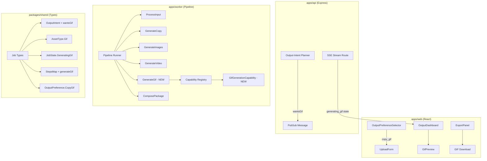

# Design Document: LinkedIn GIF Generator

## Overview

This feature extends Content Storyteller with animated GIF output support optimized for LinkedIn. Users upload an image (workflow diagram, architecture chart, UI screenshot, etc.) and receive a short looping animated GIF alongside LinkedIn-ready post copy, hashtags, and CTA. The feature integrates into the existing batch-mode pipeline by adding a new `GenerateGif` pipeline stage, extending the `OutputIntent` with a `wantsGif` flag, registering a `gif_generation` capability, and updating the frontend to preview and export GIF assets.

The design follows the established patterns: the output-intent planner resolves intent flags, the pipeline runner conditionally executes stages, capabilities check availability before generation, and the SSE stream delivers partial results to the frontend.

## Architecture

The GIF generation feature touches four layers of the monorepo:



Execution order within the pipeline runner:

```
ProcessInput → GenerateCopy → GenerateImages → GenerateVideo → GenerateGif → ComposePackage
```

The `GenerateGif` stage runs after copy (so it can reference the creative brief) and after images/video (so it doesn't block them). It runs before `ComposePackage` so the GIF asset is included in the final bundle.

## Components and Interfaces

### 1. Shared Types Extension (`packages/shared/src/types/job.ts`)

Add to existing enums and interfaces:

- `AssetType.Gif = 'gif'`
- `JobState.GeneratingGif = 'generating_gif'`
- `OutputPreference.CopyGif = 'copy_gif'`
- `OutputIntent.wantsGif: boolean`
- `StepsMap.generateGif: StepMetadata`

### 2. GIF Style Preset Type (`packages/shared/src/types/gif.ts`)

New file defining GIF-specific types:

```typescript
export type GifStylePreset =
  | 'diagram_pulse'
  | 'workflow_step_highlight'
  | 'zoom_pan_explainer'
  | 'feature_spotlight'
  | 'text_callout_animation'
  | 'process_flow_reveal'
  | 'before_after_comparison';

export type ImageClassification =
  | 'diagram'
  | 'workflow'
  | 'ui_screenshot'
  | 'chart'
  | 'infographic'
  | 'other';

export interface GifMotionConcept {
  stylePreset: GifStylePreset;
  imageClassification: ImageClassification;
  motionDescription: string;
  focusRegions: string[];
  suggestedDurationMs: number;
}

export interface GifStoryboardBeat {
  beatNumber: number;
  description: string;
  durationMs: number;
  motionType: string;
  focusArea: string;
}

export interface GifStoryboard {
  beats: GifStoryboardBeat[];
  totalDurationMs: number;
  loopStrategy: 'seamless' | 'bounce' | 'restart';
  stylePreset: GifStylePreset;
}

export interface GifAssetMetadata {
  url: string;
  mimeType: 'image/gif';
  width: number;
  height: number;
  durationMs: number;
  loop: boolean;
  fileSizeBytes: number;
  posterImageUrl?: string;
}
```

### 3. Output-Intent Planner Extension (`apps/api/src/services/planner/output-intent.ts`)

Extend `resolveOutputIntent()`:

- Add `wantsGif: false` to `createBaseIntent()`.
- In the explicit preference branch, handle `OutputPreference.CopyGif`: set `wantsGif = true`, `wantsVideo = false`, `wantsImage = false`.
- In the `FullPackage` case, also set `wantsGif = true`.
- In the prompt keyword scanning section, add a regex for GIF keywords: `/\b(gif|looping animation|animated explainer|linkedin gif|motion graphic|animated workflow)\b/i`. When matched, set `wantsGif = true` and ensure `wantsVideo` is NOT set to true unless explicit video keywords are also present.

### 4. GIF Generation Capability (`apps/worker/src/capabilities/gif-generation.ts`)

New class `GifGenerationCapability` implementing `GenerationCapability`:

- `name = 'gif_generation'`
- `isAvailable()`: checks GCP credentials and Veo API access (same pattern as `VideoGenerationCapability`).
- `generate(input)`: accepts `GenerationInput` with uploaded image path, motion concept, and storyboard. Calls the `videoFast` model slot to render a short animation, then converts the MP4 output to GIF format using ffmpeg or a GIF encoding library.

### 5. GIF Pipeline Stage (`apps/worker/src/pipeline/generate-gif.ts`)

New class `GenerateGif` implementing `PipelineStage`:

- `name = 'GenerateGif'`
- `jobState = JobState.GeneratingGif`
- `execute(context)`:
  1. Analyze uploaded image using multimodal model to classify image type and extract focus regions.
  2. Select `GifStylePreset` based on classification (diagram → `workflow_step_highlight`, UI screenshot → `feature_spotlight`, chart → `text_callout_animation`, other → `zoom_pan_explainer`).
  3. Generate motion concept using text model.
  4. Build storyboard of 3–6 beats.
  5. Check `gif_generation` capability availability.
  6. If available: render via `videoFast` slot, convert to GIF, persist to `{jobId}/gifs/{assetId}.gif`, record `AssetReference` with `AssetType.Gif`.
  7. If unavailable: record `FallbackNotice`, persist motion concept + storyboard as creative direction JSON assets.
  8. If GIF conversion fails but MP4 succeeds: return MP4 with warning.

### 6. Pipeline Runner Extension (`apps/worker/src/pipeline/pipeline-runner.ts`)

Add a new `StageConfig` entry for `GenerateGif`:

```typescript
{ stage: new GenerateGif(), stepsKey: 'generateGif', intentKey: 'wantsGif', critical: false }
```

Insert it after `GenerateVideo` and before `ComposePackage` in the `STAGE_CONFIGS` array.

### 7. Capability Registry Extension (`apps/worker/src/capabilities/capability-registry.ts`)

Register `GifGenerationCapability` in the `init()` method alongside image and video capabilities.

### 8. Frontend: OutputPreferenceSelector Extension (`apps/web/src/components/OutputPreferenceSelector.tsx`)

Add a new option to `OUTPUT_PREFERENCE_OPTIONS`:

```typescript
{
  value: OutputPreference.CopyGif,
  label: 'Copy + GIF',
  description: 'Text with animated GIF explainer',
  icon: /* animated/GIF icon SVG */,
}
```

### 9. Frontend: GIF Preview Component (`apps/web/src/components/GifPreview.tsx`)

New component that renders an inline `` tag for the GIF (auto-loops natively) with associated copy, hashtags, and CTA displayed alongside.

### 10. Frontend: OutputDashboard Extension (`apps/web/src/components/OutputDashboard.tsx`)

- Add `gifAsset?: GifAssetMetadata | null` to `OutputDashboardProps`.
- Render `GifPreview` when a GIF asset is present.
- Skip GIF skeleton when `"gif"` is in `skippedOutputs`.

### 11. Frontend: ExportPanel Extension (`apps/web/src/components/ExportPanel.tsx`)

- Add `'gif'` to the `assetLabel` map with label `'GIF'`.
- No other changes needed — the existing `AssetRow` component handles download links generically.

### 12. SSE Stream Extension (`apps/api/src/routes/stream.ts`)

- Add a partial result emission for the `GeneratingGif → ComposingPackage` transition that reads and sends the GIF asset metadata.
- The existing `state_change` event already emits all state transitions, so `generating_gif` will be included automatically once `JobState.GeneratingGif` exists.

## Data Models

### Extended OutputIntent

```typescript
export interface OutputIntent {
  wantsCopy: boolean;
  wantsHashtags: boolean;
  wantsImage: boolean;
  wantsVideo: boolean;
  wantsStoryboard: boolean;
  wantsVoiceover: boolean;
  wantsCarousel: boolean;
  wantsThread: boolean;
  wantsLinkedInPost: boolean;
  wantsGif: boolean;  // NEW
}
```

### Extended StepsMap

```typescript
export interface StepsMap {
  processInput: StepMetadata;
  generateCopy: StepMetadata;
  generateImages: StepMetadata;
  generateVideo: StepMetadata;
  generateGif: StepMetadata;  // NEW
  composePackage: StepMetadata;
}
```

### Extended Enums

```typescript
export enum JobState {
  // ... existing values ...
  GeneratingGif = 'generating_gif',  // NEW
}

export enum AssetType {
  // ... existing values ...
  Gif = 'gif',  // NEW
}

export enum OutputPreference {
  // ... existing values ...
  CopyGif = 'copy_gif',  // NEW
}
```

### GIF Asset Storage Path Convention

```
{jobId}/gifs/{assetId}.gif          — final GIF output
{jobId}/gif-motion-concept/{id}.json — motion concept fallback
{jobId}/gif-storyboard/{id}.json    — storyboard fallback
{jobId}/gif-intermediate/{id}.mp4   — intermediate MP4 (fallback when GIF conversion fails)
```


## Correctness Properties

*A property is a characteristic or behavior that should hold true across all valid executions of a system — essentially, a formal statement about what the system should do. Properties serve as the bridge between human-readable specifications and machine-verifiable correctness guarantees.*

### Property 1: GIF keyword detection sets correct intent flags

*For any* prompt string containing at least one GIF keyword ("gif", "looping animation", "animated explainer", "linkedin gif", "motion graphic", "animated workflow") but no video keywords ("video", "reel", "teaser", "promo clip"), the resolved `OutputIntent` should have `wantsGif === true` and `wantsVideo === false`.

**Validates: Requirements 1.2, 1.7**

### Property 2: Output preference to intent mapping

*For any* valid `PlannerInput` with `outputPreference` set to `CopyGif`, the resolved `OutputIntent` should have `wantsGif === true`, `wantsVideo === false`, and `wantsImage === false`. For `FullPackage`, the resolved intent should have `wantsGif === true` in addition to `wantsImage === true` and `wantsVideo === true`.

**Validates: Requirements 1.3, 1.4**

### Property 3: Conditional stage execution based on OutputIntent

*For any* `OutputIntent` configuration, the pipeline runner should execute a stage if and only if its corresponding intent flag is true (or the stage has no intent key, meaning it always runs). Specifically, when `wantsGif` is true and `wantsVideo` is false, `GenerateGif` should execute and `GenerateVideo` should be skipped. When a stage is skipped, its step status should be recorded as `"skipped"`.

**Validates: Requirements 1.5, 1.6, 6.1, 6.2, 10.2, 10.3**

### Property 4: Image classification to GIF style preset mapping

*For any* image classification value, the selected `GifStylePreset` should match the defined mapping: `"diagram"` or `"workflow"` → `"workflow_step_highlight"`, `"ui_screenshot"` → `"feature_spotlight"`, `"chart"` or `"infographic"` → `"text_callout_animation"`, `"other"` → `"zoom_pan_explainer"`.

**Validates: Requirements 3.2, 3.3, 3.4, 3.5**

### Property 5: GIF style preset validity

*For any* GIF generation execution, the selected style preset should be one of the seven valid values: `"diagram_pulse"`, `"workflow_step_highlight"`, `"zoom_pan_explainer"`, `"feature_spotlight"`, `"text_callout_animation"`, `"process_flow_reveal"`, `"before_after_comparison"`.

**Validates: Requirements 3.1**

### Property 6: GIF storyboard beat count invariant

*For any* valid GIF storyboard produced by the `GenerateGif` stage, the number of beats should be between 3 and 6 inclusive.

**Validates: Requirements 2.3**

### Property 7: GIF output duration and size constraints

*For any* completed GIF asset, the duration should be under 10,000 milliseconds and the file size should be under 5,242,880 bytes (5 MB).

**Validates: Requirements 2.9**

### Property 8: GIF storage path format

*For any* jobId and assetId, the GIF asset storage path should match the pattern `{jobId}/gifs/{assetId}.gif`.

**Validates: Requirements 2.6**

### Property 9: LinkedIn GIF copy structure

*For any* copy generated when `wantsGif` is true and the platform is `LinkedInLaunchPost`, the `CopyPackage` should contain a non-empty hook string and a caption with a word count between 50 and 200 inclusive.

**Validates: Requirements 7.1, 7.2**

### Property 10: GIF hashtag count bounds

*For any* copy generated when `wantsGif` is true, the hashtags array should contain between 3 and 8 elements inclusive.

**Validates: Requirements 7.3**

### Property 11: LinkedIn GIF copy includes required output fields

*For any* pipeline execution where `wantsGif` is true and the platform is `LinkedInLaunchPost`, the generated copy should include a hook, caption, CTA, and hashtags — the GIF pipeline should not suppress or replace the copy generation.

**Validates: Requirements 6.3**

## Error Handling

### GIF Generation Failure (Non-Critical)

The `GenerateGif` stage is configured as `critical: false` in the pipeline runner. If it fails:

1. The pipeline runner catches the error, records a `JobWarning` with severity `"warning"`.
2. The step metadata is updated to `status: "failed"` with the error message.
3. The pipeline continues to `ComposePackage` — the job completes with partial results.
4. The frontend displays a warning indicator but still shows copy and any other generated assets.

### GIF Conversion Failure with MP4 Fallback

If the `videoFast` model returns a valid MP4 but GIF conversion fails:

1. The stage persists the MP4 to `{jobId}/gif-intermediate/{assetId}.mp4`.
2. A `FallbackNotice` is recorded with `capability: 'gif_generation'` and reason describing the conversion failure.
3. The MP4 asset is recorded with `AssetType.Video` (not `Gif`) so the frontend can still display it.
4. The stage returns `{ success: true }` with a warning — it does not fail the stage.

### Capability Unavailable

If `gif_generation.isAvailable()` returns false:

1. The stage persists the motion concept and storyboard as JSON creative direction assets.
2. A `FallbackNotice` is recorded.
3. The stage returns `{ success: true }` — creative direction is still valuable output.

### Invalid Image Classification

If the multimodal model fails to classify the uploaded image:

1. The stage defaults to `ImageClassification = 'other'` and `GifStylePreset = 'zoom_pan_explainer'`.
2. A warning is logged but the stage continues.

### Storyboard Validation Failure

If the AI-generated storyboard has fewer than 3 or more than 6 beats:

1. The validation function clamps the beat count: truncates to 6 if too many, pads with default beats if fewer than 3.
2. A warning is logged about the adjustment.

## Testing Strategy

### Property-Based Testing

Use `fast-check` (already used in the project) for property-based tests. Each property test runs a minimum of 100 iterations.

Property tests target the pure, deterministic logic:

- **Output-intent planner**: Properties 1, 2 — generate random prompts with/without GIF keywords, random platforms, tones, and preferences. Verify intent flag correctness.
- **Conditional execution logic**: Property 3 — generate random `OutputIntent` configurations and verify stage execution/skip decisions.
- **Classification-to-preset mapping**: Properties 4, 5 — generate random `ImageClassification` values and verify preset selection.
- **Storyboard validation**: Property 6 — generate random beat arrays and verify the validation function clamps to 3–6.
- **GIF metadata constraints**: Property 7 — generate random GIF metadata and verify duration/size bounds.
- **Storage path format**: Property 8 — generate random jobId/assetId strings and verify path format.
- **Copy structure**: Properties 9, 10, 11 — generate random `CopyPackage` outputs and verify field presence and bounds.

Each test must be tagged with a comment:
```
// Feature: linkedin-gif-generator, Property {N}: {title}
```

### Unit Testing

Unit tests cover specific examples, edge cases, and integration points:

- **Output-intent planner**: Verify specific keyword matches (e.g., "make me a gif" → wantsGif=true). Verify CopyGif preference mapping. Verify FullPackage includes wantsGif.
- **Pipeline runner**: Verify stage ordering (GenerateGif after GenerateVideo, before ComposePackage). Verify non-critical failure handling.
- **GIF pipeline stage**: Verify fallback behavior when capability is unavailable. Verify MP4 fallback when GIF conversion fails.
- **Frontend components**: Verify OutputPreferenceSelector renders "Copy + GIF" option. Verify OutputDashboard renders GIF preview. Verify ExportPanel includes GIF in asset list. Verify GIF section is hidden when skipped.
- **Schema**: Verify AssetType.Gif, JobState.GeneratingGif, OutputPreference.CopyGif enum values exist.
- **SSE stream**: Verify generating_gif state transitions emit state_change events.

### Test File Locations

- `packages/shared/src/__tests__/gif-types.unit.test.ts` — schema/enum tests
- `packages/shared/src/__tests__/gif-types.property.test.ts` — type constraint properties
- `apps/api/src/__tests__/gif-intent.unit.test.ts` — planner unit tests
- `apps/api/src/__tests__/gif-intent.property.test.ts` — planner property tests (Properties 1, 2)
- `apps/worker/src/__tests__/gif-pipeline.unit.test.ts` — pipeline stage unit tests
- `apps/worker/src/__tests__/gif-pipeline.property.test.ts` — pipeline property tests (Properties 3, 4, 5, 6, 7, 8)
- `apps/web/src/__tests__/gif-frontend.unit.test.tsx` — frontend component tests
- `apps/web/src/__tests__/gif-frontend.property.test.tsx` — frontend property tests (Properties 9, 10, 11)
