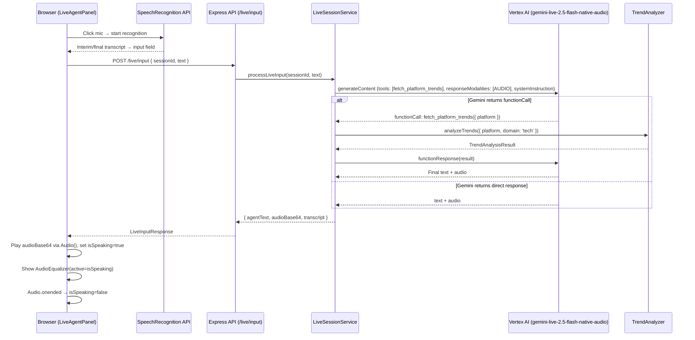

# Design Document: Live Agent Voice Assistant

## Overview

This design upgrades the existing text-based Live Agent Mode into a voice-enabled assistant with Vertex AI function calling, native audio output, browser speech recognition, and a reactive audio equalizer. The core change on the backend is replacing the current keyword-detection approach in `live-session.ts` with Vertex AI's native tool-use (function calling) so Gemini autonomously decides when to invoke `fetch_platform_trends`. On the frontend, the `LiveAgentPanel` gains real speech-to-text input via the browser `SpeechRecognition` API, automatic audio playback of Gemini's native audio responses, and an animated equalizer component that visualizes the AI speaking state.

The architecture keeps the existing REST request/response pattern (no WebSocket upgrade needed) — each `/api/v1/live/input` call may now return an optional `audioBase64` field alongside the text transcript. The `gemini-live-2.5-flash-native-audio` model is already registered in the Model Router under the `live` capability slot.

## Architecture



## Components and Interfaces

### Backend Components

#### 1. Function Declaration (`live-session.ts`)

A `FETCH_TRENDS_TOOL` constant defines the Vertex AI function declaration:

```typescript
const FETCH_TRENDS_TOOL = {
  functionDeclarations: [{
    name: 'fetch_platform_trends',
    description: 'Fetch current trending topics for a given social media platform.',
    parameters: {
      type: 'object',
      properties: {
        platform: {
          type: 'string',
          description: 'Target platform: instagram_reels, x_twitter, linkedin, or all_platforms',
        },
      },
      required: ['platform'],
    },
  }],
};
```

#### 2. System Instruction Constant

```typescript
const LIVE_AGENT_SYSTEM_INSTRUCTION =
  'You are an AI Creative Director. If a user asks for current trends, ' +
  'ask them which platform they want. Then, use the fetch_platform_trends tool. ' +
  'While waiting for the tool, inform the user you are fetching the data.';
```

#### 3. Updated `generateAgentResponse` function

Replaces the current simple `generateContent` call with a multi-turn tool-use loop:

- Sends the conversation with `tools`, `systemInstruction`, and `generationConfig: { responseModalities: ['AUDIO', 'TEXT'] }`.
- Checks if the response contains a `functionCall` part.
- If yes: executes `analyzeTrends`, feeds result back as `functionResponse`, extracts final response.
- If no: extracts text and audio directly.
- Returns `{ agentText: string; audioBase64: string | null }`.

#### 4. Updated `processLiveInput` function

- Removes the current `detectTrendKeywords` heuristic approach.
- Delegates entirely to the updated `generateAgentResponse` which handles tool calls.
- Returns `{ agentText, audioBase64, transcript }`.

#### 5. Updated Live Route (`live.ts`)

The `/input` endpoint response shape adds `audioBase64: string | null` to `LiveInputResponse`.

### Frontend Components

#### 6. `AudioEqualizer` component (new file: `AudioEqualizer.tsx`)

```typescript
interface AudioEqualizerProps {
  active: boolean;
}
```

- Renders 4–5 `div` bars with CSS `@keyframes equalizerBounce` animation.
- Each bar has a staggered `animation-delay`.
- Uses `brand-500`/`brand-400` colors from the existing palette.
- `animation-play-state` toggles between `running` and `paused` based on `active` prop.
- Compact size: ~24–32px height.

#### 7. Updated `LiveAgentPanel.tsx`

New state:
- `isSpeaking: boolean` — tracks audio playback.
- `speechSupported: boolean` — detected on mount via `window.SpeechRecognition || window.webkitSpeechRecognition`.

New behavior:
- Mic button: starts/stops `SpeechRecognition`, pipes interim results to `inputText`, final result replaces `inputText`.
- On receiving `audioBase64`: creates `Audio` from data URI, plays it, sets `isSpeaking=true`, listens for `onended` to set `isSpeaking=false`.
- Renders `<AudioEqualizer active={isSpeaking} />` inside/adjacent to the latest agent chat bubble.

### Shared Types

#### 8. Updated `LiveInputResponse` (in `packages/shared/src/types/live-session.ts`)

```typescript
export interface LiveInputResponse {
  sessionId: string;
  agentText: string;
  audioBase64: string | null;  // NEW — base64-encoded audio or null
  transcript: TranscriptEntry[];
}
```

## Data Models

### Modified Types

| Type | Change | Location |
|------|--------|----------|
| `LiveInputResponse` | Add `audioBase64: string \| null` field | `packages/shared/src/types/live-session.ts` |

### New Constants (Backend)

| Constant | Purpose | Location |
|----------|---------|----------|
| `FETCH_TRENDS_TOOL` | Vertex AI function declaration for `fetch_platform_trends` | `apps/api/src/services/live-session.ts` |
| `LIVE_AGENT_SYSTEM_INSTRUCTION` | System prompt for the AI Creative Director workflow | `apps/api/src/services/live-session.ts` |

### New Component

| Component | Props | Location |
|-----------|-------|----------|
| `AudioEqualizer` | `{ active: boolean }` | `apps/web/src/components/AudioEqualizer.tsx` |

### AlloyDB Impact

No schema changes. The existing `tool_invocations` table already supports recording `fetch_platform_trends` calls via `recordToolInvocation`. The `tool_name` column will now contain `'fetch_platform_trends'` (previously `'analyzeTrends'`).


## Correctness Properties

*A property is a characteristic or behavior that should hold true across all valid executions of a system — essentially, a formal statement about what the system should do. Properties serve as the bridge between human-readable specifications and machine-verifiable correctness guarantees.*

### Property 1: Tool declaration is always present

*For any* user input text and conversation history passed to `generateAgentResponse`, the Gemini generation request SHALL always include a `tools` array containing a function declaration named `fetch_platform_trends`.

**Validates: Requirements 1.1**

### Property 2: Tool argument forwarding

*For any* Gemini function-call response containing a `fetch_platform_trends` call with a `platform` argument, the Live_Session_Service SHALL invoke `analyzeTrends` with that exact platform value and `domain` set to `'tech'`.

**Validates: Requirements 2.1, 2.2**

### Property 3: Tool execution round-trip

*For any* successful `analyzeTrends` result, the Live_Session_Service SHALL feed the JSON-serialized result back to Gemini as a `functionResponse` part and extract a final text response from the subsequent Gemini reply.

**Validates: Requirements 2.3, 2.4**

### Property 4: Tool invocation recording

*For any* tool invocation (successful or failed), the Live_Session_Service SHALL call `recordToolInvocation` with the tool name `'fetch_platform_trends'`, the input parameters, the output result (or error), and the correct status string (`'completed'` or `'failed'`).

**Validates: Requirements 2.6**

### Property 5: System instruction invariant

*For any* Gemini generation request made by the live agent, the request SHALL include the system instruction text containing the AI Creative Director directive, and this instruction SHALL be positioned before the conversation content.

**Validates: Requirements 3.1, 3.2, 3.3**

### Property 6: Audio modality in request configuration

*For any* Gemini generation request made by the live agent, the `generationConfig.responseModalities` SHALL include `'AUDIO'`.

**Validates: Requirements 4.1**

### Property 7: Audio extraction and response shape

*For any* Gemini response containing inline audio data, the `LiveInputResponse` SHALL include a non-null `audioBase64` string. *For any* Gemini response without audio data, `audioBase64` SHALL be `null` while `agentText` remains populated.

**Validates: Requirements 4.3, 4.4, 4.5**

### Property 8: Speech recognition updates input field

*For any* speech recognition result (interim or final) produced by the browser SpeechRecognition API, the Live_Agent_Panel input field value SHALL reflect the transcribed text.

**Validates: Requirements 5.2, 5.3**

### Property 9: isSpeaking tracks audio lifecycle

*For any* non-null `audioBase64` response, when the Audio object begins playback `isSpeaking` SHALL be `true`, and when the Audio object fires `onended`, `isSpeaking` SHALL be `false`. If playback fails, `isSpeaking` SHALL also be `false`.

**Validates: Requirements 6.1, 6.2, 6.3, 6.4**

### Property 10: Equalizer bars have distinct animation delays

*For any* rendered `AudioEqualizer` component, each bar element SHALL have a unique `animation-delay` value, ensuring independent movement.

**Validates: Requirements 7.3**

### Property 11: Equalizer active prop controls animation state

*For any* boolean value of the `active` prop, the `AudioEqualizer` bars SHALL have `animation-play-state` set to `'running'` when `active` is `true` and `'paused'` when `active` is `false`.

**Validates: Requirements 7.4, 7.5, 8.3**

## Error Handling

| Scenario | Handling Strategy |
|----------|-------------------|
| `analyzeTrends` throws during tool execution | Feed error message as `functionResponse` to Gemini; let Gemini generate a graceful fallback. Record failed invocation to AlloyDB. |
| Gemini returns no audio data | Return `audioBase64: null` in response; frontend skips audio playback, shows text only. |
| Audio playback blocked by browser autoplay policy | Catch `.play()` rejection, set `isSpeaking=false`, continue showing text response. |
| Browser does not support SpeechRecognition | Detect on mount, set `speechSupported=false`, show info message, mic button disabled or hidden. |
| Gemini model unavailable (ModelUnavailableError) | Existing 503 response handling in `live.ts` route — no change needed. |
| SpeechRecognition `onerror` fires | Stop recognition, set `isRecording=false`, show error message, allow user to type instead. |
| Tool execution timeout | Use existing `analyzeTrends` timeout behavior; if it takes too long, the error path feeds an error to Gemini. |

## Testing Strategy

### Property-Based Testing

Library: **fast-check** (already used in the project for property-based tests).

Each correctness property maps to a single property-based test with a minimum of 100 iterations. Tests are tagged with the format:

```
Feature: live-agent-voice-assistant, Property {N}: {title}
```

Backend property tests (in `apps/api/src/__tests__/`):
- Properties 1–7 test the `live-session.ts` service and `live.ts` route logic.
- Mock the Gemini SDK (`@google/genai`) to return controlled function-call and audio responses.
- Use fast-check arbitraries to generate random platform values, conversation histories, and trend results.

Frontend property tests (in `apps/web/src/__tests__/`):
- Properties 8–11 test the `LiveAgentPanel` and `AudioEqualizer` components.
- Mock `SpeechRecognition` API and `Audio` constructor.
- Use fast-check to generate random transcription strings, boolean active states, and audio base64 payloads.

### Unit Testing

Unit tests complement property tests for specific examples and edge cases:

- Tool declaration structure matches expected schema (Req 1.2, 1.3).
- System instruction contains exact directive text (Req 3.2).
- Model resolved from `live` slot is `gemini-live-2.5-flash-native-audio` (Req 4.2).
- Mic button click starts/stops SpeechRecognition (Req 5.1, 5.4).
- Browser without SpeechRecognition shows fallback message (Req 5.5).
- AudioEqualizer renders 4–5 bars (Req 7.1).
- AudioEqualizer is rendered inside agent chat bubble (Req 8.1).
- AudioEqualizer receives `isSpeaking` as `active` prop (Req 8.2).
- Audio playback failure sets `isSpeaking=false` (Req 6.4).
- Tool execution failure records to AlloyDB with status `'failed'` (Req 2.5).
