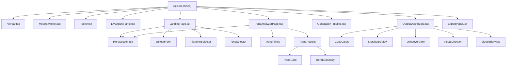

# Design Document: Premium UI Redesign

## Overview

This design covers a purely visual upgrade of the Content Storyteller web application from its current functional-but-basic UI to a premium AI SaaS aesthetic. The redesign touches every user-facing surface — the design token system, global layout shell (Navbar, Footer, ModeSwitcher), and all three mode pages (Batch, Live Agent, Trend Analyzer) plus the output/results views.

The core architectural constraint is **zero functional changes**: all existing hooks (`useJob`, `useSSE`), API calls (`client.ts`), state management, and data flow remain untouched. The redesign is implemented entirely through:

1. Extended Tailwind design tokens (`tailwind.config.js`)
2. Updated CSS component classes (`index.css`)
3. Revised JSX markup and Tailwind utility classes in existing components
4. One new shared component (`HeroSection` — already exists, will be enhanced)

No new routes, no new API endpoints, no new data models, no new npm dependencies.

### Key Design Decisions

- **Tailwind-only approach**: All styling is expressed through Tailwind utilities and `@apply`-based component classes. No CSS-in-JS, no external CSS frameworks.
- **In-place component upgrades**: Existing component files are modified rather than creating parallel "premium" versions. This avoids import path changes and keeps the component tree identical.
- **Desktop-first responsive**: The premium layout targets `lg` (1024px+) as the primary breakpoint, with graceful single-column collapse below that.
- **No external assets**: No web fonts, icon libraries, or image assets are added. All icons remain inline SVG. This preserves current load performance.

## Architecture

The redesign does not change the application architecture. The existing component tree and data flow are preserved:



### Change Scope by Layer

| Layer | Files Modified | Nature of Change |
|-------|---------------|-----------------|
| Design Tokens | `tailwind.config.js` | Add shadow utilities, gradient-nav, surface tints |
| CSS Components | `index.css` | Refine existing classes, add new shadow/gradient utilities |
| Layout Shell | `App.tsx`, `Navbar.tsx`, `Footer.tsx`, `ModeSwitcher.tsx` | Replace inline header/footer with component-based layout |
| Shared Components | `HeroSection.tsx` | Already exists — minor refinements only |
| Page Components | `LandingPage.tsx`, `LiveAgentPanel.tsx`, `TrendAnalyzerPage.tsx` | Markup/class updates for premium styling |
| Output Components | `OutputDashboard.tsx`, `GenerationTimeline.tsx`, `ExportPanel.tsx`, `CopyCards.tsx`, `StoryboardView.tsx`, `VoiceoverView.tsx`, `VisualDirection.tsx`, `VideoBriefView.tsx` | Class updates for card styling, animations |
| Form Components | `UploadForm.tsx`, `PlatformSelector.tsx`, `ToneSelector.tsx`, `TrendFilters.tsx`, `TrendCard.tsx` | Already premium-styled — minimal changes |

## Components and Interfaces

### Modified Components

#### 1. Design Token Layer

**`tailwind.config.js`** — Extended theme configuration:

```typescript
// New additions to theme.extend
{
  colors: {
    // Existing brand-50..900 and navy-800..900 preserved
    surface: {
      tint: 'rgba(139, 92, 246, 0.04)', // brand-500 at 4% for subtle tints
    },
  },
  boxShadow: {
    'brand-sm': '0 1px 2px rgba(139, 92, 246, 0.08)',
    'brand-md': '0 4px 12px rgba(139, 92, 246, 0.15)',
    'card': '0 1px 3px rgba(0, 0, 0, 0.04), 0 1px 2px rgba(0, 0, 0, 0.06)',
  },
  backgroundImage: {
    // Existing gradients preserved
    'gradient-nav': 'linear-gradient(180deg, rgba(255,255,255,0.95) 0%, rgba(255,255,255,0.85) 100%)',
  },
}
```

**`index.css`** — CSS component class refinements:

The existing classes (`.card`, `.btn-primary`, `.pill-brand`, etc.) are already well-defined. Minor refinements:
- Add `.shadow-card` utility usage to `.card` base
- Ensure `.section-lavender` uses the surface tint token
- No new component classes needed — the existing set covers all requirements

#### 2. Layout Shell (`App.tsx`)

Current state: `App.tsx` renders an inline `<header>` and `<footer>` with basic styling.

Target state: Replace inline header/footer with the `Navbar` and `Footer` components. Integrate `ModeSwitcher` as a standalone centered element below the navbar on landing view.

```typescript
// Props passed to Navbar
interface NavbarProps {
  onLogoClick: () => void;       // Navigate to landing
  showNewProject?: boolean;       // Show "New Project" button
  onNewProject?: () => void;      // Handle new project click
}

// Props passed to ModeSwitcher (unchanged)
interface ModeSwitcherProps {
  mode: AppMode;
  onModeChange: (mode: AppMode) => void;
}

// Footer takes no props (unchanged)
```

Layout structure:
```
<div className="min-h-screen flex flex-col bg-gradient-to-br from-gray-50 to-gray-100">
  <Navbar ... />
  {view === 'landing' && <ModeSwitcher ... />}
  <main className="flex-1">
    {/* mode/view content */}
  </main>
  <Footer />
</div>
```

#### 3. Navbar (`Navbar.tsx`)

Already implemented with premium styling. The component currently renders:
- Sticky `top-0 z-50` with `bg-white/80 backdrop-blur-lg`
- Logo with gradient icon + bold text
- Hidden nav links on `< md`
- Sign In + Get Started CTA
- Conditional "New Project" button

No interface changes needed. The `App.tsx` integration is the main change — passing the correct props.

#### 4. Footer (`Footer.tsx`)

Already implemented with premium styling:
- Dark navy background (`bg-navy-900`)
- 4-column link grid (2 cols mobile, 4 cols md+)
- Bottom bar with logo, attribution, social icons
- Hover transitions on links and icons

No interface changes needed.

#### 5. ModeSwitcher (`ModeSwitcher.tsx`)

Already implemented with premium pill styling:
- `rounded-full bg-gray-100 p-1` container
- Gradient active state (`bg-gradient-brand text-white shadow-md`)
- Icons + labels for each mode

No interface changes needed. The main change is in `App.tsx` — replacing the inline toggle buttons with this component.

#### 6. Landing Page — Home View

When `mode === 'batch'` and no trend/live prefill is active, the landing page should show a homepage with:
- Hero section (already rendered via `HeroSection`)
- "Three Powerful Modes" feature cards section
- Process steps section (1-2-3-4)
- Stats section (gradient numbers)
- Testimonials section

This content is added to `LandingPage.tsx` below the existing batch mode form, or rendered conditionally as a homepage view in `App.tsx`.

**Design decision**: Add the homepage sections as static content within the existing landing flow. The batch mode form is the primary CTA destination, so the homepage content wraps around it.

#### 7. Batch Mode Page (`LandingPage.tsx`)

Already has premium styling:
- HeroSection at top
- Two-column layout (form left, preview right)
- Numbered step sections
- Sticky preview card
- "What You'll Get" section

Minimal changes: ensure `section-wrapper` is used consistently, verify card styling matches spec.

#### 8. Live Agent Page (`LiveAgentPanel.tsx`)

Already has premium styling:
- HeroSection when no session
- Two-column layout (chat + sidebar)
- Gradient message bubbles
- Typing indicator with bouncing dots
- Premium input bar with mic toggle
- Extracted direction card

Minimal changes: verify all card classes use `card-elevated` consistently.

#### 9. Trend Analyzer Page (`TrendAnalyzerPage.tsx`)

Already has premium styling:
- HeroSection at top
- Two-column layout (filters/results + sidebar)
- Pill-style filter buttons with gradient active state
- AI Insights, Generate Ideas, Quick Export sidebar cards
- Stats section with gradient numbers

Minimal changes: ensure consistent use of design system classes.

#### 10. Output Views

**`GenerationTimeline.tsx`** — Already uses:
- `role="list"` / `role="listitem"` for accessibility
- Color-coded states (green/brand/gray)
- `animate-pulseGlow` for active state
- Connecting vertical lines

**`OutputDashboard.tsx`** — Already uses:
- Progressive reveal with opacity/translate transitions
- Skeleton loading placeholders with shimmer
- Section wrappers for each content type

**`ExportPanel.tsx`** — Already uses:
- Card styling for asset rows
- Copy/download action buttons
- "Download All" primary CTA

### New Sections in Landing Page

The homepage content (modes cards, process steps, stats, testimonials) will be added as new static sections within the landing view. These are purely presentational — no new props, no new state, no new API calls.

```typescript
// New static sections (no interfaces needed — pure presentational)
// Added to LandingPage.tsx or rendered in App.tsx landing view

// Three Powerful Modes — 3 feature cards
// Process Steps — 4 numbered steps
// Stats — 3-4 metric cards with gradient numbers
// Testimonials — 3 testimonial cards with quote, name, role
```


## Data Models

This redesign introduces no new data models. All existing TypeScript interfaces, shared types, API request/response shapes, and state types remain unchanged.

The only "data" involved is static presentational content for the new homepage sections:

```typescript
// Static content arrays — defined inline, not as shared types

// Feature cards for "Three Powerful Modes"
const MODES_CARDS = [
  { icon: ReactNode, title: string, description: string },
  // ... 3 items
];

// Process steps for "How It Works"
const PROCESS_STEPS = [
  { number: number, title: string, description: string },
  // ... 4 items
];

// Stats for social proof
const STATS = [
  { value: string, label: string },
  // ... 3-4 items
];

// Testimonials
const TESTIMONIALS = [
  { quote: string, name: string, role: string },
  // ... 3 items
];
```

These are component-local constants, not shared data models. No Firestore schemas, API contracts, or shared package types are affected.

### Design Token Schema

The Tailwind config extensions follow the standard Tailwind theme structure:

```
tailwind.config.js
├── theme.extend.colors.surface.tint     (new)
├── theme.extend.boxShadow.brand-sm      (new)
├── theme.extend.boxShadow.brand-md      (new)
├── theme.extend.boxShadow.card          (new)
├── theme.extend.backgroundImage.gradient-nav (new)
└── (all existing tokens preserved)
```


## Correctness Properties

*A property is a characteristic or behavior that should hold true across all valid executions of a system — essentially, a formal statement about what the system should do. Properties serve as the bridge between human-readable specifications and machine-verifiable correctness guarantees.*

### Property 1: Design token completeness

*For any* valid Tailwind configuration object, the `theme.extend` section must contain all required design tokens: brand color palette (brand-50 through brand-900), navy colors (navy-800, navy-900), all four gradient utilities (gradient-brand, gradient-hero, gradient-cta, gradient-nav), all three shadow utilities (brand-sm, brand-md, card), and all five animation keyframes (fadeIn, fadeInUp, slideIn, shimmer, pulseGlow).

**Validates: Requirements 1.1, 1.2, 1.3, 1.6**

### Property 2: CSS component class completeness

*For any* valid index.css content, all required component classes must be defined: `.card`, `.card-elevated`, `.btn-primary`, `.btn-secondary`, `.btn-ghost`, `.pill-brand`, `.pill-neutral`, `.input-base`, `.section-wrapper`, `.section-lavender`, `.text-display`, `.text-heading`, `.text-subheading`, and `.text-label`.

**Validates: Requirements 1.4, 1.5**

### Property 3: ModeSwitcher active/inactive styling

*For any* mode value in `['batch', 'live', 'trends']`, when the ModeSwitcher renders with that mode active, exactly one button should have the active gradient styling (bg-gradient-brand, white text, shadow) and the remaining two buttons should have inactive styling (gray text, no gradient background).

**Validates: Requirements 4.3, 4.4**

### Property 4: ModeSwitcher click callback

*For any* mode button in the ModeSwitcher, clicking it should invoke the `onModeChange` callback with the corresponding mode key (`'batch'`, `'live'`, or `'trends'`).

**Validates: Requirements 4.5**

### Property 5: Chat message alignment by role

*For any* transcript entry rendered in the LiveAgentPanel, if the entry's role is `'user'`, the message container should have right-alignment (justify-end) and gradient background styling; if the role is not `'user'`, the message container should have left-alignment (justify-start) and gray background styling with an AI avatar icon.

**Validates: Requirements 8.4**

### Property 6: Trend filter pill active styling

*For any* filter category (Platform, Time, Category, Region) in TrendFilters, the currently selected pill should have gradient active styling (bg-gradient-brand, white text) and all non-selected pills in that category should have inactive styling (white background, gray border, gray text).

**Validates: Requirements 9.3**

### Property 7: TrendCard content completeness

*For any* valid TrendItem object, the rendered TrendCard should contain: the trend title, a freshness badge with the correct label, the description text, momentum score metrics, a momentum progress bar, at least one hashtag pill, platform and region badges, and a "Use in Content Storyteller" CTA button.

**Validates: Requirements 9.4**

### Property 8: GenerationTimeline color coding

*For any* JobState value, the GenerationTimeline should render each pipeline stage with the correct color coding: stages before the current state should be green (completed), the current stage should be brand-purple with pulseGlow animation (active), and stages after the current state should be gray (pending).

**Validates: Requirements 10.2**

### Property 9: OutputDashboard progressive reveal

*For any* combination of partial result data (copyPackage, storyboard, videoBrief, imageConcepts), the OutputDashboard should render visible content sections for non-null data and skeleton loading placeholders for null/missing data.

**Validates: Requirements 10.3, 10.4**

### Property 10: ExportPanel asset row rendering

*For any* non-empty list of assets, the ExportPanel should render an "Export Assets" header, a "Download All" button, and exactly one asset row per asset in the list, each with a label and download action.

**Validates: Requirements 10.5**

### Property 11: CreativeBriefSummary field rendering

*For any* CreativeBrief object with non-null fields, the CreativeBriefSummary card should display: platform badge (if platform is set), tone badge (if tone is set), campaign angle (if set), pacing (if set), and visual style (if set).

**Validates: Requirements 10.6**

### Property 12: Mode switching preserves behavior

*For any* sequence of mode switches between `'batch'`, `'live'`, and `'trends'`, the App shell should correctly render the corresponding page component (LandingPage, LiveAgentPanel, or TrendAnalyzerPage) while preserving the Navbar and Footer in the DOM.

**Validates: Requirements 13.2**

### Property 13: Form submission parameter preservation

*For any* valid form state (non-empty prompt, selected platform, selected tone, file list), submitting the LandingPage form should call `startJob` with the exact same prompt text, platform, tone, and files — no parameter transformation or loss.

**Validates: Requirements 13.3**

### Property 14: ExportPanel download functionality preservation

*For any* non-empty list of assets, the ExportPanel should render a "Download All" button that triggers a fetch to the bundle endpoint, and each text-type asset row should include a "Copy" button alongside the "Download" button.

**Validates: Requirements 13.7**

## Error Handling

Since this is a purely visual redesign, error handling behavior is preserved from the existing implementation:

| Error Scenario | Current Handling | Change |
|---------------|-----------------|--------|
| Form submission failure | Red alert box with error message in LandingPage | Styling updated to use `rounded-xl bg-red-50 border-red-200` — already implemented |
| Live session API error | Red alert box below chat area | No change — already uses premium styling |
| Trend analysis failure | Red alert with dismiss button | No change — already uses premium styling |
| Asset download failure | Silent fallback from ZIP to JSON manifest | No change — logic untouched |
| SSE connection error | Exponential backoff reconnect | No change — logic untouched |
| Microphone access denied | Error message displayed | No change — logic untouched |

No new error states are introduced. All error handling logic in hooks (`useJob`, `useSSE`) and API client (`client.ts`) remains unchanged.

## Testing Strategy

### Dual Testing Approach

This redesign requires both unit tests and property-based tests:

- **Unit tests**: Verify specific rendering examples, accessibility attributes, semantic HTML, and edge cases
- **Property tests**: Verify universal properties that must hold across all valid inputs (design token completeness, component styling invariants, functional preservation)

### Property-Based Testing Configuration

- **Library**: `fast-check` (already available in the project's test ecosystem via vitest)
- **Minimum iterations**: 100 per property test
- **Tag format**: `Feature: premium-ui-redesign, Property {number}: {property_text}`
- **Each correctness property maps to exactly one property-based test**

### Unit Test Focus Areas

1. **Semantic HTML**: Navbar uses `<header>` + `<nav>`, Footer uses `<footer>` (Requirements 11.3, 11.4)
2. **ARIA attributes**: UploadForm drop zone has `role="button"`, `tabIndex=0`, `aria-label`; GenerationTimeline has `role="list"` / `role="listitem"` (Requirements 11.5, 11.6)
3. **Component presence**: Navbar renders logo, nav links, Sign In, Get Started; Footer renders 4-column grid, social icons, copyright (Requirements 2.1–2.7, 3.1–3.4)
4. **Conditional rendering**: Navbar shows "New Project" when `showNewProject=true`; ModeSwitcher shows three mode buttons; sidebar appears after trend results load (Requirements 2.5, 4.2, 9.2)
5. **Homepage sections**: Landing page renders hero, modes cards, process steps, stats, testimonials (Requirements 6.1–6.5)
6. **Empty states**: TrendResults shows "No trends found" with empty array; ExportPanel shows empty state with no assets (Requirements 9.9)
7. **External asset avoidance**: index.css contains no `@import` for external fonts (Requirement 12.7)
8. **Functional preservation**: Session lifecycle, trend-to-batch flow, creative direction flow all work correctly (Requirements 13.4, 13.5, 13.6)

### Property Test Focus Areas

Each of the 14 correctness properties above maps to one property-based test:

1. **P1**: Generate random subsets of required token names, verify all are present in config
2. **P2**: Generate random subsets of required class names, verify all are defined in CSS
3. **P3**: Generate random mode values, verify active/inactive styling split
4. **P4**: Generate random mode values, simulate click, verify callback argument
5. **P5**: Generate random transcript entries with random roles, verify alignment classes
6. **P6**: Generate random filter selections, verify active/inactive pill styling
7. **P7**: Generate random TrendItem objects, verify all required elements render
8. **P8**: Generate random JobState values, verify color coding of all stages
9. **P9**: Generate random combinations of null/non-null partial results, verify visible/skeleton split
10. **P10**: Generate random asset lists, verify row count and button presence
11. **P11**: Generate random CreativeBrief objects with random null fields, verify conditional rendering
12. **P12**: Generate random sequences of mode switches, verify correct page renders
13. **P13**: Generate random form states (prompt, platform, tone), verify startJob parameters match
14. **P14**: Generate random asset lists with mixed types, verify copy button presence for text assets

### Test File Organization

```
apps/web/src/__tests__/
├── premium-ui.unit.test.tsx          # Unit tests for all rendering/accessibility checks
└── premium-ui.property.test.tsx      # Property-based tests for all 14 properties
```
