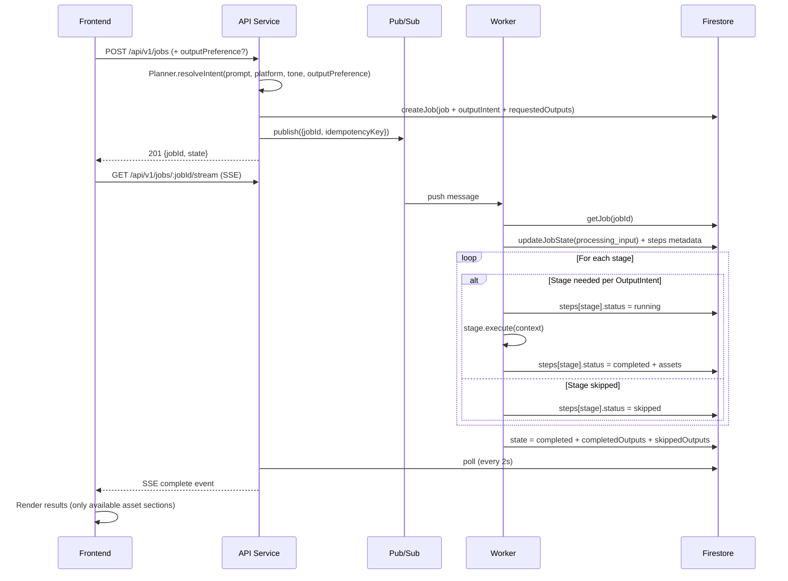
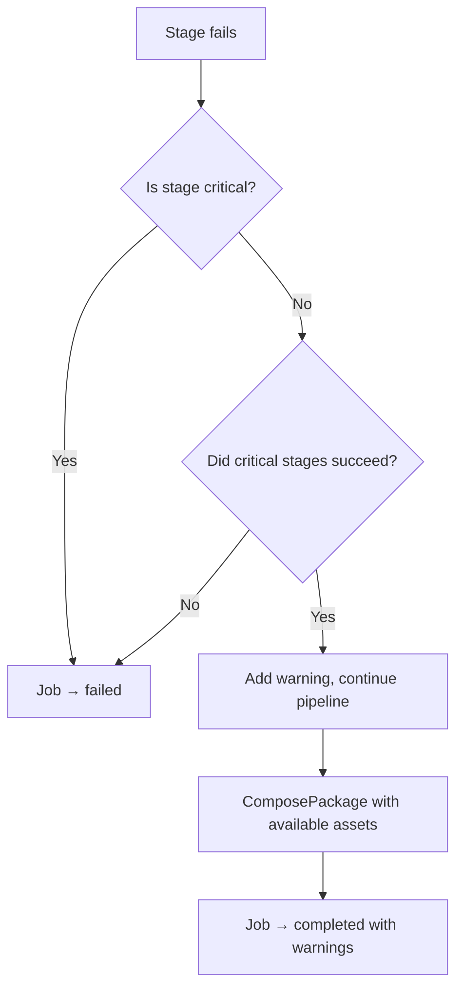

# Design Document: Smart Pipeline Orchestration

## Overview

This feature transforms the Content Storyteller Batch Mode pipeline from a rigid, all-or-nothing sequential executor into an intelligent, intent-driven orchestration system. The current pipeline executes all five stages (ProcessInput → GenerateCopy → GenerateImages → GenerateVideo → ComposePackage) unconditionally, which causes unnecessary latency and blocks on stages the user never requested. Additionally, the pipeline currently hangs after job creation because state transitions are not reliably written to Firestore, leaving the frontend stuck on the progress skeleton.

The design introduces three core capabilities:

1. **Pipeline reliability fix** — Ensure every stage writes explicit state transitions to Firestore so the SSE stream can detect progress and the frontend can render results or errors.
2. **Output-Intent detection** — A Planner module that infers which asset types the user actually wants from their prompt, platform, tone, and optional explicit flags, producing a normalized `OutputIntent` object.
3. **Conditional pipeline execution** — The pipeline runner evaluates the `OutputIntent` before each stage and skips stages that aren't needed, marking them as `skipped` in step-level metadata. Partial completion is supported when optional stages fail but critical stages succeed.

The changes span all three apps and the shared package:
- `packages/shared` — New types (`OutputIntent`, `StepMetadata`, `StepStatus`, `JobWarning`), updated `Job` interface, updated `CreateJobRequest`
- `apps/api` — New Planner module, updated job creation route, updated SSE stream to handle skipped stages
- `apps/worker` — Updated pipeline runner with conditional execution, step metadata tracking, partial completion logic, per-stage timeouts
- `apps/web` — Output preference selector on LandingPage, updated GenerationTimeline with "Skipped" state, updated OutputDashboard to hide skipped sections

## Architecture

### High-Level Flow



### Decision: Planner Location

The Planner module lives in `apps/api/src/services/planner/output-intent.ts` rather than in the worker. Rationale: the API service already has access to the user's prompt, platform, tone, and explicit flags at job creation time. Computing the intent at creation time means the `OutputIntent` is persisted on the Job document before the worker even picks it up, so the SSE stream and frontend can immediately know which stages are planned. This avoids a round-trip where the worker would need to compute intent and write it back before the frontend could use it.

### Decision: Step Metadata on Job Document

Rather than creating a separate Firestore collection for step tracking, step metadata is stored directly on the Job document as a `steps` object. This keeps reads atomic (one document fetch gives full job state) and avoids cross-collection consistency issues. The trade-off is a slightly larger document, but the metadata is small (5 keys × ~100 bytes each).

### Decision: Partial Completion

When an optional stage (GenerateImages, GenerateVideo) fails but the critical stages (ProcessInput, GenerateCopy) succeeded, the job transitions to `completed` with warnings rather than `failed`. This gives users partial results instead of nothing. The `warnings` array on the Job document describes what failed and why.

## Components and Interfaces

### 1. OutputIntent Type (`packages/shared/src/types/job.ts`)

```typescript
export interface OutputIntent {
  wantsCopy: boolean;       // Always true — copy is the minimum output
  wantsHashtags: boolean;
  wantsImage: boolean;
  wantsVideo: boolean;
  wantsStoryboard: boolean;
  wantsVoiceover: boolean;
  wantsCarousel: boolean;
  wantsThread: boolean;
  wantsLinkedInPost: boolean;
}
```

### 2. StepMetadata and StepStatus (`packages/shared/src/types/job.ts`)

```typescript
export type StepStatus = 'queued' | 'running' | 'completed' | 'skipped' | 'failed';

export interface StepMetadata {
  status: StepStatus;
  startedAt?: Date;
  completedAt?: Date;
  errorMessage?: string;
}

export interface StepsMap {
  processInput: StepMetadata;
  generateCopy: StepMetadata;
  generateImages: StepMetadata;
  generateVideo: StepMetadata;
  composePackage: StepMetadata;
}
```

### 3. JobWarning (`packages/shared/src/types/job.ts`)

```typescript
export interface JobWarning {
  stage: string;
  message: string;
  timestamp: Date;
  severity: 'info' | 'warning';
}
```

### 4. OutputPreference Enum (`packages/shared/src/types/job.ts`)

```typescript
export enum OutputPreference {
  Auto = 'auto',
  CopyOnly = 'copy_only',
  CopyImage = 'copy_image',
  CopyVideo = 'copy_video',
  FullPackage = 'full_package',
}
```

### 5. Updated Job Interface (`packages/shared/src/types/job.ts`)

New fields added to the existing `Job` interface:

```typescript
export interface Job {
  // ... existing fields ...
  outputIntent?: OutputIntent;
  outputPreference?: OutputPreference;
  steps?: StepsMap;
  requestedOutputs?: string[];   // e.g. ['copy', 'image']
  completedOutputs?: string[];   // e.g. ['copy']
  skippedOutputs?: string[];     // e.g. ['image', 'video']
  warnings?: JobWarning[];
}
```

### 6. Updated CreateJobRequest (`packages/shared/src/types/api.ts`)

```typescript
export interface CreateJobRequest {
  uploadedMediaPaths: string[];
  idempotencyKey: string;
  promptText: string;
  platform: Platform;
  tone: Tone;
  outputPreference?: OutputPreference;  // NEW — optional explicit selector
}
```

### 7. Updated StreamEventShape (`packages/shared/src/types/api.ts`)

Add `outputIntent`, `steps`, `requestedOutputs`, `skippedOutputs`, and `warnings` to the SSE data payload so the frontend can react to skipped stages:

```typescript
export interface StreamEventShape {
  event: string;
  data: {
    // ... existing fields ...
    outputIntent?: OutputIntent;
    steps?: StepsMap;
    requestedOutputs?: string[];
    skippedOutputs?: string[];
    warnings?: JobWarning[];
  };
}
```

### 8. Planner Module (`apps/api/src/services/planner/output-intent.ts`)

```typescript
export interface PlannerInput {
  promptText: string;
  platform: Platform;
  tone: Tone;
  uploadedMediaPaths: string[];
  outputPreference?: OutputPreference;
  trendContext?: { desiredOutputType?: string };
}

export function resolveOutputIntent(input: PlannerInput): OutputIntent;
```

The Planner is a pure, synchronous function (no AI calls). It uses a rule-based approach:

1. If `outputPreference` is explicitly set (not `auto`), map directly to boolean flags.
2. If `trendContext.desiredOutputType` is set, use that.
3. Otherwise, apply platform defaults:
   - `instagram_reel` → `wantsVideo: true`, `wantsImage: true`
   - `linkedin_launch_post` → copy-only by default
   - `x_twitter_thread` → `wantsThread: true`, copy-focused
   - `general_promo_package` → full package
4. Then scan the prompt text for keywords (`video`, `reel`, `teaser`, `image`, `photo`, `picture`, `copy only`, `text only`, `complete package`, `full package`) to override platform defaults.
5. `wantsCopy` is always `true` — it's the invariant minimum output.

### 9. Updated Pipeline Runner (`apps/worker/src/pipeline/pipeline-runner.ts`)

The runner receives the `OutputIntent` from the Job document and evaluates each stage:

```typescript
interface StageConfig {
  stage: PipelineStage;
  intentKey: keyof OutputIntent | null;  // null = always run
  critical: boolean;                      // true = failure → job fails
}

const STAGE_CONFIGS: StageConfig[] = [
  { stage: new ProcessInput(),    intentKey: null,          critical: true },
  { stage: new GenerateCopy(),    intentKey: 'wantsCopy',   critical: true },
  { stage: new GenerateImages(),  intentKey: 'wantsImage',  critical: false },
  { stage: new GenerateVideo(),   intentKey: 'wantsVideo',  critical: false },
  { stage: new ComposePackage(),  intentKey: null,          critical: true },
];
```

For each stage:
- If `intentKey` is non-null and `outputIntent[intentKey]` is `false`, mark the step as `skipped` in Firestore and continue.
- Otherwise, set step status to `running`, execute, then set to `completed` or `failed`.
- If a non-critical stage fails, add a warning and continue. If a critical stage fails, mark the job as `failed`.

### 10. Updated Worker Firestore Service (`apps/worker/src/services/firestore.ts`)

New functions:

```typescript
export async function updateStepMetadata(
  jobId: string,
  stepKey: keyof StepsMap,
  metadata: Partial<StepMetadata>,
): Promise<void>;

export async function updateJobWithWarnings(
  jobId: string,
  updates: {
    state?: JobState;
    warnings?: JobWarning[];
    completedOutputs?: string[];
    skippedOutputs?: string[];
    errorMessage?: string;
  },
): Promise<void>;

export async function initializeStepsMetadata(
  jobId: string,
  steps: StepsMap,
): Promise<void>;
```

### 11. Updated API Firestore Service (`apps/api/src/services/firestore.ts`)

Update `createJob` to accept and persist `outputPreference`, `outputIntent`, `requestedOutputs`, `steps`, `warnings`, `completedOutputs`, `skippedOutputs`.

### 12. Updated SSE Stream (`apps/api/src/routes/stream.ts`)

The `emitPartialResults` function needs to handle skipped stages. When the state transitions from a stage that was skipped (e.g., `generating_images` was skipped, so the transition goes from `generating_copy` directly to `generating_video` or `composing_package`), the SSE stream should:
- Not attempt to read assets for skipped stages
- Include `steps`, `requestedOutputs`, `skippedOutputs` in event data so the frontend knows what to expect

The poll loop reads the `steps` metadata from the Job document and includes it in every `state_change` event.

### 13. Frontend Components

**LandingPage** — Add an `OutputPreferenceSelector` component (radio group or segmented control) with options: "Auto-detect", "Copy only", "Copy + image", "Copy + video", "Full package". Default: "Auto-detect". Pass the selection through `useJob.startJob()` to the API.

**GenerationTimeline** — Add a `'skipped'` status alongside `'pending'`, `'active'`, `'completed'`. When `steps[stageKey].status === 'skipped'`, render a gray "Skipped" indicator with a skip icon instead of a pending number or active spinner.

**OutputDashboard** — Read `requestedOutputs` or `skippedOutputs` from the job data. For skipped output types, don't render skeleton placeholders. Only render sections for which data is available or expected.

**useJob hook** — Accept `outputPreference` parameter in `startJob()`, include it in the `CreateJobRequest`.

**useSSE hook** — No structural changes needed. The existing `onStateChange` and `onComplete` callbacks already receive the full event data. The frontend components read the new fields from the event data.

## Data Models

### Updated Job Document (Firestore)

```json
{
  "id": "abc123",
  "correlationId": "corr-456",
  "idempotencyKey": "idem-789",
  "state": "completed",
  "uploadedMediaPaths": ["path/to/file.jpg"],
  "promptText": "Create a LinkedIn post about our product launch",
  "platform": "linkedin_launch_post",
  "tone": "professional",
  "outputPreference": "auto",
  "outputIntent": {
    "wantsCopy": true,
    "wantsHashtags": true,
    "wantsImage": false,
    "wantsVideo": false,
    "wantsStoryboard": false,
    "wantsVoiceover": false,
    "wantsCarousel": false,
    "wantsThread": false,
    "wantsLinkedInPost": true
  },
  "requestedOutputs": ["copy", "hashtags", "linkedInPost"],
  "completedOutputs": ["copy", "hashtags", "linkedInPost"],
  "skippedOutputs": ["image", "video", "storyboard"],
  "steps": {
    "processInput": { "status": "completed", "startedAt": "...", "completedAt": "..." },
    "generateCopy": { "status": "completed", "startedAt": "...", "completedAt": "..." },
    "generateImages": { "status": "skipped" },
    "generateVideo": { "status": "skipped" },
    "composePackage": { "status": "completed", "startedAt": "...", "completedAt": "..." }
  },
  "assets": [ /* only actually generated assets */ ],
  "warnings": [],
  "fallbackNotices": [],
  "creativeBrief": { /* ... */ },
  "createdAt": "2025-01-15T10:00:00Z",
  "updatedAt": "2025-01-15T10:02:30Z"
}
```

### OutputIntent Derivation Rules

| OutputPreference | wantsCopy | wantsImage | wantsVideo | Notes |
|---|---|---|---|---|
| `auto` | true | inferred | inferred | Platform defaults + prompt keywords |
| `copy_only` | true | false | false | Skips image and video stages |
| `copy_image` | true | true | false | Skips video stage |
| `copy_video` | true | false | true | Skips image stage |
| `full_package` | true | true | true | All stages run |

### Platform Defaults (when `auto`)

| Platform | wantsCopy | wantsImage | wantsVideo | wantsThread | wantsLinkedInPost |
|---|---|---|---|---|---|
| `instagram_reel` | true | true | true | false | false |
| `linkedin_launch_post` | true | false | false | false | true |
| `x_twitter_thread` | true | false | false | true | false |
| `general_promo_package` | true | true | true | false | false |

## Correctness Properties

*A property is a characteristic or behavior that should hold true across all valid executions of a system — essentially, a formal statement about what the system should do. Properties serve as the bridge between human-readable specifications and machine-verifiable correctness guarantees.*

### Property 1: Planner wantsCopy invariant

*For any* valid `PlannerInput` (any prompt text, any platform, any tone, any outputPreference, any uploaded media paths, any trend context), the resulting `OutputIntent` SHALL have `wantsCopy === true`.

**Validates: Requirements 9.8, 4.6**

### Property 2: Planner platform defaults

*For any* platform value and any prompt text that does not contain explicit visual/video keywords, when `outputPreference` is `auto`, the Planner SHALL produce an `OutputIntent` matching the platform default table: `instagram_reel` → `wantsVideo: true`, `linkedin_launch_post` → `wantsImage: false, wantsVideo: false`, `x_twitter_thread` → `wantsThread: true`, `general_promo_package` → `wantsImage: true, wantsVideo: true`.

**Validates: Requirements 3.9, 3.10, 3.11, 9.7**

### Property 3: Explicit outputPreference overrides inference

*For any* prompt text (including prompts with video/image keywords), when an explicit `outputPreference` other than `auto` is provided, the Planner SHALL produce an `OutputIntent` that matches the explicit preference mapping (e.g., `copy_only` → `wantsImage: false, wantsVideo: false`) regardless of prompt content.

**Validates: Requirements 3.13, 5.5**

### Property 4: Planner output structure completeness

*For any* valid `PlannerInput`, the resulting `OutputIntent` SHALL contain all required boolean fields: `wantsCopy`, `wantsHashtags`, `wantsImage`, `wantsVideo`, `wantsStoryboard`, `wantsVoiceover`, `wantsCarousel`, `wantsThread`, `wantsLinkedInPost`, and each field SHALL be a boolean value.

**Validates: Requirements 3.2**

### Property 5: Prompt keyword detection for video

*For any* prompt text that does NOT contain the words "video", "reel", "teaser", or "promo clip" (case-insensitive), and when the platform does not default to video (i.e., not `instagram_reel`) and `outputPreference` is `auto`, the Planner SHALL produce an `OutputIntent` with `wantsVideo === false`.

**Validates: Requirements 3.4**

### Property 6: Backward compatibility without outputPreference

*For any* valid `PlannerInput` where `outputPreference` is `undefined` or `auto`, the Planner SHALL still produce a valid `OutputIntent` with all required fields and `wantsCopy === true`.

**Validates: Requirements 5.6**

### Property 7: Skipped stages marked correctly in steps metadata

*For any* `OutputIntent` and pipeline execution, every stage whose corresponding intent flag is `false` (e.g., `wantsImage === false` → `generateImages`) SHALL have its step status set to `'skipped'` in the `steps` metadata, and stages whose intent flag is `true` or `null` (always-run) SHALL NOT have status `'skipped'`.

**Validates: Requirements 4.1, 4.2, 2.6**

### Property 8: Pipeline reaches completed when all requested stages succeed

*For any* `OutputIntent`, if all stages that are required by the intent (plus the always-run stages ProcessInput, GenerateCopy, ComposePackage) complete successfully, the Job state SHALL transition to `completed`, regardless of how many stages were skipped.

**Validates: Requirements 4.5, 4.3, 1.3**

### Property 9: Critical stage failure transitions job to failed

*For any* pipeline execution where a critical stage (ProcessInput or GenerateCopy) returns `success: false` or throws an error, the Job state SHALL be `failed` and the Job document SHALL contain a structured `errorMessage`.

**Validates: Requirements 8.3, 1.6, 2.4**

### Property 10: Non-critical failure with critical success yields partial completion

*For any* pipeline execution where all critical stages (ProcessInput, GenerateCopy) succeed but a non-critical stage (GenerateImages or GenerateVideo) fails, the Job state SHALL be `completed` and the `warnings` array SHALL contain at least one entry describing the partial failure.

**Validates: Requirements 8.2**

### Property 11: State sequence correctness

*For any* `OutputIntent` and successful pipeline execution, the sequence of `JobState` values written to Firestore SHALL follow the canonical order (`processing_input` → `generating_copy` → `generating_images` → `generating_video` → `composing_package` → `completed`), skipping states for stages that were skipped per the intent.

**Validates: Requirements 9.5, 1.8**

### Property 12: Steps metadata structure after pipeline execution

*For any* Job document after pipeline execution, the `steps` object SHALL have exactly five keys (`processInput`, `generateCopy`, `generateImages`, `generateVideo`, `composePackage`), and each key's `status` SHALL be one of `'queued'`, `'running'`, `'completed'`, `'skipped'`, or `'failed'`.

**Validates: Requirements 2.5**

### Property 13: Output tracking consistency

*For any* completed Job document, the union of `completedOutputs` and `skippedOutputs` SHALL cover all pipeline output types, `completedOutputs` SHALL be a subset of `requestedOutputs`, and `skippedOutputs` SHALL not overlap with `completedOutputs`.

**Validates: Requirements 7.1, 7.2, 7.3**

### Property 14: Assets only from non-skipped stages

*For any* completed Job document, the `assets` array SHALL contain no asset references whose `assetType` corresponds to a stage that was marked as `skipped` in the `steps` metadata.

**Validates: Requirements 7.4, 4.4**

### Property 15: Warning structure validity

*For any* `JobWarning` object in the `warnings` array, it SHALL contain fields `stage` (string), `message` (string), `timestamp` (Date), and `severity` (either `'info'` or `'warning'`).

**Validates: Requirements 8.6, 7.5**

### Property 16: Job serialization round-trip

*For any* valid `Job` object (including the new fields `outputIntent`, `steps`, `requestedOutputs`, `completedOutputs`, `skippedOutputs`, `warnings`), serializing to JSON and deserializing back SHALL produce an equivalent object.

**Validates: Requirements 7.7**

### Property 17: GenerationTimeline skipped indicator

*For any* `steps` metadata object where one or more stages have `status === 'skipped'`, the `GenerationTimeline` component SHALL render a "Skipped" indicator for those stages instead of a pending or active state.

**Validates: Requirements 6.6**

### Property 18: OutputDashboard conditional rendering

*For any* combination of `requestedOutputs` and `skippedOutputs`, the `OutputDashboard` component SHALL render asset sections only for output types that are in `requestedOutputs` and not in `skippedOutputs`, and SHALL not render skeleton placeholders for skipped output types.

**Validates: Requirements 6.5, 6.4**

### Property 19: Trend context respected by planner

*For any* `PlannerInput` where `trendContext.desiredOutputType` is set, the Planner SHALL produce an `OutputIntent` that reflects the desired output type from the trend context, overriding platform defaults.

**Validates: Requirements 3.12**

## Error Handling

### Pipeline Error Categories

| Category | Stages | Behavior | Job State |
|---|---|---|---|
| Critical failure | ProcessInput, GenerateCopy | Pipeline stops immediately | `failed` |
| Non-critical failure | GenerateImages, GenerateVideo | Warning added, pipeline continues | `completed` (with warnings) |
| Global timeout | Any | Pipeline stops, job marked failed | `failed` |
| Per-stage timeout | Any | Stage marked failed, evaluated for partial completion | Depends on criticality |
| Firestore write failure | Any | Best-effort retry, then fail | `failed` |

### Per-Stage Timeout Strategy

Each stage gets a timeout derived from the remaining global budget:

```typescript
const PIPELINE_TIMEOUT_MS = 10 * 60 * 1000; // 10 minutes global
const remainingMs = PIPELINE_TIMEOUT_MS - (Date.now() - startTime);
```

The existing `Promise.race` pattern in the pipeline runner is preserved. When a stage times out:
1. The step metadata is updated to `failed` with `errorMessage: "Stage X timed out"` and `failedAt` timestamp.
2. If the stage is non-critical and critical stages already succeeded, the pipeline continues and adds a warning.
3. If the stage is critical, the job transitions to `failed`.

### Structured Error Objects

When a stage fails, the step metadata includes:

```typescript
{
  status: 'failed',
  errorMessage: string,    // Human-readable error description
  completedAt: Date,       // Timestamp of failure (reused as failedAt)
}
```

The Job-level `errorMessage` is set only when the job transitions to `failed` (critical failure or global timeout).

### Partial Completion Flow



### Backward Compatibility

- Job documents without `outputIntent`, `steps`, `requestedOutputs`, `completedOutputs`, `skippedOutputs`, or `warnings` fields are treated as legacy jobs.
- The frontend checks for the presence of these fields before using them. If absent, it falls back to the current behavior (show all sections, no skipped indicators).
- The API service returns these fields only when present, using optional chaining.

## Testing Strategy

### Testing Framework

- **Unit tests**: Vitest (already configured in all three apps)
- **Property-based tests**: `fast-check` library with Vitest
- Each property test runs a minimum of 100 iterations
- Each property test is tagged with a comment referencing the design property

### Property-Based Tests

Property tests validate universal properties across randomly generated inputs. Each test uses `fast-check` arbitraries to generate random `PlannerInput` objects, `OutputIntent` objects, `Job` documents, and pipeline execution scenarios.

**Tag format**: `Feature: smart-pipeline-orchestration, Property {number}: {property_text}`

Each correctness property from the design document is implemented by a single property-based test.

### Test Organization

| Test File | Scope | Properties Covered |
|---|---|---|
| `packages/shared/src/__tests__/pipeline-types.property.test.ts` | Shared types, serialization | P4, P12, P15, P16 |
| `apps/api/src/__tests__/output-intent.property.test.ts` | Planner module | P1, P2, P3, P5, P6, P19 |
| `apps/worker/src/__tests__/pipeline-orchestration.property.test.ts` | Pipeline runner, conditional execution | P7, P8, P9, P10, P11, P13, P14 |
| `apps/web/src/__tests__/pipeline-ui.property.test.tsx` | Frontend components | P17, P18 |

### Unit Tests

Unit tests cover specific examples, edge cases, and integration points. They complement property tests by verifying concrete scenarios:

| Test File | Scope | Covers |
|---|---|---|
| `packages/shared/src/__tests__/pipeline-types.unit.test.ts` | Type validation, backward compat | Req 2.1, 7.6 |
| `apps/api/src/__tests__/output-intent.unit.test.ts` | Planner examples | Req 3.3, 3.5, 3.6, 3.7, 3.8, 5.1, 5.2 |
| `apps/worker/src/__tests__/pipeline-orchestration.unit.test.ts` | Pipeline scenarios | Req 9.1, 9.2, 9.3, 9.4, 9.6, 8.4 |
| `apps/web/src/__tests__/pipeline-ui.unit.test.tsx` | Component rendering | Req 5.1, 5.2, 6.1 |

### Test Configuration

```typescript
// fast-check configuration for all property tests
const FC_CONFIG = { numRuns: 100 };
```

### Arbitraries (Generators)

Key `fast-check` arbitraries needed:

- `arbPlatform`: `fc.constantFrom(...Object.values(Platform))`
- `arbTone`: `fc.constantFrom(...Object.values(Tone))`
- `arbOutputPreference`: `fc.constantFrom(...Object.values(OutputPreference))`
- `arbPromptText`: `fc.string({ minLength: 1, maxLength: 500 })`
- `arbOutputIntent`: Object with all boolean fields generated via `fc.boolean()`
- `arbStepStatus`: `fc.constantFrom('queued', 'running', 'completed', 'skipped', 'failed')`
- `arbStepsMap`: Record of 5 step keys, each with `arbStepStatus` and optional timestamps
- `arbJobWarning`: Object with `stage`, `message`, `timestamp`, `severity`
- `arbJob`: Full Job object with all new fields
