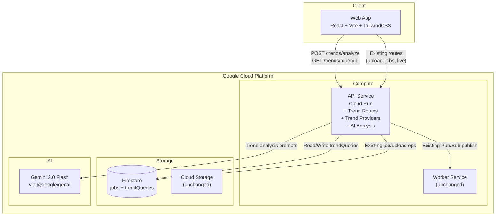
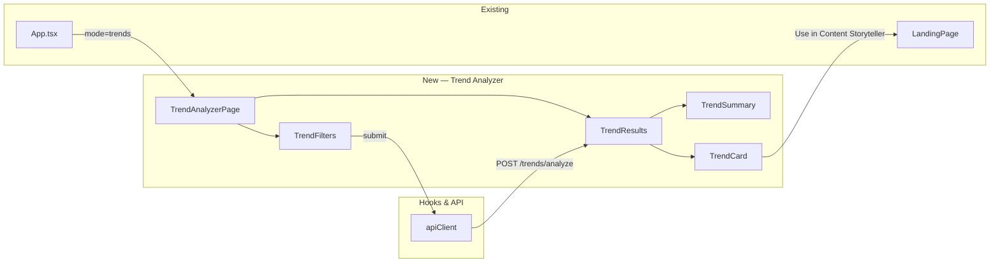

# Design Document: Trend Analyzer

## Overview

Trend Analyzer extends the Content Storyteller application with a trend discovery feature. Users select a platform (Instagram Reels, X/Twitter, LinkedIn, or All Platforms), content domain, geographic region, and optional time/language filters, then receive AI-analyzed trend results with momentum scores, freshness labels, and actionable content suggestions. Each trend can be used to pre-fill the existing campaign generation flow via a "Use in Content Storyteller" CTA.

The feature adds:

1. **Shared types** — `TrendPlatform` enum, `TrendDomain`/`TrendDomainPreset` types, `TrendRegion`, `TrendQuery`, `TrendItem`, `TrendAnalysisResult` interfaces in `packages/shared`
2. **Backend API** — `POST /api/v1/trends/analyze` and `GET /api/v1/trends/:queryId` routes in `apps/api`, with input validation, Firestore persistence, and a provider-based trend collection architecture feeding into a Gemini-powered AI analysis layer
3. **Frontend** — `TrendAnalyzerPage`, `TrendFilters`, `TrendResults`, `TrendCard`, `TrendSummary` components in `apps/web`, plus navigation integration and "Use in Content Storyteller" CTA that pre-fills the existing landing page

The trend analysis runs synchronously in the API service (no worker/Pub/Sub needed) since Gemini calls are fast enough for this use case. This keeps the architecture simple and avoids adding async complexity.

## Architecture

### How Trend Analyzer Fits Into the Existing System



### Key Design Decisions

| Decision | Choice | Rationale |
|---|---|---|
| Execution model | Synchronous in API service | Gemini calls return in 2-5s; no need for Pub/Sub/worker overhead |
| Trend data source | Gemini knowledge + provider abstraction | Real-time API integrations can be added later via the provider interface |
| Firestore collection | `trendQueries` | Separate from `jobs` — different lifecycle and schema |
| Navigation | Tab/mode in existing header | Consistent with batch/live mode toggle pattern |
| CTA integration | Pre-fill existing LandingPage form | Reuses existing generation flow without modification |

### Frontend Architecture Addition



## Components and Interfaces

### 1. Shared Package Additions (`packages/shared`)

#### New Types File: `packages/shared/src/types/trends.ts`

```typescript
export enum TrendPlatform {
  InstagramReels = 'instagram_reels',
  XTwitter = 'x_twitter',
  LinkedIn = 'linkedin',
  AllPlatforms = 'all_platforms',
}

export type TrendDomainPreset =
  | 'tech'
  | 'fashion'
  | 'finance'
  | 'fitness'
  | 'education'
  | 'gaming'
  | 'startup';

export type TrendDomain = TrendDomainPreset | (string & {});

export interface TrendRegion {
  scope: 'global' | 'country' | 'state_province';
  country?: string;
  stateProvince?: string;
}

export interface TrendQuery {
  platform: TrendPlatform;
  domain: TrendDomain;
  region: TrendRegion;
  timeWindow?: '24h' | '7d' | '30d';
  language?: string;
}

export type FreshnessLabel = 'Fresh' | 'Rising Fast' | 'Established' | 'Fading';

export interface TrendItem {
  title: string;
  keyword: string;
  description: string;
  momentumScore: number;       // 0–100
  relevanceScore: number;      // 0–100
  suggestedHashtags: string[];
  suggestedHook: string;
  suggestedContentAngle: string;
  sourceLabels: string[];
  region: TrendRegion;
  platform: TrendPlatform;
  freshnessLabel: FreshnessLabel;
}

export interface TrendAnalysisResult {
  queryId: string;
  platform: TrendPlatform;
  domain: TrendDomain;
  region: TrendRegion;
  timeWindow?: string;
  language?: string;
  generatedAt: string;         // ISO 8601
  summary: string;
  trends: TrendItem[];
}
```

#### Barrel Export Update: `packages/shared/src/index.ts`

Add to existing exports:

```typescript
export {
  TrendPlatform,
  TrendDomainPreset,
  TrendDomain,
  TrendRegion,
  TrendQuery,
  FreshnessLabel,
  TrendItem,
  TrendAnalysisResult,
} from './types/trends';
```

### 2. Backend API — Trend Routes (`apps/api`)

#### New Route File: `apps/api/src/routes/trends.ts`

Two endpoints:

**`POST /api/v1/trends/analyze`** — Accepts a `TrendQuery` body, validates input, runs the trend analysis pipeline (providers → normalize → score → Gemini analysis), persists the result in Firestore, returns the `TrendAnalysisResult`.

**`GET /api/v1/trends/:queryId`** — Retrieves a previously stored `TrendAnalysisResult` by its Firestore document ID.

#### Input Validation Logic

```typescript
// Validation rules for POST /api/v1/trends/analyze
// 1. platform: must be a valid TrendPlatform enum value → 400 INVALID_TREND_PLATFORM
// 2. domain: must be non-empty string → 400 MISSING_DOMAIN
// 3. region.scope: must be 'global' | 'country' | 'state_province'
//    - scope='country' requires non-empty country → 400 INVALID_REGION
//    - scope='state_province' requires non-empty country + stateProvince → 400 INVALID_REGION
// 4. timeWindow (optional): if present, must be '24h' | '7d' | '30d' → 400 INVALID_TIME_WINDOW
// 5. language (optional): no validation, passed through
```

#### Route Registration in `apps/api/src/index.ts`

```typescript
import { trendsRouter } from './routes/trends';
// ...
app.use('/api/v1/trends', trendsRouter);
```

### 3. Trend Provider Architecture (`apps/api/src/services/trends/`)

```
apps/api/src/services/trends/
├── types.ts           # RawTrendSignal, TrendProvider interface
├── normalize.ts       # normalizeSignals() → NormalizedSignal[]
├── scoring.ts         # computeMomentumScore(), computeRelevanceScore()
├── providers/
│   └── gemini-provider.ts   # GeminiTrendProvider (primary)
├── registry.ts        # getProviders() → TrendProvider[]
└── analyzer.ts        # analyzeTrends(query) → TrendAnalysisResult
```

#### Provider Interface

```typescript
// apps/api/src/services/trends/types.ts
export interface RawTrendSignal {
  rawTitle: string;
  rawDescription: string;
  sourceName: string;
  platform: TrendPlatform;
  region: TrendRegion;
  rawScore?: number;
  collectedAt: string;        // ISO 8601
  isInferred: boolean;
}

export interface TrendProvider {
  name: string;
  fetchSignals(query: TrendQuery): Promise<RawTrendSignal[]>;
}
```

#### Normalization (`normalize.ts`)

```typescript
export interface NormalizedSignal {
  rawTitle: string;
  rawDescription: string;
  sourceName: string;
  platform: TrendPlatform;
  region: TrendRegion;
  rawScore: number | null;
  collectedAt: string;
  isInferred: boolean;
  momentumScore: number;       // 0–100, from scoring.ts
  relevanceScore: number;      // 0–100, from scoring.ts
}

export function normalizeSignals(
  raw: RawTrendSignal[],
  query: TrendQuery
): NormalizedSignal[];
```

Normalization standardizes region labels to English, applies scoring, and deduplicates by title similarity.

#### Scoring (`scoring.ts`)

```typescript
export function computeMomentumScore(signal: RawTrendSignal): number;
// Uses rawScore velocity indicators if available, otherwise defaults to 50
// Returns 0–100, clamped

export function computeRelevanceScore(signal: RawTrendSignal, query: TrendQuery): number;
// Keyword matching against domain, platform alignment check
// Returns 0–100, clamped
```

#### Provider Registry (`registry.ts`)

```typescript
export function getProviders(): TrendProvider[];
// Returns array of registered providers
// Currently: [GeminiTrendProvider]
// Future: can add RSS, social API, Google Trends providers
```

#### Analyzer Orchestrator (`analyzer.ts`)

```typescript
export async function analyzeTrends(query: TrendQuery): Promise<TrendAnalysisResult>;
```

Orchestration flow:
1. Get all registered providers from registry
2. Call `fetchSignals(query)` on each provider concurrently with `Promise.allSettled`
3. Collect successful results, log warnings for failures
4. Normalize and score all signals via `normalizeSignals()`
5. Pass normalized signals + query to Gemini for consolidation, clustering, ranking, and content generation
6. Return structured `TrendAnalysisResult`

### 4. AI Analysis Layer — Gemini Integration

The API service creates its own `@google/genai` client (same pattern as `apps/worker/src/services/genai.ts`) for trend analysis. This lives in `apps/api/src/services/genai.ts`.

#### Gemini Prompt Structure

The Gemini call receives:
- The `TrendQuery` (platform, domain, region, timeWindow, language)
- Normalized signals as context (if any)
- Instructions to produce a JSON response matching `TrendAnalysisResult` shape

Key prompt behaviors:
- **Consolidation**: Cluster similar topics from multiple signals into single trends
- **Ranking**: Sort by composite score (momentum × 0.3 + relevance × 0.3 + freshness × 0.2 + platform fit × 0.2)
- **Content generation**: For each trend, generate description, suggestedHook, suggestedHashtags, suggestedContentAngle tailored to the platform and domain
- **Freshness labeling**: Assign `Fresh`, `Rising Fast`, `Established`, or `Fading` based on signal age and velocity
- **Summary**: Generate an overall narrative of the trend landscape
- **Fallback**: If no raw signals are provided, generate trends from Gemini's knowledge with `sourceLabels: ['inferred']`
- **Domain tailoring**: Use domain-specific language, angles, and hashtag conventions (e.g., tech → developer jargon, fashion → style terminology)
- **Region tailoring**: Prioritize region-specific cultural context when region is not global

### 5. Firestore Persistence

#### New Collection: `trendQueries`

```typescript
// Document structure in Firestore
{
  queryId: string;              // Firestore document ID
  platform: TrendPlatform;
  domain: TrendDomain;
  region: TrendRegion;
  timeWindow?: string;
  language?: string;
  generatedAt: string;          // ISO 8601
  summary: string;
  trends: TrendItem[];          // Array of trend items
  createdAt: Date;
}
```

New Firestore helper functions in `apps/api/src/services/firestore.ts`:

```typescript
export async function createTrendQuery(result: TrendAnalysisResult): Promise<string>;
// Creates document in trendQueries collection, returns queryId

export async function getTrendQuery(queryId: string): Promise<TrendAnalysisResult | null>;
// Reads document by ID, returns null if not found
```

### 6. Frontend Components (`apps/web`)

#### New Files

```
apps/web/src/components/
├── TrendAnalyzerPage.tsx    # Container: filters + results
├── TrendFilters.tsx         # Platform, domain, region, time, language selectors
├── TrendResults.tsx         # Results container: summary + card grid + states
├── TrendCard.tsx            # Individual trend display + CTA button
└── TrendSummary.tsx         # Overall trend landscape narrative
```

#### App.tsx Changes

Add a third mode `'trends'` to the existing `'batch' | 'live'` mode toggle:

```typescript
type AppMode = 'batch' | 'live' | 'trends';
```

The header mode toggle gets a third button: "📊 Trend Analyzer". When active, renders `<TrendAnalyzerPage />` instead of `<LandingPage />` or `<LiveAgentPanel />`.

#### TrendAnalyzerPage

Container component managing:
- `trendQuery` state (the filter selections)
- `analysisResult` state (the API response)
- `isLoading` state
- `error` state
- Calls `POST /api/v1/trends/analyze` on form submit
- Passes results to `TrendResults`

#### TrendFilters

Renders filter controls:
- Platform selector: radio group or dropdown with 4 options
- Domain selector: dropdown with 7 presets + "Custom" option that reveals a text input
- Region selector: scope dropdown (Global/Country/State-Province) with conditional text inputs for country and stateProvince
- Time window selector: optional dropdown (24h, 7d, 30d)
- Language input: optional text field
- "Analyze Trends" submit button
- Client-side validation: platform and domain are required

#### TrendResults

Renders:
- Loading state: skeleton placeholders while analysis is in progress
- Empty state: message suggesting filter adjustments when no trends returned
- `TrendSummary` component showing the `summary` field
- Grid of `TrendCard` components, one per `TrendItem`

#### TrendCard

Displays a single trend:
- Title and keyword
- Description (why it matters)
- Suggested hook
- Suggested hashtags as badges
- Suggested content angle
- Platform and region labels
- Freshness label as a colored badge (green=Fresh, blue=Rising Fast, gray=Established, orange=Fading)
- Momentum score as a progress bar or numeric badge
- "Use in Content Storyteller" CTA button

#### TrendSummary

Displays the overall `summary` narrative from the `TrendAnalysisResult` in a styled card.

#### API Client Addition (`apps/web/src/api/client.ts`)

```typescript
export async function analyzeTrends(query: TrendQuery): Promise<TrendAnalysisResult> {
  const res = await fetch(`${API_URL}/api/v1/trends/analyze`, {
    method: 'POST',
    headers: { 'Content-Type': 'application/json' },
    body: JSON.stringify(query),
  });
  if (!res.ok) {
    const err = await res.json().catch(() => ({ error: { message: res.statusText } }));
    throw new Error(err.error?.message || `Trend analysis failed: ${res.status}`);
  }
  return res.json();
}

export async function getTrendResult(queryId: string): Promise<TrendAnalysisResult> {
  const res = await fetch(`${API_URL}/api/v1/trends/${encodeURIComponent(queryId)}`);
  if (!res.ok) {
    const err = await res.json().catch(() => ({ error: { message: res.statusText } }));
    throw new Error(err.error?.message || `Get trend result failed: ${res.status}`);
  }
  return res.json();
}
```

### 7. "Use in Content Storyteller" Integration

When the user clicks the CTA on a `TrendCard`:

1. Build a prompt string from the trend data:
   ```
   Trending Topic: {title}
   {description}
   
   Hook: {suggestedHook}
   Content Angle: {suggestedContentAngle}
   Hashtags: {suggestedHashtags.join(', ')}
   ```

2. Map `TrendPlatform` to existing `Platform` enum:
   - `InstagramReels` → `Platform.InstagramReel`
   - `XTwitter` → `Platform.XTwitterThread`
   - `LinkedIn` → `Platform.LinkedInLaunchPost`
   - `AllPlatforms` → `Platform.GeneralPromoPackage`

3. Switch `AppMode` to `'batch'` and set pre-filled values on the `LandingPage` form state

The existing generation flow is completely unchanged — the pre-filled values are editable and the user proceeds through the normal upload → generate → results flow.


## Data Models

### New Types Summary

| Type | File | Purpose |
|---|---|---|
| `TrendPlatform` | `types/trends.ts` | Target platform enum (4 values) |
| `TrendDomainPreset` | `types/trends.ts` | Fixed domain category type (7 values) |
| `TrendDomain` | `types/trends.ts` | Domain preset or custom string |
| `TrendRegion` | `types/trends.ts` | Geographic scope with optional country/state |
| `TrendQuery` | `types/trends.ts` | Input parameters for trend analysis |
| `FreshnessLabel` | `types/trends.ts` | Categorical freshness indicator (4 values) |
| `TrendItem` | `types/trends.ts` | Single trend result with scores and suggestions |
| `TrendAnalysisResult` | `types/trends.ts` | Complete analysis response with summary and trends |

### Backend Internal Types

| Type | File | Purpose |
|---|---|---|
| `RawTrendSignal` | `services/trends/types.ts` | Raw signal from a trend provider |
| `TrendProvider` | `services/trends/types.ts` | Provider interface for trend data collection |
| `NormalizedSignal` | `services/trends/normalize.ts` | Scored and normalized signal ready for AI analysis |

### Firestore Collections

| Collection | Document Shape | Purpose |
|---|---|---|
| `jobs` (existing) | `Job` | Unchanged — existing generation jobs |
| `trendQueries` (new) | `TrendAnalysisResult + createdAt` | Persisted trend analysis results |

### TrendPlatform → Platform Mapping

| TrendPlatform | Platform (existing) |
|---|---|
| `InstagramReels` | `InstagramReel` |
| `XTwitter` | `XTwitterThread` |
| `LinkedIn` | `LinkedInLaunchPost` |
| `AllPlatforms` | `GeneralPromoPackage` |

### Environment Variable Additions

| Variable | Service | Purpose |
|---|---|---|
| `GEMINI_API_KEY` | API | Google GenAI SDK API key (already exists on Worker; now also needed on API) |


## Correctness Properties

*A property is a characteristic or behavior that should hold true across all valid executions of a system — essentially, a formal statement about what the system should do. Properties serve as the bridge between human-readable specifications and machine-verifiable correctness guarantees.*

### Property 1: TrendPlatform and TrendDomainPreset completeness

*For any* expected TrendPlatform value in `['instagram_reels', 'x_twitter', 'linkedin', 'all_platforms']`, the `TrendPlatform` enum shall contain that value, and conversely, every value in the enum shall be one of the expected values. Similarly, *for any* expected TrendDomainPreset value in `['tech', 'fashion', 'finance', 'fitness', 'education', 'gaming', 'startup']`, the type shall contain exactly those values and no extras.

**Validates: Requirements 1.1, 2.1, 21.3, 21.4**

### Property 2: Trend type interface field completeness

*For any* randomly generated instance of `TrendRegion`, `TrendQuery`, `TrendItem`, or `TrendAnalysisResult`, the object shall contain all required fields with correct types as specified in the interface definitions (strings are strings, numbers are numbers, arrays are arrays, enums are valid enum values).

**Validates: Requirements 3.1, 4.1, 5.1, 6.1, 21.1**

### Property 3: TrendAnalysisResult JSON round-trip

*For any* valid `TrendAnalysisResult` object, serializing to JSON via `JSON.stringify` then parsing back via `JSON.parse` shall produce an object deeply equal to the original.

**Validates: Requirements 6.3, 21.2**

### Property 4: Invalid TrendQuery rejection

*For any* POST request to `/api/v1/trends/analyze` containing an invalid `platform` (not a TrendPlatform value), or an empty/missing `domain`, or an invalid `region` (scope=`country` with missing country, scope=`state_province` with missing country or stateProvince), or an unsupported `timeWindow` (not `24h`, `7d`, or `30d`), the API shall reject the request with HTTP 400 and the appropriate error code (`INVALID_TREND_PLATFORM`, `MISSING_DOMAIN`, `INVALID_REGION`, or `INVALID_TIME_WINDOW`).

**Validates: Requirements 3.3, 3.4, 7.2, 7.3, 7.4, 7.5, 20.1, 20.2, 20.3, 20.4**

### Property 5: Valid TrendQuery acceptance

*For any* POST request to `/api/v1/trends/analyze` with a valid TrendPlatform, non-empty domain, valid region (global with no extra fields, country with non-empty country, state_province with non-empty country and stateProvince), and optional valid timeWindow and language, the API shall return HTTP 200 with a TrendAnalysisResult containing a non-empty `queryId`, matching `platform`, `domain`, and `region` fields, a non-empty `summary`, and a `trends` array.

**Validates: Requirements 7.1, 20.5**

### Property 6: Trend analysis persistence round-trip

*For any* successful trend analysis (POST returns 200 with a `queryId`), a subsequent GET to `/api/v1/trends/:queryId` shall return HTTP 200 with a TrendAnalysisResult whose `platform`, `domain`, `region`, `summary`, and `trends` fields are equivalent to the original POST response.

**Validates: Requirements 7.6, 8.1**

### Property 7: Non-existent queryId returns 404

*For any* randomly generated string that does not correspond to a stored trend query, a GET to `/api/v1/trends/:queryId` shall return HTTP 404 with error code `TREND_QUERY_NOT_FOUND`.

**Validates: Requirements 8.2**

### Property 8: Normalization produces complete common format

*For any* raw trend signal from any provider, the `normalizeSignals` function shall produce a `NormalizedSignal` object containing all required fields: `rawTitle` (string), `rawDescription` (string), `sourceName` (string), `platform` (valid TrendPlatform), `region` (valid TrendRegion), `rawScore` (number or null), `collectedAt` (string), `isInferred` (boolean), `momentumScore` (number), and `relevanceScore` (number).

**Validates: Requirements 9.3, 11.1, 22.1**

### Property 9: Momentum and relevance scores bounded 0–100

*For any* raw trend signal passed through normalization and scoring, the resulting `momentumScore` shall be a number between 0 and 100 inclusive, and the resulting `relevanceScore` shall be a number between 0 and 100 inclusive.

**Validates: Requirements 11.2, 11.3, 22.2, 22.3**

### Property 10: TrendItem output fields are complete and valid

*For any* `TrendItem` in a `TrendAnalysisResult`, the item shall have a non-empty `title`, non-empty `keyword`, non-empty `description`, `momentumScore` between 0–100, `relevanceScore` between 0–100, non-empty `suggestedHashtags` array, non-empty `suggestedHook`, non-empty `suggestedContentAngle`, a valid `platform` (TrendPlatform value), a valid `region` (TrendRegion), and a `freshnessLabel` that is one of `Fresh`, `Rising Fast`, `Established`, `Fading`.

**Validates: Requirements 12.3, 17.2**

### Property 11: Trends array sorted by composite score descending

*For any* `TrendAnalysisResult` with two or more trends, the `trends` array shall be ordered such that for each consecutive pair of items, the preceding item's composite ranking (derived from momentum, relevance, freshness, and platform fit) is greater than or equal to the following item's.

**Validates: Requirements 12.2, 17.1, 17.5**

### Property 12: Platform selector renders all TrendPlatform options

*For any* value in the `TrendPlatform` enum, the `TrendFilters` component shall render a corresponding selectable option in the platform selector.

**Validates: Requirements 14.1, 23.5**

### Property 13: Filter validation prevents submission without required fields

*For any* form state where platform is not selected or domain is empty, clicking the "Analyze Trends" button shall display a validation message and shall not trigger an API call.

**Validates: Requirements 14.7, 14.8**

### Property 14: TrendResults renders one TrendCard per TrendItem

*For any* `TrendAnalysisResult` with N trends (N ≥ 0), the `TrendResults` component shall render exactly N `TrendCard` components.

**Validates: Requirements 15.2, 23.2**

### Property 15: TrendCard renders all required fields

*For any* `TrendItem`, the `TrendCard` component shall render the title, keyword, description, suggestedHook, suggestedHashtags, suggestedContentAngle, platform label, region label, freshnessLabel badge, momentumScore indicator, and a "Use in Content Storyteller" button.

**Validates: Requirements 15.3, 15.4, 16.1, 17.3, 17.4**

### Property 16: CTA pre-fills prompt and maps platform correctly

*For any* `TrendItem` with a given `TrendPlatform`, clicking the "Use in Content Storyteller" button shall result in the campaign generation form's prompt field containing the trend's title, description, suggestedHook, suggestedContentAngle, and suggestedHashtags, and the platform selector being set to the correctly mapped `Platform` value (InstagramReels→InstagramReel, XTwitter→XTwitterThread, LinkedIn→LinkedInLaunchPost, AllPlatforms→GeneralPromoPackage).

**Validates: Requirements 16.3, 16.4**

### Property 17: Domain presets and custom strings accepted

*For any* of the 7 domain preset values or any non-empty custom string, the API shall accept it as a valid `domain` in a TrendQuery and not reject with a validation error.

**Validates: Requirements 2.2, 18.2, 18.3**

### Property 18: Inferred signals labeled correctly

*For any* trend signal that is estimated or inferred rather than directly observed, the `isInferred` field shall be `true` and the `sourceLabels` array on the resulting `TrendItem` shall contain the string `'inferred'`.

**Validates: Requirements 9.5**


## Error Handling

### API Service — Trend-Specific Errors

| Error Scenario | HTTP Status | Error Code | Behavior |
|---|---|---|---|
| Invalid `platform` value | 400 | `INVALID_TREND_PLATFORM` | Return error with valid platform values listed |
| Missing or empty `domain` | 400 | `MISSING_DOMAIN` | Return error requesting domain selection |
| Invalid `region` configuration | 400 | `INVALID_REGION` | Return error describing which fields are missing for the given scope |
| Unsupported `timeWindow` value | 400 | `INVALID_TIME_WINDOW` | Return error with valid time window options |
| Non-existent `queryId` on GET | 404 | `TREND_QUERY_NOT_FOUND` | Return error with the requested queryId |
| Gemini API failure | 503 | `ANALYSIS_UNAVAILABLE` | Log error with correlation ID, return descriptive message |
| All providers fail (but Gemini works) | 200 | — | Return results with inferred trends, note in summary |
| Firestore write failure | 500 | `INTERNAL_ERROR` | Log error, return via existing error handler middleware |

### Graceful Degradation Strategy

1. **Provider failures**: If individual providers fail, the analyzer continues with remaining providers. If all providers fail, the Gemini analysis layer generates trends from its own knowledge, labeling them as `inferred`.

2. **Gemini failure**: This is the only hard failure. If Gemini is unavailable, the endpoint returns 503 since the AI analysis is the core value of the feature. The error is logged with the correlation ID.

3. **Unsupported language**: If the user provides a language that Gemini can't handle well, the analysis proceeds in English and the summary includes a notice about the language fallback.

4. **Existing flow isolation**: The trend analyzer routes are completely separate from the existing job/upload/stream routes. A failure in trend analysis cannot affect the campaign generation flow. No shared mutable state, no shared async queues.

### Frontend Error Handling

| Error Scenario | Behavior |
|---|---|
| API returns 400 (validation error) | Display the error message from the API response near the relevant filter field |
| API returns 503 (Gemini unavailable) | Display a friendly "Analysis temporarily unavailable" message with retry button |
| API returns 500 (server error) | Display generic error message with retry button |
| Network error | Display offline indicator, allow retry |
| Slow response (>10s) | Show extended loading message ("This is taking longer than usual...") |

## Testing Strategy

### Dual Testing Approach

This feature uses both unit tests and property-based tests:

- **Unit tests**: Specific examples, edge cases, integration points, error conditions, UI rendering
- **Property-based tests**: Universal properties across randomly generated inputs

Both are complementary and necessary for comprehensive coverage.

### Property-Based Testing Configuration

**Library**: [fast-check](https://github.com/dubzzz/fast-check) (TypeScript, already used in the project)

**Configuration**:
- Minimum 100 iterations per property test (`numRuns: 100`)
- Each property test references its design document property via comment tag
- Tag format: `Feature: trend-analyzer, Property {number}: {property_text}`
- Each correctness property is implemented by a single property-based test

### Test Categories

#### Shared Package Tests (`packages/shared/src/__tests__/`)

Property tests:
- Property 1: Enum/type completeness — verify TrendPlatform has exactly 4 values, TrendDomainPreset has exactly 7 values
- Property 2: Interface field completeness — generate random instances of all trend types, verify all fields present with correct types
- Property 3: JSON round-trip — generate random TrendAnalysisResult, serialize/deserialize, verify deep equality

Unit tests:
- Verify barrel exports include all new trend types
- Verify TrendPlatform enum string values match expected patterns
- Verify FreshnessLabel type accepts exactly 4 values

#### API Validation Tests (`apps/api/src/__tests__/`)

Property tests:
- Property 4: Invalid input rejection — generate random invalid platforms, empty domains, malformed regions, bad timeWindows; verify 400 responses with correct error codes
- Property 5: Valid input acceptance — generate random valid TrendQuery objects; verify 200 responses with complete TrendAnalysisResult
- Property 7: Non-existent queryId — generate random UUIDs; verify 404 responses
- Property 17: Domain acceptance — generate random preset and custom domain strings; verify acceptance

Unit tests:
- Test specific validation error messages
- Test Firestore persistence and retrieval (Property 6 as integration test)
- Test 503 response when Gemini is unavailable
- Test graceful degradation when providers fail
- Test correlation ID logging on errors

#### Provider and Scoring Tests (`apps/api/src/__tests__/`)

Property tests:
- Property 8: Normalization completeness — generate random RawTrendSignal objects, normalize, verify all NormalizedSignal fields present
- Property 9: Score bounds — generate random signals, compute scores, verify 0–100 range
- Property 18: Inferred signal labeling — generate inferred signals, verify isInferred flag and sourceLabels

Unit tests:
- Test specific scoring edge cases (null rawScore, extreme values)
- Test provider registry returns expected providers
- Test provider failure logging

#### Frontend Component Tests (`apps/web/src/__tests__/`)

Property tests:
- Property 12: Platform selector completeness — verify all TrendPlatform values have corresponding options
- Property 13: Filter validation — generate form states missing platform or domain, verify validation messages
- Property 14: TrendCard count — generate TrendAnalysisResult with random N trends, verify N cards rendered
- Property 15: TrendCard field rendering — generate random TrendItem, verify all fields visible in rendered output
- Property 16: CTA pre-fill — generate random TrendItem with each TrendPlatform, verify prompt and platform mapping

Unit tests:
- Test loading state renders skeleton placeholders
- Test empty state renders when no trends
- Test "Use in Content Storyteller" button click triggers mode switch
- Test TrendSummary renders summary text
- Test freshness label badge colors
- Test momentum score indicator rendering

#### Integration Tests

Unit tests (example-based):
- End-to-end: submit filters → receive results → click CTA → verify pre-filled form
- Verify existing batch mode and live agent mode still work after adding trends mode
- Verify trend analysis with all 4 platform values
- Verify trend analysis with all 7 domain presets plus a custom domain
