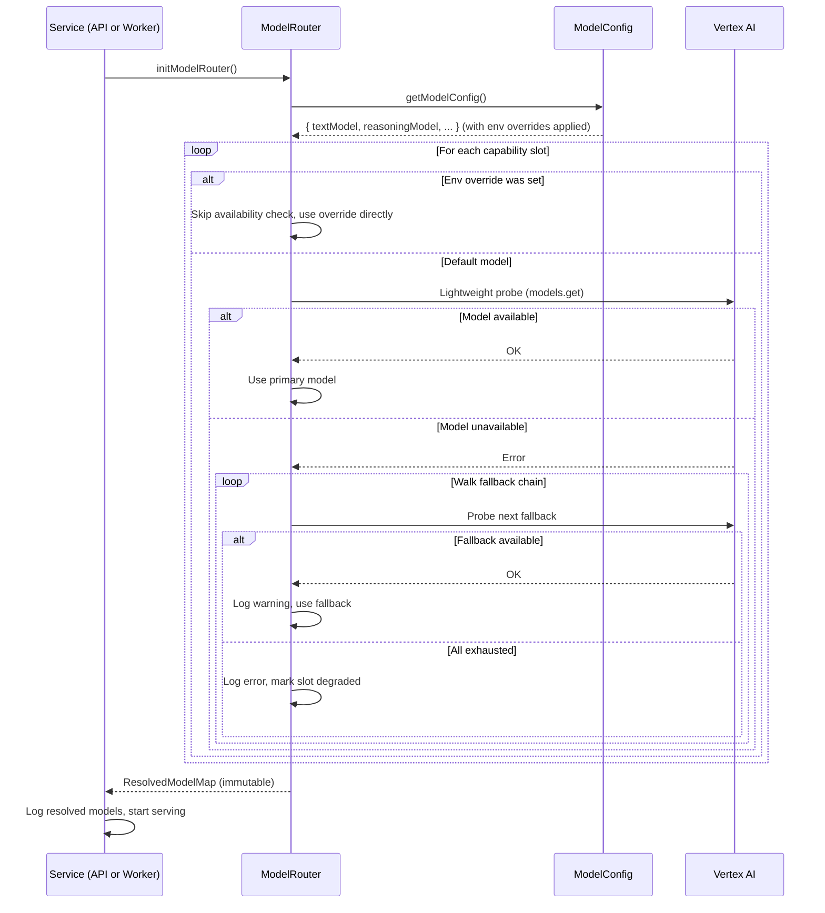

# Design Document: Vertex AI Model Router

## Overview

This design introduces a centralized model routing layer that replaces all hardcoded Vertex AI model references across the Content Storyteller monorepo. Today, both the API and Worker services hardcode `gemini-2.5-flash` in their respective `gcp.ts` config files, and the video generation capability hardcodes `veo-2.0-generate-001`. Every `generateContent()` call reads the single model from `GcpConfig` with no way to vary by task type.

The model router maps each AI task to the optimal model by capability slot (text, reasoning, image, imageHQ, videoFast, videoFinal, live), supports environment-variable overrides, performs startup availability checks, and walks ordered fallback chains when a primary model is unavailable. The refactoring preserves all existing API contracts, SSE streaming, Pub/Sub message formats, and frontend flows.

### Design Decisions

1. **Shared module in `packages/shared`**: The model config and router live in `packages/shared/src/ai/` so both API and Worker import from `@content-storyteller/shared` — zero duplication.
2. **`generateContent` accepts explicit model parameter**: Rather than reading from a global config, callers pass the model identifier. This makes the dependency explicit and testable.
3. **Startup availability checks are best-effort**: A lightweight `models.get()` probe validates each primary model. Failures trigger fallback chain traversal, not crashes.
4. **Fallback state is immutable after init**: The router resolves all slots once at startup and caches the result. No runtime re-resolution — predictable behavior throughout the process lifetime.
5. **Live model has no fallback**: The `liveModel` slot returns a structured error when unavailable rather than substituting a non-live model, because the Live API has fundamentally different capabilities.

## Architecture

```mermaid
graph TB
    subgraph "packages/shared"
        MC["ModelConfig<br/>ai/model-config.ts<br/>Reads VERTEX_* env vars<br/>Defines defaults per slot"]
        MR["ModelRouter<br/>ai/model-router.ts<br/>Availability checks<br/>Fallback chain resolution<br/>Slot → model mapping"]
        MC --> MR
    end

    subgraph "apps/api"
        AGCP["config/gcp.ts<br/>(geminiModel removed)"]
        AGEN["services/genai.ts<br/>generateContent(prompt, model)"]
        ALS["services/live-session.ts<br/>Uses liveModel for conversation<br/>textModel for extraction"]
        ATA["services/trends/analyzer.ts<br/>textModel for synthesis<br/>reasoningModel for strategy"]
        AGP["services/trends/providers/<br/>gemini-provider.ts<br/>textModel for signal collection"]
        AH["routes/health + debug<br/>Exposes model routing info"]
    end

    subgraph "apps/worker"
        WGCP["config/gcp.ts<br/>(geminiModel removed)"]
        WGEN["services/genai.ts<br/>generateContent(prompt, model)"]
        PI["pipeline/process-input.ts<br/>textModel"]
        GC["pipeline/generate-copy.ts<br/>textModel"]
        GI["pipeline/generate-images.ts<br/>textModel (concepts)<br/>imageModel (generation)"]
        GV["pipeline/generate-video.ts<br/>reasoningModel (storyboard)<br/>videoFastModel / videoFinalModel"]
        CP["pipeline/compose-package.ts<br/>textModel"]
        IG["capabilities/image-generation.ts<br/>imageModel from router"]
        VG["capabilities/video-generation.ts<br/>videoFastModel/videoFinalModel<br/>from router"]
    end

    MR --> AGEN
    MR --> WGEN
    MR --> ALS
    MR --> ATA
    MR --> AGP
    MR --> AH
    MR --> PI
    MR --> GC
    MR --> GI
    MR --> GV
    MR --> CP
    MR --> IG
    MR --> VG
```



### Startup Sequence



## Components and Interfaces

### 1. ModelConfig (`packages/shared/src/ai/model-config.ts`)

Reads environment variables and returns the raw configuration with defaults.

```typescript
/** All capability slot names */
export type CapabilitySlot =
  | 'text'
  | 'textFallback'
  | 'reasoning'
  | 'image'
  | 'imageHQ'
  | 'videoFast'
  | 'videoFinal'
  | 'live';

export interface ModelConfigValues {
  projectId: string;
  location: string;
  slots: Record<CapabilitySlot, string>;
}

/** Default model identifiers per capability slot */
export const MODEL_DEFAULTS: Record<CapabilitySlot, string> = {
  text: 'gemini-3.1-flash',
  textFallback: 'gemini-3-flash-preview',
  reasoning: 'gemini-3.1-pro-preview',
  image: 'gemini-3.1-flash-image-preview',
  imageHQ: 'gemini-3-pro-image-preview',
  videoFast: 'veo-3.1-fast-generate-001',
  videoFinal: 'veo-3.1-generate-001',
  live: 'gemini-live-2.5-flash-native-audio',
};

/** Environment variable names per slot */
export const SLOT_ENV_VARS: Record<CapabilitySlot, string> = {
  text: 'VERTEX_TEXT_MODEL',
  textFallback: 'VERTEX_TEXT_FALLBACK_MODEL',
  reasoning: 'VERTEX_REASONING_MODEL',
  image: 'VERTEX_IMAGE_MODEL',
  imageHQ: 'VERTEX_IMAGE_HQ_MODEL',
  videoFast: 'VERTEX_VIDEO_FAST_MODEL',
  videoFinal: 'VERTEX_VIDEO_FINAL_MODEL',
  live: 'VERTEX_LIVE_MODEL',
};

/**
 * Reads env vars and returns model config with overrides applied.
 * Does NOT perform availability checks — that's the router's job.
 */
export function getModelConfig(): ModelConfigValues;
```

### 2. ModelRouter (`packages/shared/src/ai/model-router.ts`)

Performs availability checks, walks fallback chains, and exposes the resolved model map.

```typescript
export type SlotStatus = 'available' | 'degraded' | 'unavailable';

export interface ResolvedSlot {
  model: string;
  status: SlotStatus;
  primary: string;
  fallbackUsed: string | null;
  isOverride: boolean;
}

export type ResolvedModelMap = Record<CapabilitySlot, ResolvedSlot>;

/** Fallback chains — only slots with fallbacks are listed */
export const FALLBACK_CHAINS: Partial<Record<CapabilitySlot, string[]>> = {
  text: ['gemini-3.1-flash', 'gemini-3-flash-preview', 'gemini-3.1-flash-lite-preview'],
  imageHQ: ['gemini-3-pro-image-preview', 'gemini-3.1-flash-image-preview'],
  videoFinal: ['veo-3.1-generate-001', 'veo-3.1-fast-generate-001'],
};

/**
 * Initialize the model router. Performs availability checks for each slot,
 * walks fallback chains as needed, and returns the immutable resolved map.
 * Must be called once at service startup.
 */
export async function initModelRouter(options?: {
  checkAvailability?: (model: string, projectId: string, location: string) => Promise<boolean>;
}): Promise<ResolvedModelMap>;

/**
 * Get the resolved model for a capability slot.
 * Throws if initModelRouter() has not been called.
 */
export function getModel(slot: CapabilitySlot): string;

/**
 * Get the full resolved slot info (model, status, fallback info).
 */
export function getSlotInfo(slot: CapabilitySlot): ResolvedSlot;

/**
 * Get the entire resolved model map (for health endpoints).
 */
export function getResolvedModels(): ResolvedModelMap;

/**
 * Reset router state (for testing only).
 */
export function _resetRouterForTesting(): void;
```

### 3. Refactored GenAI Service (`apps/api/src/services/genai.ts` and `apps/worker/src/services/genai.ts`)

Both files get the same change: `generateContent` and `generateContentMultimodal` accept an explicit `model` parameter.

```typescript
/**
 * Generate content using a specific model via Vertex AI.
 * The model parameter is required — callers get it from the ModelRouter.
 */
export async function generateContent(prompt: string, model: string): Promise<string>;

/**
 * Generate content with multimodal parts using a specific model.
 * (Worker only)
 */
export async function generateContentMultimodal(
  parts: Array<{ text: string } | { inlineData: { data: string; mimeType: string } }>,
  model: string,
): Promise<string>;
```

The `getGeminiModel()` function and `GENAI_MODEL` constant are removed. The `getGenAI()` singleton remains unchanged (it handles SDK initialization with ADC or API key).

### 4. Pipeline Stage Changes

Each pipeline stage imports `getModel` from `@content-storyteller/shared` and passes the appropriate model to `generateContent`:

| Stage | Current | After |
|-------|---------|-------|
| ProcessInput | `generateContent(prompt)` | `generateContent(prompt, getModel('text'))` |
| GenerateCopy | `generateContent(prompt)` | `generateContent(prompt, getModel('text'))` |
| GenerateImages (concepts) | `generateContent(prompt)` | `generateContent(prompt, getModel('text'))` |
| GenerateImages (actual) | `cfg.geminiModel` | `getModel('image')` |
| GenerateImages (HQ) | N/A | `getModel('imageHQ')` |
| GenerateVideo (storyboard) | `generateContent(prompt)` | `generateContent(prompt, getModel('reasoning'))` |
| GenerateVideo (teaser) | `VEO_MODEL` | `getModel('videoFast')` |
| GenerateVideo (final) | `VEO_MODEL` | `getModel('videoFinal')` |
| ComposePackage | No GenAI call | No change (no model needed) |

### 5. Live Session Changes

```typescript
// Real-time conversation
async function generateAgentResponse(transcript: TranscriptEntry[]): Promise<string> {
  const model = getModel('live');
  // ... build prompt ...
  return generateContent(prompt, model);
}

// Post-session extraction
async function extractCreativeDirection(transcript: TranscriptEntry[]): Promise<ExtractedCreativeDirection> {
  const model = getModel('text'); // or 'reasoning' for deeper analysis
  // ... build prompt ...
  const text = await generateContent(prompt, model);
  // ...
}
```

When `getModel('live')` throws (slot unavailable), `processLiveInput` catches it and returns a structured error to the client.

### 6. Trend Analyzer Changes

```typescript
// analyzer.ts — synthesis and clustering
const geminiRaw = await generateContent(prompt, getModel('text'));

// gemini-provider.ts — signal collection
const raw = await generateContent(prompt, getModel('text'));
```

Strategy generation (future) would use `getModel('reasoning')`.

### 7. Health/Debug Endpoint Changes

The API health endpoint at `/api/v1/health` adds model routing info:

```typescript
app.get('/api/v1/health', (_req, res) => {
  const cfg = getGcpConfig();
  const models = getResolvedModels();
  res.json({
    status: 'ok',
    timestamp: new Date().toISOString(),
    projectId: cfg.projectId,
    location: cfg.location,
    authMode: cfg.authMode,
    models: Object.fromEntries(
      Object.entries(models).map(([slot, info]) => [
        slot,
        { model: info.model, status: info.status, fallbackUsed: info.fallbackUsed },
      ]),
    ),
  });
});
```

The debug endpoint adds the full `ResolvedModelMap` including `primary`, `isOverride` fields.

Worker `/health` gets the same `models` field.

### 8. GcpConfig Changes

Both `apps/api/src/config/gcp.ts` and `apps/worker/src/config/gcp.ts`:
- Remove the `geminiModel` field from `GcpConfig` interface
- Remove the hardcoded `geminiModel: 'gemini-2.5-flash'` assignment
- Remove `geminiModel` from `logGcpConfig()` output
- Keep all other fields unchanged

### 9. Capability Registry Changes

`ImageGenerationCapability` and `VideoGenerationCapability` import `getModel` from the shared package:

```typescript
// image-generation.ts
const model = getModel('image'); // replaces cfg.geminiModel

// video-generation.ts
const model = getModel('videoFinal'); // replaces hardcoded VEO_MODEL
```

The `VEO_MODEL` constant is removed from `video-generation.ts`.

## Data Models

### CapabilitySlot (union type)

```typescript
type CapabilitySlot = 'text' | 'textFallback' | 'reasoning' | 'image' | 'imageHQ' | 'videoFast' | 'videoFinal' | 'live';
```

### ModelConfigValues

```typescript
interface ModelConfigValues {
  projectId: string;
  location: string;
  slots: Record<CapabilitySlot, string>;
}
```

### ResolvedSlot

```typescript
interface ResolvedSlot {
  /** The model identifier that will be used for this slot */
  model: string;
  /** Availability status after startup checks */
  status: 'available' | 'degraded' | 'unavailable';
  /** The primary (default or env-override) model for this slot */
  primary: string;
  /** If a fallback was used, which model; null if primary is active */
  fallbackUsed: string | null;
  /** Whether this slot's primary was set via VERTEX_* env var */
  isOverride: boolean;
}
```

### ResolvedModelMap

```typescript
type ResolvedModelMap = Record<CapabilitySlot, ResolvedSlot>;
```

### FallbackChain definition

```typescript
const FALLBACK_CHAINS: Partial<Record<CapabilitySlot, string[]>> = {
  text: ['gemini-3.1-flash', 'gemini-3-flash-preview', 'gemini-3.1-flash-lite-preview'],
  imageHQ: ['gemini-3-pro-image-preview', 'gemini-3.1-flash-image-preview'],
  videoFinal: ['veo-3.1-generate-001', 'veo-3.1-fast-generate-001'],
};
```

Slots not in `FALLBACK_CHAINS` have no fallback — if the primary is unavailable, the slot is marked `unavailable`.


## Correctness Properties

*A property is a characteristic or behavior that should hold true across all valid executions of a system — essentially, a formal statement about what the system should do. Properties serve as the bridge between human-readable specifications and machine-verifiable correctness guarantees.*

### Property 1: Environment variable override applies to any capability slot

*For any* capability slot and *for any* non-empty string value, setting the corresponding `VERTEX_*` environment variable and then calling `getModelConfig()` should return that string as the model identifier for that slot, replacing the default.

**Validates: Requirements 1.3, 1.4, 1.5, 1.6, 1.7, 1.8, 1.9, 1.10**

### Property 2: Fallback chain selects the first available model

*For any* capability slot that has a defined fallback chain, and *for any* boolean availability pattern across the models in that chain, the model router should resolve to the first model in the chain for which the availability check returns true. If the primary is available, no fallback is used.

**Validates: Requirements 2.3, 3.2, 3.3, 3.4**

### Property 3: All-unavailable fallback chain marks slot as degraded

*For any* capability slot with a fallback chain, if the availability check returns false for every model in the chain, the router should mark that slot's status as `'degraded'` and should not throw an error or crash the application.

**Validates: Requirements 3.8**

### Property 4: generateContent forwards the provided model identifier

*For any* model identifier string passed to `generateContent(prompt, model)`, the underlying SDK call should use that exact model identifier — not a value read from GcpConfig or any other source.

**Validates: Requirements 7.1, 7.2**

### Property 5: No hardcoded model name strings in source files

*For any* TypeScript source file in the `apps/` directory (excluding test files and `model-config.ts`), the file content should contain zero occurrences of the literal strings `gemini-2.5-flash` and `veo-2.0-generate-001`.

**Validates: Requirements 7.8**

### Property 6: Health endpoint response contains no secrets

*For any* resolved model map and GCP config, the health endpoint response object should not contain any field whose key matches `apiKey`, `secret`, `token`, `credential`, or `password` (case-insensitive), and should not contain any string value that matches the `GEMINI_API_KEY` environment variable.

**Validates: Requirements 8.4**

### Property 7: Environment override skips availability check for that slot

*For any* capability slot where the corresponding `VERTEX_*` environment variable is set, the model router should use the override value directly and should not invoke the availability check function for that slot's default model.

**Validates: Requirements 10.3**

## Error Handling

### Model Router Initialization Failures

| Scenario | Behavior |
|----------|----------|
| Primary model unavailable, fallback available | Log warning, use fallback, slot status = `'available'` |
| All models in chain unavailable | Log error, slot status = `'degraded'`, model = last in chain |
| Live model unavailable | Slot status = `'unavailable'`, `getModel('live')` throws `ModelUnavailableError` |
| Availability check network error | Treat as unavailable, try next in chain |
| No `projectId` set | `getModelConfig()` throws at startup (fail fast, same as current behavior) |

### Runtime Errors

| Scenario | Behavior |
|----------|----------|
| `getModel()` called before `initModelRouter()` | Throws `RouterNotInitializedError` |
| `getModel('live')` when live is unavailable | Throws `ModelUnavailableError` with structured message |
| `generateContent()` fails with model error | Existing error propagation unchanged — stage catches and records failure |
| Degraded slot used at runtime | `generateContent` may fail; pipeline stage handles via existing try/catch + fallback notice pattern |

### Custom Error Types

```typescript
export class RouterNotInitializedError extends Error {
  constructor() {
    super('ModelRouter has not been initialized. Call initModelRouter() at startup.');
    this.name = 'RouterNotInitializedError';
  }
}

export class ModelUnavailableError extends Error {
  readonly slot: CapabilitySlot;
  constructor(slot: CapabilitySlot) {
    super(`Model for capability "${slot}" is unavailable and has no fallback.`);
    this.name = 'ModelUnavailableError';
    this.slot = slot;
  }
}
```

### Live Session Error Response

When `getModel('live')` throws `ModelUnavailableError`, the live session endpoint returns:

```json
{
  "error": {
    "code": "LIVE_MODE_UNAVAILABLE",
    "message": "Live conversation mode is not available. The required model (gemini-live-2.5-flash-native-audio) could not be reached."
  }
}
```

HTTP status: `503 Service Unavailable`.

## Testing Strategy

### Property-Based Testing

Library: **fast-check** (already available in the project's vitest ecosystem)

Each correctness property maps to a single property-based test with a minimum of 100 iterations. Tests are tagged with the design property they validate.

| Property | Test Location | Generator Strategy |
|----------|--------------|-------------------|
| P1: Env override | `packages/shared/src/__tests__/model-config.property.test.ts` | Generate random `CapabilitySlot` + random alphanumeric model name string |
| P2: Fallback chain | `packages/shared/src/__tests__/model-router.property.test.ts` | Generate random boolean availability arrays for each chain |
| P3: All-unavailable | `packages/shared/src/__tests__/model-router.property.test.ts` | Generate random chain lengths, all returning false |
| P4: Model forwarding | `apps/api/src/__tests__/genai.property.test.ts` | Generate random model name strings, mock SDK, verify model passed through |
| P5: No hardcoded strings | `packages/shared/src/__tests__/model-config.property.test.ts` | Enumerate source files, grep for forbidden strings (deterministic but structured as property) |
| P6: No secrets in health | `apps/api/src/__tests__/health.property.test.ts` | Generate random ResolvedModelMap + random API key strings, verify absence |
| P7: Override skips check | `packages/shared/src/__tests__/model-router.property.test.ts` | Generate random slot + override value, mock availability checker, verify it's not called for that slot |

### Unit Testing

Unit tests cover specific examples, edge cases, and integration points:

| Test | Location | What It Verifies |
|------|----------|-----------------|
| Default values | `packages/shared/src/__tests__/model-config.unit.test.ts` | All 8 slots return correct defaults when no env vars set (Req 1.11) |
| Router init with all available | `packages/shared/src/__tests__/model-router.unit.test.ts` | All slots resolve to primary, status = available (Req 2.2) |
| Live unavailable error | `packages/shared/src/__tests__/model-router.unit.test.ts` | `getModel('live')` throws `ModelUnavailableError` when live is down (Req 3.5) |
| Pipeline stage slot mapping | `apps/worker/src/__tests__/pipeline-routing.unit.test.ts` | Each stage calls `getModel` with correct slot (Req 4.1-4.9) |
| Live session slot mapping | `apps/api/src/__tests__/live-routing.unit.test.ts` | Conversation uses `live`, extraction uses `text` (Req 5.1, 5.2) |
| Trend analyzer slot mapping | `apps/api/src/__tests__/trend-routing.unit.test.ts` | Signal collection uses `text`, strategy uses `reasoning` (Req 6.1-6.3) |
| Health endpoint structure | `apps/api/src/__tests__/health.unit.test.ts` | Response includes models with status, fallback info (Req 8.1-8.3, 8.5) |
| Live unavailable 503 | `apps/api/src/__tests__/live-routing.unit.test.ts` | Returns 503 with LIVE_MODE_UNAVAILABLE code (Req 5.4) |
| GcpConfig no geminiModel | `apps/api/src/__tests__/gcp-config.unit.test.ts` | Verify `geminiModel` field is absent from GcpConfig (Req 7.6, 7.7) |

### Test Configuration

- All property tests: minimum 100 iterations via `fc.assert(fc.property(...), { numRuns: 100 })`
- Each property test tagged: `// Feature: vertex-ai-model-router, Property N: <title>`
- Mocking strategy: `initModelRouter` accepts an optional `checkAvailability` function for dependency injection in tests
- Environment isolation: each test uses `_resetRouterForTesting()` and `_resetConfigForTesting()` in `beforeEach`
