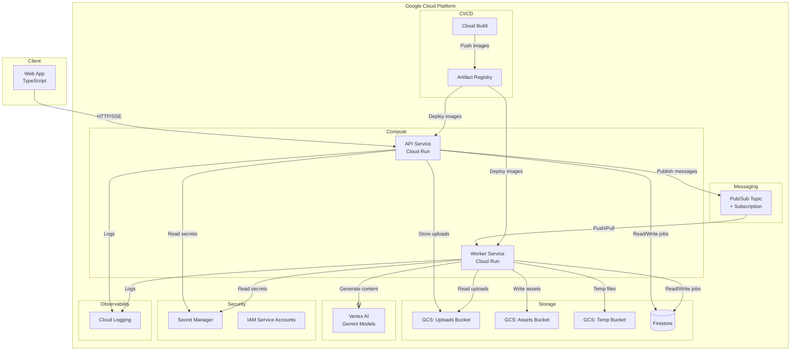

# Content Storyteller

Multimodal AI platform that transforms rough inputs — text, images, screenshots, voice notes — into polished marketing assets: copy, visuals, storyboards, voiceover scripts, and short promo videos. Includes a Trend Analyzer for AI-powered trend discovery across Instagram Reels, X/Twitter, and LinkedIn — with one-click handoff to the content generation pipeline. Built entirely on Google Cloud with Vertex AI (Gemini models).

## Architecture



### How It Works

1. User uploads media via the Web App → API Service
2. API stores media in Cloud Storage, creates a Job in Firestore (`queued`), publishes a message to Pub/Sub
3. Worker receives the message and progresses through pipeline stages: `processing_input` → `generating_copy` → `generating_images` → `generating_video` → `composing_package` → `completed`
4. Each stage persists assets to Cloud Storage and updates the Job document
5. Web App polls or streams (SSE) job status via the API Service
6. On completion, the Web App retrieves the final asset bundle

### Output-Intent Inference (Smart Pipeline)

The Planner module (`apps/api/src/services/planner/output-intent.ts`) determines which pipeline stages to run at job creation time. It evaluates four signals in priority order:

1. **Explicit preference** — If the user selects an `OutputPreference` (Copy only, Copy+Image, Copy+Video, Full Package), it maps directly to boolean intent flags. This always wins.
2. **Trend context** — When a trend is handed off via "Use in Content Storyteller", the `desiredOutputType` from the trend overrides platform defaults.
3. **Platform defaults** — Each platform has sensible defaults: `instagram_reel` → video+image, `linkedin_launch_post` → copy-only, `x_twitter_thread` → thread-focused, `general_promo_package` → full package.
4. **Prompt keyword scanning** — The prompt is scanned (case-insensitive) for keywords like "video", "reel", "image", "photo", "complete package" to toggle intent flags.

The `OutputPreference` options are: **Auto** (infer from above signals), **Copy only**, **Copy + Image**, **Copy + Video**, and **Full Package**. The `wantsCopy` flag is always `true` — copy is the minimum output for every job.

The resolved `OutputIntent` is persisted on the Job document so the worker, SSE stream, and frontend all know which stages are planned before execution begins.

### Key Decisions

| Decision | Choice | Rationale |
|---|---|---|
| Async dispatch | Pub/Sub | Flexible, supports fan-out and dead-letter topics |
| Worker deployment | Cloud Run service | Push subscriptions, always-on, simpler for hackathon |
| Language | TypeScript everywhere | Code sharing via `packages/shared`, single toolchain |
| State store | Firestore Native | Serverless, real-time listeners for SSE |
| IaC | Terraform | Declarative, reproducible, well-supported GCP provider |
| Model routing | Centralized Model Router | Maps each AI capability to the optimal Vertex AI model with env-var overrides and fallback chains |

## Project Structure

```
content-storyteller/
├── apps/
│   ├── web/          # TypeScript frontend (Vite + React)
│   ├── api/          # TypeScript API service (Express)
│   └── worker/       # TypeScript async worker service
├── packages/
│   └── shared/       # Shared types, schemas, enums
├── infra/
│   └── terraform/    # All GCP infrastructure
├── scripts/          # bootstrap, build, deploy, dev
├── docs/             # Architecture, IAM, env, demo, checklist
├── cloudbuild.yaml   # CI/CD pipeline
├── Makefile          # Task runner
└── README.md
```

## Quickstart

### Prerequisites

- [Node.js](https://nodejs.org/) >= 18
- [Google Cloud SDK](https://cloud.google.com/sdk/docs/install) (`gcloud`)
- [Terraform](https://developer.hashicorp.com/terraform/downloads) >= 1.0 (for infrastructure provisioning)
- [Docker](https://docs.docker.com/get-docker/) (for backend deployment)

### Local Development

```bash
# 1. Clone and install
git clone <repo-url>
cd content-storyteller
npm install

# 2. Authenticate with Google Cloud (needed for Firestore, Storage, Pub/Sub, Vertex AI)
gcloud auth login
gcloud auth application-default login
gcloud config set project deep-hook-468814-t7
gcloud auth application-default set-quota-project deep-hook-468814-t7

# 3. Copy and fill environment files
cp .env.example .env
cp apps/api/.env.example apps/api/.env
cp apps/worker/.env.example apps/worker/.env
cp apps/web/.env.example apps/web/.env

# 4. Edit apps/api/.env and apps/worker/.env:
#    - Set GCP_PROJECT_ID to your project
#    - Set bucket names (UPLOADS_BUCKET, ASSETS_BUCKET, TEMP_BUCKET)
#    - Optionally set GEMINI_API_KEY for local dev (otherwise uses ADC via Vertex AI)
#    - Optionally set VERTEX_* variables to override default model selections
#      (see docs/env.md for the full list of model routing variables)

# 5. Start all services (web :5173, api :8080, worker :8080)
make dev
```

The Vite dev server proxies `/api` requests to `localhost:8080` automatically — no need to set `VITE_API_URL` locally.

## Deployment

### Architecture: Frontend on GitHub Pages, Backend on Cloud Run

```
GitHub Pages (static)          Cloud Run (API + Worker)
┌──────────────────┐          ┌──────────────────────┐
│  Web App (React) │──HTTP──▶│  API Service (:8080)  │
│  VITE_API_URL=   │          │  ├─ Firestore         │
│  <Cloud Run URL> │          │  ├─ Cloud Storage      │
└──────────────────┘          │  ├─ Pub/Sub            │
                              │  └─ Vertex AI (Gemini) │
                              │                        │
                              │  Worker Service (:8080)│
                              │  ├─ Firestore          │
                              │  ├─ Cloud Storage       │
                              │  └─ Vertex AI (Gemini)  │
                              └──────────────────────┘
```

### Step 1: Provision GCP Infrastructure (first time)

```bash
make bootstrap
```

### Step 2: Deploy Backend (API + Worker to Cloud Run)

```bash
# Set your project ID
export GCP_PROJECT_ID=deep-hook-468814-t7

# Build images and deploy to Cloud Run
bash scripts/deploy-backend.sh
```

This prints the API service URL. Copy it for the next step.

### Step 3: Deploy Frontend (GitHub Pages)

```bash
# Replace with your actual Cloud Run API URL and repo name
VITE_API_URL=https://api-service-xxxxx-uc.a.run.app \
VITE_BASE_PATH=/content-storyteller/ \
bash scripts/deploy-frontend.sh

# Push to GitHub Pages
npx gh-pages -d apps/web/dist
```

Or use the GitHub Actions workflow (`.github/workflows/deploy-pages.yml`) — set `VITE_API_URL` and `VITE_BASE_PATH` as repository variables in GitHub Settings → Secrets and variables → Actions → Variables.

### Step 4: Set CORS on Cloud Run

After deploying, update the API service's `CORS_ORIGIN` to allow your GitHub Pages domain:

```bash
gcloud run services update api-service \
  --region us-central1 \
  --update-env-vars CORS_ORIGIN=https://<username>.github.io
```

### One-Command Deploy (Cloud Run for everything)

```bash
make bootstrap   # First time: provision infrastructure
make build       # Build all Docker images
make deploy      # Deploy all services to Cloud Run
```

### Terraform Operations

```bash
make tf-plan      # Preview infrastructure changes
make tf-apply     # Apply infrastructure changes
make tf-destroy   # Tear down all resources
```

### CI/CD

The project includes a `cloudbuild.yaml` pipeline that automates: dependency installation, testing, Docker image builds, Artifact Registry push, and Cloud Run deployment.

## GCP Services Used

| Service | Purpose |
|---|---|
| Cloud Run | API and Worker compute |
| Cloud Storage | Three buckets — uploads, assets, temp (7-day lifecycle) |
| Firestore | Job state management and metadata |
| Pub/Sub | Async job dispatch with dead-letter topic |
| Vertex AI | Gemini models for multimodal content generation |
| Artifact Registry | Docker image storage |
| Secret Manager | Sensitive configuration placeholders |
| Cloud Build | CI/CD pipeline |
| Cloud Logging | Structured observability |
| IAM | Least-privilege service accounts (api-sa, worker-sa, cicd-sa) |

## Hackathon Criteria Compliance

| Criterion | Status | Details |
|---|---|---|
| Gemini Model Usage | ✅ | Vertex AI Gemini for multimodal understanding, copy generation, image prompts, storyboards |
| Google GenAI SDK / ADK | ✅ | `@google-cloud/vertexai` SDK, Google Cloud client libraries, structured output schemas |
| Google Cloud Services | ✅ | 10 GCP services — Cloud Run, Storage, Firestore, Pub/Sub, Vertex AI, Artifact Registry, Secret Manager, Cloud Build, Cloud Logging, IAM |
| Multimodal I/O | ✅ | Input: text, images, screenshots, voice notes. Output: copy, images, storyboards, voiceover scripts, video briefs |
| Real-Time Interaction | ✅ | SSE streaming endpoint, polling endpoint, real-time Firestore state transitions |
| Trend Analysis | ✅ | Gemini-powered trend discovery with momentum scoring, freshness labels, and CTA integration into content generation |
| Live Deployment | ✅ | Terraform-managed, Cloud Build CI/CD, one-command bootstrap/build/deploy scripts |

For the full submission checklist, see [`docs/submission-checklist.md`](docs/submission-checklist.md).

## Documentation

- [`docs/architecture.md`](docs/architecture.md) — Full architecture diagram and service descriptions
- [`docs/deployment-proof.md`](docs/deployment-proof.md) — Live deployment evidence
- [`docs/iam.md`](docs/iam.md) — Service accounts, roles, and justifications
- [`docs/env.md`](docs/env.md) — Environment variable reference
- [`docs/demo-flow.md`](docs/demo-flow.md) — End-to-end demo scenario
- [`docs/submission-checklist.md`](docs/submission-checklist.md) — Hackathon criteria checkboxes
- [`docs/kiro-build-handoff.md`](docs/kiro-build-handoff.md) — Structured handoff for Kiro

## License

This project was built for the Google Cloud hackathon.
