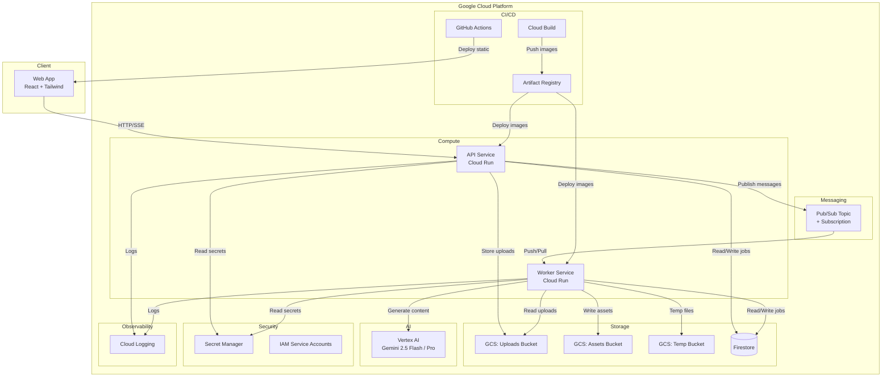

# Content Storyteller

Multimodal AI platform that transforms rough inputs — text, images, screenshots, voice notes — into polished marketing assets: copy, visuals, storyboards, voiceover scripts, and short promo videos. Includes a Trend Analyzer for AI-powered trend discovery across Instagram Reels, X/Twitter, and LinkedIn — with one-click handoff to the content generation pipeline. Built entirely on Google Cloud with Vertex AI (Gemini models).

## Architecture



### How It Works

1. User uploads media via the Web App → API Service
2. API stores media in Cloud Storage, creates a Job in Firestore (`queued`), publishes a message to Pub/Sub
3. Worker receives the message and progresses through pipeline stages: `processing_input` → `generating_copy` → `generating_images` → `generating_video` → `composing_package` → `completed`
4. Each stage persists assets to Cloud Storage and updates the Job document
5. Web App streams job status in real-time via SSE
6. On completion, the Web App retrieves the final asset bundle (including ZIP export)

### Output-Intent Inference (Smart Pipeline)

The Planner module (`apps/api/src/services/planner/output-intent.ts`) determines which pipeline stages to run at job creation time. It evaluates four signals in priority order:

1. Explicit preference — If the user selects an `OutputPreference` (Copy only, Copy+Image, Copy+Video, Full Package), it maps directly to boolean intent flags.
2. Trend context — When a trend is handed off via "Use in Content Storyteller", the `desiredOutputType` from the trend overrides platform defaults.
3. Platform defaults — Each platform has sensible defaults: `instagram_reel` → video+image, `linkedin_launch_post` → copy-only, `x_twitter_thread` → thread-focused, `general_promo_package` → full package.
4. Prompt keyword scanning — The prompt is scanned for keywords like "video", "reel", "image", "photo", "complete package" to toggle intent flags.

The resolved `OutputIntent` is persisted on the Job document so the worker, SSE stream, and frontend all know which stages are planned before execution begins.

### Key Features

| Feature | Description |
|---|---|
| Multimodal Content Generation | Text, images, storyboards, voiceover scripts, video briefs from any input type |
| Trend Analyzer | AI-powered trend discovery across Instagram Reels, X/Twitter, LinkedIn with momentum scoring |
| Smart Pipeline Orchestration | Output-intent inference determines which stages to run per job |
| GIF Generation | LinkedIn-optimized animated GIF creation from content assets |
| Live Agent Voice Assistant | AI Creative Director with Vertex AI function calling, native audio output (gemini-live-2.5-flash-native-audio), browser speech-to-text via SpeechRecognition API, and animated audio equalizer |
| Export Bundle | ZIP download of all generated assets with organized folder structure |
| Model Router | Centralized Vertex AI model selection with env-var overrides and fallback chains |
| Premium UI | Dark/light mode, responsive layout, platform-specific content previews |

### Key Decisions

| Decision | Choice | Rationale |
|---|---|---|
| Async dispatch | Pub/Sub | Flexible, supports fan-out and dead-letter topics |
| Worker deployment | Cloud Run service | Push subscriptions, always-on, simpler for hackathon |
| Language | TypeScript everywhere | Code sharing via `packages/shared`, single toolchain |
| State store | Firestore Native | Serverless, real-time listeners for SSE |
| IaC | Terraform | Declarative, reproducible, well-supported GCP provider |
| Model routing | Centralized Model Router | Maps each AI capability to the optimal Vertex AI model with env-var overrides and fallback chains |
| Frontend hosting | GitHub Pages | Free, fast CDN, automated via GitHub Actions |
| Backend hosting | Cloud Run | Serverless containers, auto-scaling, integrated with GCP services |

## Project Structure

```
content-storyteller/
├── apps/
│   ├── web/              # React frontend (Vite + Tailwind)
│   ├── api/              # Express API service
│   └── worker/           # Async worker service (Pub/Sub consumer)
├── packages/
│   └── shared/           # Shared types, schemas, enums, model router
├── infra/
│   └── terraform/        # All GCP infrastructure (10 .tf files)
├── scripts/              # bootstrap, build, deploy-backend, deploy-frontend, dev
├── docs/                 # Architecture, IAM, env, demo, checklist
├── .github/workflows/    # CI (test) + Deploy Pages (frontend)
├── cloudbuild.yaml       # Full CI/CD pipeline (test → build → deploy)
├── cloudbuild-deploy.yaml # Deploy-only pipeline (skip tests)
├── Makefile              # Task runner
└── README.md
```

## Quickstart

### Prerequisites

- [Node.js](https://nodejs.org/) >= 18
- [Google Cloud SDK](https://cloud.google.com/sdk/docs/install) (`gcloud`)
- [Terraform](https://developer.hashicorp.com/terraform/downloads) >= 1.0 (for infrastructure provisioning)
- [Docker](https://docs.docker.com/get-docker/) (for backend deployment)

### Local Development

```bash
# 1. Clone and install
git clone <repo-url>
cd content-storyteller
npm install

# 2. Authenticate with Google Cloud
gcloud auth login
gcloud auth application-default login
gcloud config set project deep-hook-468814-t7
gcloud auth application-default set-quota-project deep-hook-468814-t7

# 3. Copy and fill environment files
cp .env.example .env
cp apps/api/.env.example apps/api/.env
cp apps/worker/.env.example apps/worker/.env
cp apps/web/.env.example apps/web/.env

# 4. Edit apps/api/.env and apps/worker/.env:
#    - Set GCP_PROJECT_ID, bucket names, Pub/Sub config
#    - Optionally set GEMINI_API_KEY for local dev
#    - Optionally set VERTEX_* variables to override model selections
#      (see docs/env.md for the full list)

# 5. Start all services (web :5173, api :8080, worker :8080)
make dev
```

The Vite dev server proxies `/api` requests to `localhost:8080` automatically.

## Deployment

### Architecture: Frontend on GitHub Pages, Backend on Cloud Run

```
GitHub Pages (static)              Cloud Run (API + Worker)
┌────────────────────┐            ┌──────────────────────────┐
│  Web App (React)   │───HTTP───▶│  API Service (:8080)      │
│  VITE_API_URL=     │            │  ├─ Firestore             │
│  <Cloud Run URL>   │            │  ├─ Cloud Storage          │
└────────────────────┘            │  ├─ Pub/Sub                │
                                  │  └─ Vertex AI (Gemini)     │
                                  │                            │
                                  │  Worker Service (:8080)    │
                                  │  ├─ Firestore              │
                                  │  ├─ Cloud Storage           │
                                  │  └─ Vertex AI (Gemini)      │
                                  └──────────────────────────┘
```

### Option A: One-Command Deploy via Cloud Build

```bash
# Full pipeline (install → test → build → push → deploy)
gcloud builds submit --config cloudbuild.yaml --project=deep-hook-468814-t7

# Deploy-only (skip tests, faster iteration)
gcloud builds submit --config cloudbuild-deploy.yaml --project=deep-hook-468814-t7
```

### Option B: Step-by-Step Deploy

#### Step 1: Provision GCP Infrastructure (first time only)

```bash
make bootstrap
```

This runs Terraform to create Cloud Run services, Storage buckets, Firestore, Pub/Sub, Artifact Registry, IAM service accounts, and Secret Manager entries.

#### Step 2: Deploy Backend (API + Worker to Cloud Run)

```bash
export GCP_PROJECT_ID=deep-hook-468814-t7
bash scripts/deploy-backend.sh
```

This builds Docker images, pushes to Artifact Registry, and deploys to Cloud Run. It prints the API service URL — copy it for the next step.

#### Step 3: Deploy Frontend (GitHub Pages)

```bash
VITE_API_URL=https://api-service-xxxxx-uc.a.run.app \
VITE_BASE_PATH=/Content-Storyteller/ \
bash scripts/deploy-frontend.sh

npx gh-pages -d apps/web/dist
```

Or push to `main` and let the GitHub Actions workflow handle it automatically. Set `VITE_API_URL` and `VITE_BASE_PATH` as repository variables in GitHub Settings → Secrets and variables → Actions → Variables.

#### Step 4: Set CORS on Cloud Run

```bash
gcloud run services update api-service \
  --region us-central1 \
  --update-env-vars CORS_ORIGIN=https://<username>.github.io
```

### Makefile Commands

```bash
make bootstrap        # Provision GCP infrastructure via Terraform
make build            # Build Docker images
make deploy           # Deploy to Cloud Run
make deploy-backend   # Build + deploy API and Worker
make deploy-frontend  # Build frontend for GitHub Pages
make dev              # Start local dev servers
make tf-plan          # Preview Terraform changes
make tf-apply         # Apply Terraform changes
make tf-destroy       # Tear down all resources
```

## CI/CD

| Pipeline | File | Trigger | What it does |
|---|---|---|---|
| Full CI/CD | `cloudbuild.yaml` | Cloud Build trigger or manual submit | Install → Test → Build images → Push to AR → Deploy to Cloud Run |
| Deploy-only | `cloudbuild-deploy.yaml` | Manual submit | Build images → Push to AR → Deploy to Cloud Run (skips tests) |
| CI Tests | `.github/workflows/ci.yml` | Push to main, PRs | Install → Build shared → Run all tests |
| Frontend Deploy | `.github/workflows/deploy-pages.yml` | Push to main (web/shared changes) | Build → Deploy to GitHub Pages |

## GCP Services Used

| Service | Purpose |
|---|---|
| Cloud Run | API and Worker compute (serverless containers) |
| Cloud Storage | Three buckets — uploads, assets, temp (7-day lifecycle) |
| Firestore | Job state management and metadata |
| Pub/Sub | Async job dispatch with dead-letter topic |
| Vertex AI | Gemini 2.5 Flash and Pro for multimodal content generation |
| Artifact Registry | Docker image storage |
| Secret Manager | Sensitive configuration |
| Cloud Build | CI/CD pipeline |
| Cloud Logging | Structured observability |
| IAM | Least-privilege service accounts (api-sa, worker-sa, cicd-sa) |

## Testing

The project uses Vitest with both unit tests and property-based tests (via fast-check):

```bash
# Run all tests across all workspaces
npm test

# Run tests for a specific workspace
npm test --workspace=apps/api
npm test --workspace=apps/worker
npm test --workspace=apps/web
npm test --workspace=packages/shared

# Run only property-based tests
npm run test:properties
```

## Hackathon Criteria Compliance

| Criterion | Status | Details |
|---|---|---|
| Gemini Model Usage | ✅ | Vertex AI Gemini 2.5 Flash/Pro for multimodal understanding, copy generation, image prompts, storyboards, trend analysis |
| Google GenAI SDK / ADK | ✅ | `@google-cloud/vertexai` SDK, `@google/genai`, Google Cloud client libraries, structured output schemas |
| Google Cloud Services | ✅ | 10 GCP services — Cloud Run, Storage, Firestore, Pub/Sub, Vertex AI, Artifact Registry, Secret Manager, Cloud Build, Cloud Logging, IAM |
| Multimodal I/O | ✅ | Input: text, images, screenshots, voice notes. Output: copy, images, storyboards, voiceover scripts, video briefs, GIFs |
| Real-Time Interaction | ✅ | SSE streaming, polling endpoint, real-time Firestore state transitions |
| Voice AI Assistant | ✅ | Live Agent with Vertex AI function calling, native audio (gemini-live-2.5-flash-native-audio), browser SpeechRecognition, animated equalizer |
| Trend Analysis | ✅ | Gemini-powered trend discovery with momentum scoring, freshness labels, and CTA integration |
| Live Deployment | ✅ | Terraform-managed, Cloud Build CI/CD, GitHub Actions, one-command deploy scripts |

For the full submission checklist, see [`docs/submission-checklist.md`](docs/submission-checklist.md).

## Documentation

- [`docs/architecture.md`](docs/architecture.md) — Full architecture diagram and service descriptions
- [`docs/deployment-proof.md`](docs/deployment-proof.md) — Live deployment evidence
- [`docs/iam.md`](docs/iam.md) — Service accounts, roles, and justifications
- [`docs/env.md`](docs/env.md) — Environment variable reference
- [`docs/demo-flow.md`](docs/demo-flow.md) — End-to-end demo scenario
- [`docs/demo-script.md`](docs/demo-script.md) — Demo walkthrough script
- [`docs/submission-checklist.md`](docs/submission-checklist.md) — Hackathon criteria checkboxes
- [`docs/judge-checklist.md`](docs/judge-checklist.md) — Judge evaluation checklist
- [`docs/kiro-build-handoff.md`](docs/kiro-build-handoff.md) — Structured handoff for Kiro

## License

This project was built for the Google Cloud hackathon.
