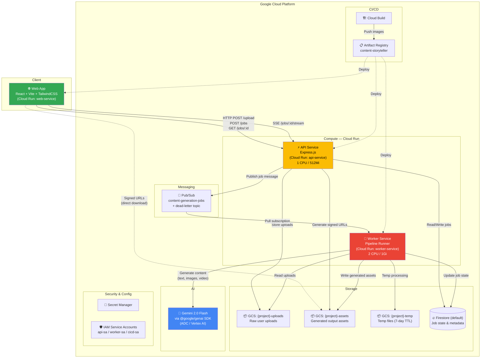
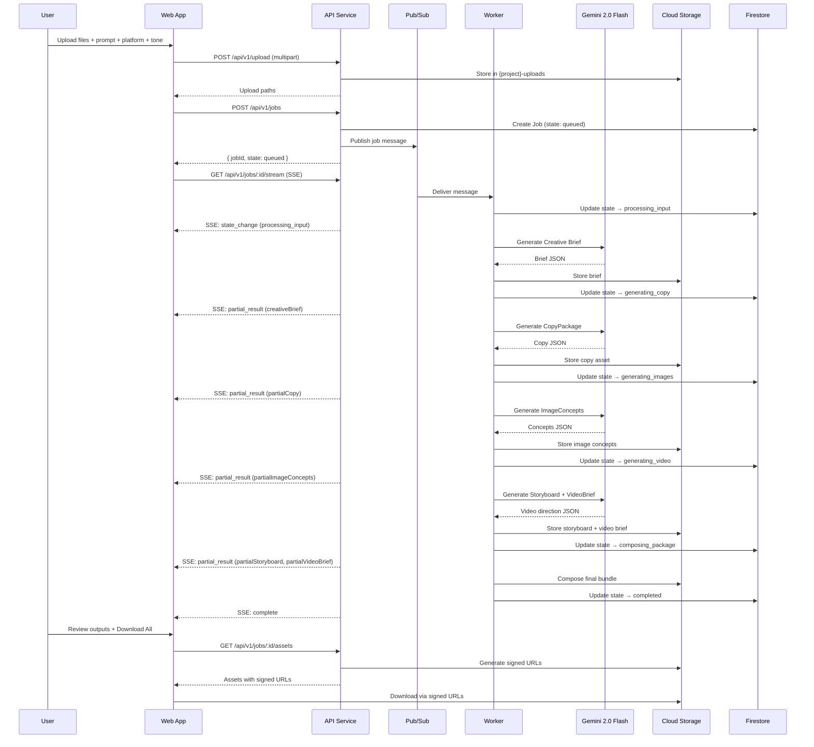
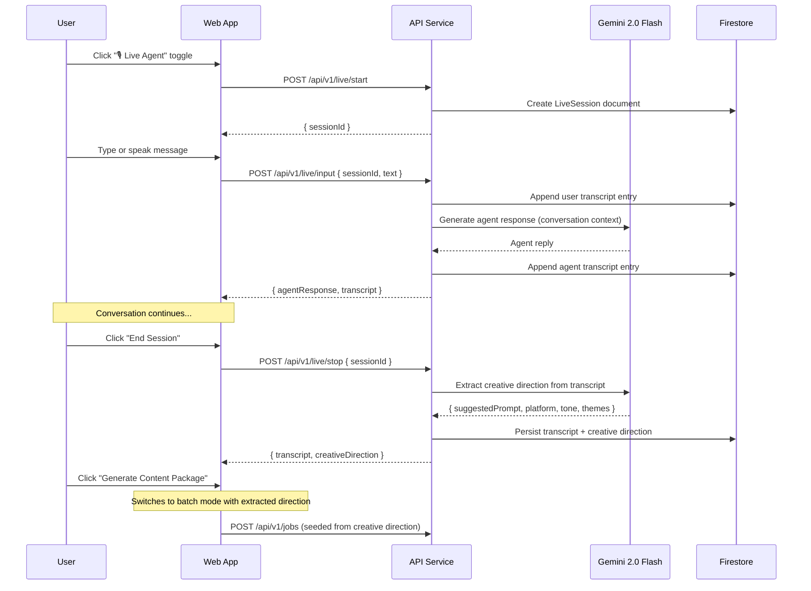

# Architecture

## Overview

Content Storyteller is a multimodal AI system that transforms rough inputs (text, images, screenshots, voice notes) into polished marketing assets: copy, visuals, storyboards, voiceover scripts, and short promo videos. It runs entirely on Google Cloud with Gemini 2.0 Flash (via `@google/genai` SDK) for AI generation.

## System Architecture

## Data Flow

## Service Descriptions

### Web App (Cloud Run: `web-service`)

- React 18 + Vite + TailwindCSS SPA served via nginx
- Drag-and-drop upload, platform/tone selectors, text prompt input
- Real-time generation timeline via SSE
- Output dashboard with progressive reveal: copy cards, storyboard, visual direction, video brief, voiceover
- Export panel with signed URL downloads and copy-to-clipboard

### API Service (Cloud Run: `api-service`)

- Express.js HTTP server — 1 CPU / 512Mi, concurrency 80
- Service account: `api-sa`
- Endpoints:
  - `POST /api/v1/upload` — multipart file upload with MIME validation
  - `POST /api/v1/jobs` — job creation with prompt, platform, tone
  - `GET /api/v1/jobs/:jobId` — poll job status with creative brief
  - `GET /api/v1/jobs/:jobId/stream` — SSE streaming with partial results
  - `GET /api/v1/jobs/:jobId/assets` — asset list with signed URLs
  - `GET /api/v1/jobs/:jobId/bundle` — download all assets
  - `POST /api/v1/live/start` — create live agent session
  - `POST /api/v1/live/input` — send text/audio to live session
  - `POST /api/v1/live/stop` — end session, persist transcript, extract creative direction
  - `GET /api/v1/live/:sessionId` — get live session state
  - `POST /api/v1/trends/analyze` — submit trend analysis query
  - `GET /api/v1/trends/:queryId` — retrieve stored trend analysis result
  - `GET /api/v1/health` — health check

### Worker Service (Cloud Run: `worker-service`)

- Async pipeline processor consuming Pub/Sub messages — 2 CPU / 1Gi, concurrency 1, timeout 600s
- Service account: `worker-sa`
- Pipeline stages (sequential):

| # | Stage | Gemini Usage | Output |
|---|-------|-------------|--------|
| 1 | ProcessInput | Creative Director — platform/tone-aware brief | CreativeBrief |
| 2 | GenerateCopy | Structured copy generation | CopyPackage |
| 3 | GenerateImages | Visual concept generation | ImageConcept[] |
| 4 | GenerateVideo | Storyboard + video brief generation | Storyboard + VideoBrief |
| 5 | ComposePackage | — | AssetBundle |

## GCP Resources (Terraform-managed)

| Resource | Type | Terraform File | Purpose |
|----------|------|---------------|---------|
| `api-service` | Cloud Run v2 | `cloudrun.tf` | HTTP API server |
| `worker-service` | Cloud Run v2 | `cloudrun.tf` | Async pipeline worker |
| `web-service` | Cloud Run v2 | deployed via script | Frontend SPA |
| `{project}-uploads` | Cloud Storage | `storage.tf` | Raw user uploads |
| `{project}-assets` | Cloud Storage | `storage.tf` | Generated output assets |
| `{project}-temp` | Cloud Storage | `storage.tf` | Temporary processing (7-day lifecycle) |
| `(default)` | Firestore Native | `firestore.tf` | Job state, metadata, and live sessions |
| `content-generation-jobs` | Pub/Sub Topic | `pubsub.tf` | Async job dispatch |
| `content-generation-jobs-sub` | Pub/Sub Subscription | `pubsub.tf` | Worker message consumption |
| `content-generation-jobs-dead-letter` | Pub/Sub Topic | `pubsub.tf` | Failed message routing |
| `content-storyteller` | Artifact Registry | `registry.tf` | Docker image storage |
| `api-keys`, `app-config`, `vertex-ai-config` | Secret Manager | `secrets.tf` | Sensitive config |
| `api-sa`, `worker-sa`, `cicd-sa` | Service Accounts | `iam.tf` | Least-privilege IAM |

## GCP Configuration Module

Both services use a shared config module (`apps/*/src/config/gcp.ts`) as the single source of truth for all Google Cloud settings. Key properties:

- All GCP client libraries receive explicit `projectId` from the config — no reliance on ADC default project
- Config is a lazy singleton: resolved once on first call, cached thereafter
- Startup validation: services call `getGcpConfig()` at boot and exit immediately if `GCP_PROJECT_ID` is missing
- `_resetConfigForTesting()` exported for test isolation
- `logGcpConfig()` logs resolved config at startup (no secrets)
- Health endpoints (`/api/v1/health`, `/health`) expose `projectId`, `location`, `authMode` for verification
- Debug endpoint (`/api/v1/debug/gcp-config`) returns full config in dev, returns 404 in production

## Conditional Pipeline Execution (Smart Pipeline Orchestration)

The pipeline runner evaluates the `OutputIntent` (persisted on the Job document at creation time) before each stage. Stages whose intent flag is `false` are skipped entirely.

### Stage Execution Rules

| Stage | Intent Key | Critical | Skippable |
|-------|-----------|----------|-----------|
| ProcessInput | always runs | Yes | No |
| GenerateCopy | `wantsCopy` (always true) | Yes | No |
| GenerateImages | `wantsImage` | No | Yes |
| GenerateVideo | `wantsVideo` | No | Yes |
| ComposePackage | always runs | Yes | No |

### Skipped Stages in the Job Document

Skipped stages are recorded in the `steps` metadata object on the Job document with `status: 'skipped'`. Example: if `wantsImage` is `false`, `steps.generateImages = { status: 'skipped' }`. The `skippedOutputs` array lists the output types that were intentionally skipped (e.g., `['image', 'video']`).

### Skipped Stages in SSE Events

The SSE stream includes `steps`, `requestedOutputs`, and `skippedOutputs` in every `state_change` and terminal event. The frontend reads these to skip rendering skeleton placeholders for stages that will never produce results. State transitions jump over skipped stages (e.g., `generating_copy` → `composing_package` when images and video are both skipped).

### Partial Completion Model

- **Non-critical failure** (GenerateImages or GenerateVideo fails): the job completes with `state: 'completed'` and a `warnings` array describing what failed. The user gets partial results.
- **Critical failure** (ProcessInput or GenerateCopy fails): the job transitions to `state: 'failed'` with a structured `errorMessage`. The pipeline stops immediately.
- A global 10-minute timeout applies. Per-stage timeouts are derived from the remaining budget.

## Troubleshooting Stuck Batch Mode Jobs

### Verify Pub/Sub Message Delivery

Check that the job message was published and delivered: `gcloud pubsub subscriptions pull content-generation-jobs-sub --auto-ack --limit=5`. If no messages appear, verify the topic exists and the API service has `pubsub.publisher` permissions.

### Inspect Firestore Job State

Open the GCP Console → Firestore → `jobs` collection → find the document by `jobId`. Check the `state` field — if stuck at `queued`, the worker never picked it up. If stuck at a stage (e.g., `generating_copy`), the stage is hanging or crashed. Check `steps` metadata for per-stage status.

### Verify SSE Connection

Open browser DevTools → Network → filter by `EventStream`. Confirm the SSE connection to `/api/v1/jobs/:jobId/stream` is open and receiving events. If no events arrive, the API service may not be polling Firestore or the job state isn't advancing.

### Common Failure Patterns

| Symptom | Likely Cause | Fix |
|---------|-------------|-----|
| Job stuck at `queued` | Pub/Sub message not delivered or worker not running | Check worker logs, verify subscription exists |
| Job stuck at a stage | Stage timeout or Vertex AI error | Check worker logs for timeout/API errors |
| SSE shows no events | API not polling or CORS blocking | Verify `CORS_ORIGIN`, check API logs |
| Partial results missing | Non-critical stage failed | Check `warnings` array on Job document |

### Debug Locally

Run the worker with `npm run dev` in `apps/worker/`, create a job via the API, and watch the console for stage-by-stage logs. Each stage logs its start/completion/skip status. Set `LOG_LEVEL=debug` for verbose output.

## Key Architecture Decisions

| Decision | Choice | Rationale |
|----------|--------|-----------|
| AI SDK | `@google/genai` (Google GenAI SDK) | Hackathon requirement; supports ADC + API key |
| AI Model | `gemini-2.0-flash` | Fast, multimodal, cost-effective |
| Auth | ADC-first, API key fallback | Production security best practice |
| Async dispatch | Pub/Sub | Decoupled, supports dead-letter, retry policies |
| Frontend | React + Vite + TailwindCSS | Modern, fast builds, utility-first CSS |
| Real-time updates | SSE (Server-Sent Events) | Simpler than WebSocket for unidirectional streaming |
| Asset delivery | Signed URLs (60-min expiry) | Direct browser download, no backend proxy |
| Language | TypeScript everywhere | Code sharing via `packages/shared`, single toolchain |
| State store | Firestore Native | Serverless, real-time listeners for SSE |
| IaC | Terraform | Declarative, reproducible, well-supported GCP provider |
| Model routing | Centralized Model Router | Maps each AI capability to the optimal Vertex AI model; env-var overrides, fallback chains |

## Model Router

The Model Router (`packages/shared/src/ai/`) is a centralized routing layer that maps each AI capability to the optimal Vertex AI model. It replaces all hardcoded model references across the codebase.

### Capability Slots

Each AI task is assigned a capability slot that resolves to a specific model:

| Slot | Default Model | Used By |
|------|--------------|---------|
| `text` | `gemini-3.1-flash` | ProcessInput, GenerateCopy, GenerateImages (concepts), Live extraction, Trend analysis |
| `textFallback` | `gemini-3-flash-preview` | Fallback for text slot |
| `reasoning` | `gemini-3.1-pro-preview` | GenerateVideo (storyboard/brief) |
| `image` | `gemini-3.1-flash-image-preview` | Image generation capability |
| `imageHQ` | `gemini-3-pro-image-preview` | High-quality image generation |
| `videoFast` | `veo-3.1-fast-generate-001` | Fast video generation (teasers) |
| `videoFinal` | `veo-3.1-generate-001` | Final video generation |
| `live` | `gemini-live-2.5-flash-native-audio` | Live Agent real-time conversation |

### Fallback Chains

When a primary model is unavailable at startup, the router walks an ordered fallback chain:

- **text**: `gemini-3.1-flash` → `gemini-3-flash-preview` → `gemini-3.1-flash-lite-preview`
- **imageHQ**: `gemini-3-pro-image-preview` → `gemini-3.1-flash-image-preview`
- **videoFinal**: `veo-3.1-generate-001` → `veo-3.1-fast-generate-001`

Slots without a fallback chain (e.g., `live`) are marked `unavailable` if the primary model is down. The `live` slot returns a structured 503 error rather than substituting a non-live model.

### Environment Variable Overrides

Any slot can be overridden via `VERTEX_*` environment variables (e.g., `VERTEX_TEXT_MODEL=gemini-custom`). Overrides skip availability checks and are used directly. See [`docs/env.md`](env.md) for the full list.

### Startup Sequence

1. `initModelRouter()` is called at service startup (both API and Worker)
2. `getModelConfig()` reads env vars and applies overrides over defaults
3. For each slot, the router probes model availability (skipped for env overrides)
4. Fallback chains are walked when a primary is unavailable
5. The resolved model map is cached immutably for the process lifetime
6. Health endpoints expose the resolved map (model, status, fallbackUsed per slot)

## Live Agent Mode Flow

## Trend Analyzer

The Trend Analyzer extends Content Storyteller with AI-powered trend discovery. Users select a platform, content domain, geographic region, and optional time/language filters, then receive Gemini-analyzed trend results with momentum scores, freshness labels, and actionable content suggestions. Each trend can be used to pre-fill the existing campaign generation flow via a "Use in Content Storyteller" CTA.

### Data Flow

1. User selects filters (platform, domain, region) in the `TrendAnalyzerPage` frontend
2. Frontend calls `POST /api/v1/trends/analyze` with a `TrendQuery` body
3. API Service runs the trend analysis pipeline: registered providers (`GeminiTrendProvider`) fetch raw signals → `normalizeSignals()` standardizes and scores them → Gemini consolidates, clusters, ranks, and generates content suggestions
4. Result is persisted in the Firestore `trendQueries` collection and returned as a `TrendAnalysisResult`
5. Previously stored results can be retrieved via `GET /api/v1/trends/:queryId`
6. User clicks "Use in Content Storyteller" on a trend card → prompt and platform are pre-filled in the batch mode landing page

### Key Components

- **API endpoints**: `POST /api/v1/trends/analyze` (submit query), `GET /api/v1/trends/:queryId` (retrieve result)
- **Trend provider architecture**: `apps/api/src/services/trends/` — provider interface, Gemini provider, normalization, scoring, registry, and analyzer orchestrator
- **Gemini integration**: `apps/api/src/services/genai.ts` — API service GenAI client for trend analysis prompts
- **Frontend**: `TrendAnalyzerPage`, `TrendFilters`, `TrendResults`, `TrendCard`, `TrendSummary` components with CTA integration in `App.tsx`

Analysis runs synchronously in the API service (no worker/Pub/Sub needed) since Gemini calls are fast enough for this use case.
